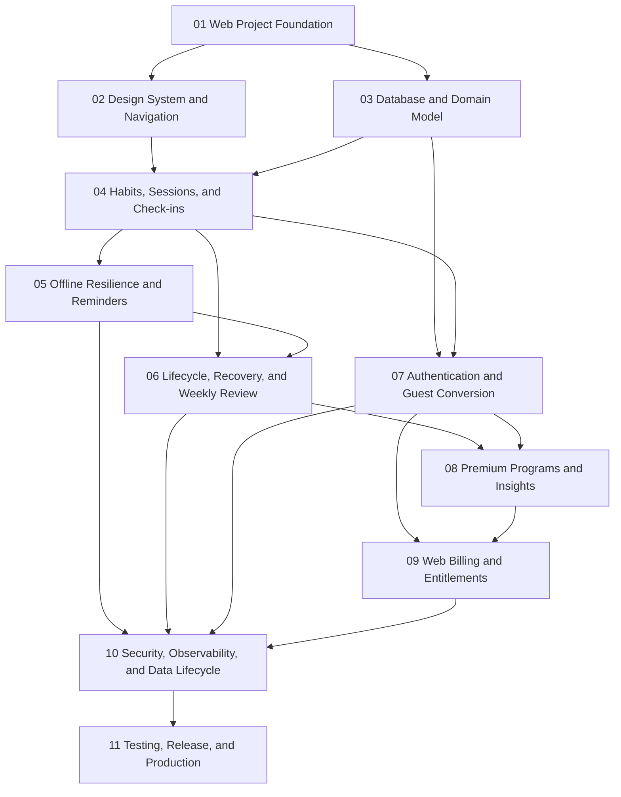

# Recovery-First Habit Tracker
## Website Implementation Master Plan

> **Execution mode:** Single-agent sequential execution.
> Use the `executing-plans` workflow. Do not create, delegate to, or dispatch subagents.
> Complete and verify one detailed plan before beginning the next detailed plan.

**Goal:** Build and release a responsive, website-only Recovery-First Habit Tracker from an empty repository through a sequence of independently verifiable implementation plans.

**Architecture:** The product uses Next.js App Router, React, and strict TypeScript for the web application; Supabase Auth and PostgreSQL for signed-in canonical data; IndexedDB through Dexie for Guest data, drafts, durable cache, and pending operations; and server-authoritative workflows for authorization, billing, export, deletion, and external callbacks. Each phase establishes a stable contract required by the next phase.

**Tech Stack:** Next.js App Router, React, TypeScript, pnpm, Tailwind CSS, shadcn/ui, Lucide, TanStack Query, React Hook Form, Zod, Zustand where explicitly required, Dexie, Supabase, PostgreSQL, Vitest, React Testing Library, Playwright, Vercel, Web Push, transactional email, error monitoring, and privacy-safe product analytics.

---

# 1. Source of Truth

Implementation must follow these files in order:

1. `AGENTS.md`
2. `docs/specs/PRD.md`
3. `docs/specs/UX-FLOWS.md`
4. `docs/specs/UI-SPEC.md`
5. `docs/specs/TECHNICAL-DESIGN.md`
6. Approved records in `docs/architecture/`
7. This master plan
8. The active detailed plan in `docs/implementation/`

A detailed plan may sequence approved work but may not redefine product, UX, UI, security, or architecture requirements. A conflict must be reported before the affected work continues.

---

# 2. Master Execution Rules

- Start from a greenfield repository.
- Use one agent only.
- Execute detailed plans in numerical order.
- Work on one task at a time inside each detailed plan.
- Use test-driven development for domain rules, data operations, authorization, and regressions.
- Run every task-level verification command before marking its checkbox complete.
- Commit at the boundary specified by each detailed plan.
- Do not begin a dependent plan until the preceding plan quality gate passes.
- Do not implement scope assigned to a later plan merely because an interface is visible earlier.
- Early phases may define typed interfaces and test doubles for later systems, but must not fake production success.
- Keep secrets and provider credentials outside source control.
- Keep `pnpm-lock.yaml`, database migrations, generated types, and documentation synchronized with implementation changes.
- Preserve Guest, Free, and Premium business rules throughout all phases.
- Preserve Recovery-First language and data-history guarantees throughout all phases.

---

# 3. Repository Documentation Layout

```text
docs/
├── specs/
│   ├── PRD.md
│   ├── UX-FLOWS.md
│   ├── UI-SPEC.md
│   └── TECHNICAL-DESIGN.md
├── implementation/
│   ├── IMPLEMENTATION-PLAN.md
│   ├── 01-web-project-foundation.md
│   ├── 02-web-design-system-navigation.md
│   ├── 03-database-domain-model.md
│   ├── 04-habits-sessions-checkins.md
│   ├── 05-offline-resilience-reminders.md
│   ├── 06-lifecycle-recovery-weekly-review.md
│   ├── 07-authentication-guest-conversion.md
│   ├── 08-premium-programs-insights.md
│   ├── 09-web-billing-entitlements.md
│   ├── 10-security-observability-data-lifecycle.md
│   └── 11-testing-release-production.md
├── architecture/
│   ├── ADR-001-nextjs-app-router.md
│   ├── ADR-002-supabase-postgresql.md
│   ├── ADR-003-indexeddb-dexie.md
│   ├── ADR-004-browser-resilient-cloud-model.md
│   ├── ADR-005-server-authoritative-entitlements.md
│   ├── ADR-006-idempotent-commands.md
│   ├── ADR-007-single-agent-sequential-delivery.md
│   └── ADR-008-web-push-email-reminders.md
└── operations/
    ├── ENVIRONMENTS.md
    ├── RELEASE.md
    ├── DATABASE-RECOVERY.md
    ├── INCIDENT-RESPONSE.md
    ├── PAYMENT-INCIDENTS.md
    └── ACCOUNT-DELETION.md
```

---

# 4. Phase Dependency Graph



Although some dependencies form parallel branches conceptually, execution remains sequential because the project uses one agent. The required order is Plan 01 through Plan 11.

---

# 5. Standard Quality Gates

Every detailed plan must define focused commands. At the end of every plan, run the applicable subset of:

```bash
pnpm format:check
pnpm lint
pnpm typecheck
pnpm test
pnpm test:integration
pnpm test:e2e
pnpm build
pnpm audit --prod
pnpm exec supabase db reset
pnpm exec supabase test db
```

A plan may add stronger gates but may not remove relevant checks. Commands that do not yet exist must be introduced in Plan 01 before later plans rely on them.

Required evidence at each plan boundary:

- completed task checklist;
- files created, modified, and deleted;
- tests executed with pass and failure counts;
- static-analysis result;
- production-build result where applicable;
- migration and RLS test results where applicable;
- accessibility and browser results where applicable;
- commit hashes;
- deviations and unresolved risks;
- readiness decision for the next plan.

---

# 6. Detailed Plan Roadmap

## Plan 01 — Web Project Foundation

**Detailed plan:** `docs/implementation/01-web-project-foundation.md`

**Objective:** Establish the greenfield Next.js repository, deterministic tooling, environment validation, testing baseline, Supabase local workspace, CI foundation, and minimal deployable application shell.

**Dependencies:** None beyond the approved specification documents and local development prerequisites.

**Required scope:**

- Initialize Git and a pnpm-managed Next.js App Router project with strict TypeScript.
- Establish the required Node.js and pnpm version policy.
- Configure Tailwind CSS, ESLint, formatting, import boundaries, and strict compiler options.
- Add Vitest, React Testing Library, Playwright, and shared test utilities.
- Create environment schemas separating browser-exposed and server-only values.
- Create deterministic clock, UUID, result, error, and structured-logging contracts.
- Establish the approved repository directory structure.
- Create a minimal public route and minimal authenticated-application placeholder route without implementing authentication.
- Initialize Supabase local development, baseline migrations directory, deterministic seed policy, and database-test command.
- Add health endpoints that expose no sensitive information.
- Configure GitHub Actions for install, format, lint, typecheck, unit tests, database reset, database tests, and production build.
- Add Vercel-compatible build configuration without binding production secrets.
- Create setup, environment, secrets, contribution, and verification documentation.
- Record the foundational ADRs required by the technical design.

**Primary deliverables:**

```text
package.json
pnpm-lock.yaml
next.config.ts
tsconfig.json
eslint.config.mjs
postcss.config.mjs
vitest.config.ts
playwright.config.ts
src/app/
src/domain/
src/features/
src/lib/
supabase/config.toml
supabase/migrations/
supabase/tests/
tests/
.github/workflows/quality.yml
docs/architecture/
docs/operations/ENVIRONMENTS.md
README.md
```

**Plan boundary quality gate:**

- clean checkout installs with frozen lockfile;
- environment validation fails clearly for missing required values;
- unit smoke test passes;
- browser smoke test passes;
- Supabase local reset succeeds;
- database smoke test passes;
- lint and strict typecheck pass;
- production build succeeds;
- CI workflow syntax is valid;
- no secret or machine-specific file is tracked.

**Explicitly excluded:** Design-system components, complete navigation, product database schema, Guest data, authentication, habits, check-ins, reminders, recovery, billing, and production deployment.

---

## Plan 02 — Web Design System and Navigation

**Detailed plan:** `docs/implementation/02-web-design-system-navigation.md`

**Objective:** Implement the responsive visual foundation and route shell defined by `UI-SPEC.md` and `UX-FLOWS.md` without implementing business features.

**Dependencies:** Plan 01.

**Required scope:**

- Encode emerald, neutral, accent, semantic, and check-in status tokens.
- Implement typography, spacing, radius, elevation, motion, focus, and responsive layout tokens.
- Configure shadcn/ui primitives under project ownership.
- Implement buttons, links, inputs, selects, checkboxes, radio groups, switches, badges, chips, cards, progress, skeletons, alerts, banners, toasts, dialogs, drawers, dropdowns, tooltips, and data-display primitives.
- Implement public header and footer.
- Implement desktop application sidebar, top bar, page header, profile-menu placeholder, and responsive content container.
- Implement mobile bottom navigation and More drawer.
- Create typed route definitions and route metadata for public and application routes.
- Create static placeholder pages for Today, Habits, Review, Insights, Reminders, Settings, Sign In, Pricing, Privacy, Terms, Help, Status, Not Found, and Error.
- Implement loading, empty, offline, permission, error, locked, and decision-required presentation components.
- Add component tests, accessibility checks, responsive navigation tests, and visual-regression baselines for high-value primitives.

**Primary deliverables:**

```text
src/app/globals.css
src/app/(public)/
src/app/(application)/
src/components/ui/
src/components/layout/
src/components/navigation/
src/components/feedback/
src/lib/navigation/
tests/components/
tests/accessibility/
tests/visual/
```

**Plan boundary quality gate:**

- all tokens match `UI-SPEC.md`;
- keyboard navigation works across shell controls;
- visible focus indicators meet specification;
- desktop sidebar and mobile bottom navigation expose the same mental model;
- route placeholders render without business-data mocks that imply completion;
- component and accessibility tests pass;
- supported responsive reference frames pass Playwright checks;
- production build succeeds.

**Explicitly excluded:** Real habit data, authentication, database integration, IndexedDB persistence, recovery logic, reminder delivery, and billing.

---

## Plan 03 — Database and Domain Model

**Detailed plan:** `docs/implementation/03-database-domain-model.md`

**Objective:** Establish deterministic Recovery-First domain rules, PostgreSQL schema, RLS baseline, generated types, and browser-local schema contracts before product workflows depend on them.

**Dependencies:** Plan 01. Plan 02 must already be complete because execution is sequential, although this phase primarily depends on Plan 01 technically.

**Required scope:**

- Define framework-independent domain types for identity mode, plan tier, habit lifecycle, check-in outcome, friction reason, recommendation decision, recovery status, subscription status, and synchronization state.
- Implement deterministic active-slot rules for Guest, Free, and Premium.
- Implement recurrence, timezone, habit-version, session-identity, consistency, continuity, and recovery-counter functions.
- Create PostgreSQL migrations for profiles, browser installations, habits, habit versions, sessions, check-ins, history, recommendations, recovery plans, reviews, reminders, push subscriptions, email preferences, entitlements, payment events, idempotency records, and audit events.
- Add constraints, indexes, timestamps, immutable identifiers, ownership fields, and soft-deletion fields.
- Create transactional database functions for active-limit checks, habit activation, version creation, session generation, check-in recording, and idempotent command application.
- Implement RLS policies and denial tests for every user-owned table.
- Establish generated Supabase TypeScript types and a reproducible regeneration command.
- Define Dexie Guest, cache, draft, and pending-operation schemas with explicit versions and migration tests.
- Add deterministic seed fixtures containing no real personal data.

**Primary deliverables:**

```text
src/domain/habits/
src/domain/check-ins/
src/domain/recovery/
src/domain/subscriptions/
src/lib/supabase/database.types.ts
src/lib/indexed-db/
supabase/migrations/
supabase/tests/
supabase/seed.sql
tests/domain/
tests/indexed-db/
```

**Plan boundary quality gate:**

- domain unit tests cover all state transitions and plan limits;
- a clean Supabase reset applies every migration in order;
- database constraints reject invalid states;
- RLS permits owner access and rejects cross-user access;
- duplicate command IDs do not duplicate state;
- Dexie schema migrations preserve representative Guest data;
- generated types match the migrated schema;
- lint, typecheck, tests, and build pass.

**Explicitly excluded:** User-facing creation forms, live synchronization, authentication UI, reminder delivery, Premium screens, and payment-provider integration.

---

## Plan 04 — Habits, Sessions, and Check-ins

**Detailed plan:** `docs/implementation/04-habits-sessions-checkins.md`

**Objective:** Deliver the complete Guest core loop and signed-in-compatible application interfaces for creating habits, viewing Today, recording outcomes, editing same-day check-ins, and preserving history.

**Dependencies:** Plans 01–03.

**Required scope:**

- Implement basic habit templates and custom-habit creation.
- Implement progressive creation forms with React Hook Form and Zod.
- Implement Normal and Minimum definitions, recurrence, timezone, reminder intent, and draft preservation.
- Enforce active limits transactionally for Guest and through server contracts for account tiers.
- Implement habit list, habit detail, lifecycle summary, version-history display, and draft handling.
- Implement bounded session generation for Guest and server-backed users.
- Implement Today grouping and ordering.
- Implement one-action Full and Minimum check-ins.
- Implement Skipped with optional friction capture.
- Implement same-day edit with immutable check-in history.
- Implement Unrecorded display and three-day resolution rules.
- Implement optimistic local confirmation and idempotent server command interfaces.
- Implement account-neutral repository contracts so Guest uses IndexedDB and signed-in mode can use Supabase later.
- Add accessibility, component, integration, and end-to-end coverage for the full Guest core loop.

**Primary deliverables:**

```text
src/features/habits/
src/features/check-ins/
src/features/today/
src/features/templates/
src/lib/repositories/
src/app/(application)/today/
src/app/(application)/habits/
tests/features/habits/
tests/features/check-ins/
tests/e2e/guest-core-loop.spec.ts
```

**Plan boundary quality gate:**

- a first-time Guest can create and activate a habit;
- a Guest cannot activate a fourth habit;
- Full, Minimum, and Skipped remain semantically distinct;
- Minimum counts toward consistency and continuity as specified;
- duplicate submissions do not create duplicate check-ins;
- same-day edits preserve prior history;
- page reload preserves Guest progress;
- desktop and mobile-web flows pass Playwright;
- lint, typecheck, unit, component, integration, E2E, and build checks pass.

**Explicitly excluded:** Cloud authentication, cross-device synchronization, Web Push, email reminders, automated Recovery Mode, Premium analytics, and billing.

---

## Plan 05 — Offline Resilience and Reminders

**Detailed plan:** `docs/implementation/05-offline-resilience-reminders.md`

**Objective:** Add honest browser resilience, durable pending operations, multiple-tab coordination, service-worker behavior, and capability-aware reminder channels.

**Dependencies:** Plans 01–04.

**Required scope:**

- Implement online/offline detection without treating browser status as proof of server reachability.
- Implement durable pending-operation queue with stable operation IDs, idempotency keys, retries, backoff, leases, and dead-letter presentation.
- Implement cache freshness and explicit pending, synchronized, failed, and conflict states.
- Implement BroadcastChannel-based same-origin tab coordination with fallback behavior.
- Implement service-worker registration, application-shell caching, offline fallback, safe update handling, and cache-version cleanup.
- Define and implement synchronization command envelopes and acknowledgement handling.
- Implement reminder configuration independent of delivery channel.
- Implement in-application reminder surfaces.
- Implement contextual Web Push permission flow, subscription registration, renewal, revocation, and denied/unsupported states.
- Implement server-side reminder dispatch contracts and idempotent delivery records.
- Implement quiet hours, primary and follow-up reminders, completed-check-in cancellation, and stale-reminder invalidation.
- Implement email reminder preference and unsubscribe contracts without enabling Premium-only adaptive analysis.
- Test offline reload, queue persistence, retry, duplicate prevention, stale operation handling, multiple tabs, service-worker upgrades, and browser permission states.

**Primary deliverables:**

```text
src/lib/offline/
src/lib/sync/
src/lib/service-worker/
src/features/reminders/
src/app/api/sync/
src/app/api/reminders/
public/manifest.webmanifest
public/service-worker.js
supabase/functions/reminder-dispatch/
tests/offline/
tests/service-worker/
tests/e2e/offline-check-in.spec.ts
```

**Plan boundary quality gate:**

- supported offline actions persist through reload;
- unsupported offline actions explain that connectivity is required;
- one pending command is applied at most once;
- two tabs do not process the same queue concurrently;
- stale service-worker caches are removed safely;
- notification permission is never requested without context;
- the UI never claims delivery merely because a reminder was scheduled;
- reminder cancellation and quiet hours pass deterministic tests;
- lint, typecheck, database tests, browser tests, and build pass.

**Explicitly excluded:** Recovery recommendations, account conversion, Premium reminder analysis, and paid entitlement enforcement.

---

## Plan 06 — Lifecycle, Recovery, and Weekly Review

**Detailed plan:** `docs/implementation/06-lifecycle-recovery-weekly-review.md`

**Objective:** Implement the full Recovery-First behavior model, lifecycle transitions, recommendation decisions, Check-in Review, Weekly Review, and history-preserving redesign workflows.

**Dependencies:** Plans 01–05.

**Required scope:**

- Implement Draft, Starting, Building, Active, Stable, At Risk, Recovery, Rebuilding, Needs Review, Paused, Stopped, Completed, Archived, Trash, and Decision Required transitions.
- Implement transition guards, reason capture, history entries, future-session handling, and reminder regeneration.
- Implement pause, resume, stop, complete, archive, trash, restore, and permanent-deletion eligibility.
- Implement automatic Unrecorded resolution and Check-in Review triggers.
- Implement deterministic recommendation signals and explainable reason text.
- Implement Apply, Customize, and Keep Current decision contracts.
- Implement Recovery Mode trigger after three scheduled manual skips.
- Implement Recovery plan creation, progress, success, failure, Needs Review, and return-to-Normal behavior.
- Implement Weekly Review generation, summary metrics, action-required ordering, recommendation decisions, and completion.
- Implement version-based habit redesign that preserves lifetime history and separates version metrics.
- Implement non-punitive content and safeguards defined in the UX and UI specifications.

**Primary deliverables:**

```text
src/features/lifecycle/
src/features/recovery/
src/features/recommendations/
src/features/weekly-review/
src/features/check-in-review/
src/app/(application)/review/
tests/domain/lifecycle/
tests/domain/recovery/
tests/features/weekly-review/
tests/e2e/recovery-flow.spec.ts
```

**Plan boundary quality gate:**

- every lifecycle transition is explicit and tested;
- pausing, stopping, archiving, trashing, restoring, and redesigning preserve required history;
- automatic Skipped does not count as a manual Recovery trigger;
- three qualifying manual skips trigger Recovery exactly once;
- Recovery decisions remain user-controlled;
- Weekly Review contains only valid review items and preserves decisions;
- recommendations state observed signals and expected benefits;
- Recovery and Weekly Review flows pass desktop and mobile-web E2E tests;
- all standard checks pass.

**Explicitly excluded:** Sign-in, cloud conversion, Premium-only algorithms, checkout, and production monitoring.

---

## Plan 07 — Authentication and Guest Conversion

**Detailed plan:** `docs/implementation/07-authentication-guest-conversion.md`

**Objective:** Add secure account identity, SSR session handling, Free account cloud persistence, idempotent Guest conversion, and cross-device synchronization without losing browser-local progress.

**Dependencies:** Plans 01–06.

**Required scope:**

- Implement Supabase SSR clients with strict browser, server, and privileged separation.
- Implement Google OAuth and approved email OTP or magic-link flows.
- Implement callback validation, safe return paths, session refresh, sign-out, and expired-session recovery.
- Implement server-side route gating while retaining RLS as the authorization authority.
- Implement account profile and installation registration.
- Implement contextual account requests based on user benefit.
- Implement Guest conversion package creation from IndexedDB.
- Implement conversion preview, active-limit conflict resolution, idempotent server import, local acknowledgement, and rollback-safe behavior.
- Implement signed-in repositories using Supabase canonical data and IndexedDB durable cache.
- Implement pull synchronization, server revisions, change cursors, conflict detection, and explicit conflict presentation.
- Enforce Free active limit of five on server and client presentation.
- Preserve account data across sign-out while removing sensitive session material.
- Add cross-user RLS, auth callback, conversion retry, partial-failure, multiple-device, and cross-device synchronization tests.

**Primary deliverables:**

```text
src/features/authentication/
src/features/guest-conversion/
src/features/synchronization/
src/lib/supabase/browser.ts
src/lib/supabase/server.ts
src/lib/supabase/admin.ts
src/app/(auth)/
src/app/auth/callback/
src/app/api/conversion/
src/app/api/sync/
tests/authentication/
tests/guest-conversion/
tests/e2e/account-conversion.spec.ts
```

**Plan boundary quality gate:**

- Google and email authentication complete securely in the staging environment;
- open redirects are rejected;
- expired sessions recover according to UX flows;
- Guest conversion can be retried without duplicating records;
- limit conflicts require an explicit user decision;
- Guest data is not removed until server acknowledgement is durable;
- cross-user reads and writes are denied by RLS;
- signed-in changes appear on another browser after synchronization;
- offline signed-in check-ins synchronize safely after reconnect;
- all standard checks pass.

**Explicitly excluded:** Premium feature implementation, payment checkout, entitlement webhooks, export generation, and production release.

---

## Plan 08 — Premium Programs and Insights

**Detailed plan:** `docs/implementation/08-premium-programs-insights.md`

**Objective:** Implement tier-aware Premium program surfaces, advanced review insights, adaptive reminder analysis, and informative previews without granting access based on browser state.

**Dependencies:** Plans 01–07.

**Required scope:**

- Implement server-authorized entitlement queries through an internal capability contract.
- Implement Premium preview surfaces for Guest and Free users.
- Implement basic versus advanced Weekly Review presentation.
- Implement Premium adaptive programs and enhanced Recovery guidance according to PRD limits.
- Implement Premium adaptive reminder analysis without replacing user approval.
- Implement Insights metrics, charts, empty states, range filters, version boundaries, and accessible data alternatives.
- Implement consistency, continuity, outcome distribution, friction distribution, lifecycle history, Recovery history, and recommendation-decision reporting.
- Implement URL-owned filter state where shareable and appropriate.
- Implement privacy-safe aggregation that excludes free text from analytics and charts.
- Enforce Premium routes and actions through server-authoritative capability checks.
- Add preview, locked, active, expired, and downgrade presentation states.

**Primary deliverables:**

```text
src/features/premium-programs/
src/features/insights/
src/features/entitlements/
src/app/(application)/insights/
src/app/(application)/programs/
tests/features/insights/
tests/features/premium/
tests/e2e/premium-preview.spec.ts
```

**Plan boundary quality gate:**

- Guest and Free previews never expose Premium-only result data as unlocked functionality;
- direct URL access cannot bypass server authorization;
- Premium users receive the correct capability set;
- expired entitlements disable Premium actions without deleting data;
- chart information has accessible text or table alternatives;
- filters remain stable across refresh and browser navigation where specified;
- metrics match domain reference fixtures;
- all standard checks pass.

**Explicitly excluded:** Real checkout, provider webhooks, refunds, cancellation reconciliation, production payment configuration, and final launch hardening.

---

## Plan 09 — Web Billing and Entitlements

**Detailed plan:** `docs/implementation/09-web-billing-entitlements.md`

**Objective:** Integrate the approved web payment provider through a provider-neutral interface and derive Premium access only from verified backend entitlement state.

**Dependencies:** Plans 01–08.

**Required scope:**

- Implement internal payment-provider interface and normalized event model.
- Implement monthly and annual plan selection with no default plan.
- Implement explicit 14-day trial confirmation.
- Implement server-created checkout sessions and validated return routes.
- Implement signed webhook verification, raw-event retention policy, idempotent event processing, and ordered reconciliation.
- Implement Trial Active, Trial Cancelled, Active, Grace Period, Past Due, Cancelled, Expired, Refunded, and Revoked entitlement transitions.
- Implement subscription-management and cancellation links or provider portal integration where supported.
- Implement delayed, duplicate, reordered, malformed, and replayed webhook handling.
- Implement downgrade workflow for users above the Free active-habit limit without deleting data.
- Implement payment-status UI, retry guidance, cancellation disclosure, expiry disclosure, and entitlement refresh.
- Add staging provider fixtures and contract tests without using production credentials.
- Add audit events and operational diagnostics that omit payment instruments and sensitive payload fields.

**Primary deliverables:**

```text
src/lib/payments/
src/features/subscriptions/
src/features/entitlements/
src/app/(public)/pricing/
src/app/(application)/settings/subscription/
src/app/api/billing/checkout/
src/app/api/billing/webhook/
supabase/functions/payment-webhook/
tests/payments/
tests/e2e/subscription-flow.spec.ts
docs/operations/PAYMENT-INCIDENTS.md
```

**Plan boundary quality gate:**

- no Premium entitlement is granted from return-query parameters or browser state;
- webhook signatures are verified before processing;
- duplicate provider events produce one normalized state transition;
- out-of-order events reconcile to authoritative state;
- trial start requires explicit plan selection and confirmation;
- expiry and downgrade preserve all user history;
- provider test-mode monthly, annual, cancellation, failed payment, refund, and revocation scenarios pass;
- no production secret appears in browser bundles, logs, fixtures, or Git history;
- all standard checks pass.

**Explicitly excluded:** Final production credentials, public launch, support operations beyond documented runbooks, and broad performance certification.

---

## Plan 10 — Security, Observability, and Data Lifecycle

**Detailed plan:** `docs/implementation/10-security-observability-data-lifecycle.md`

**Objective:** Complete security controls, privacy-safe telemetry, export, retention, deletion, auditability, operational health, and failure handling required before release certification.

**Dependencies:** Plans 01–09.

**Required scope:**

- Implement approved browser security headers and Content Security Policy.
- Implement origin, CSRF, callback, and webhook protections.
- Implement rate limiting for authentication, write commands, export, deletion, push registration, and billing endpoints.
- Complete secret classification and server-only enforcement tests.
- Add structured logging with request, command, and provider-event correlation identifiers.
- Integrate error monitoring through an adapter with sensitive-field redaction.
- Integrate privacy-safe product analytics through an adapter and consent rules.
- Implement operational metrics, health endpoints, and alerts for synchronization, reminders, auth, billing, export, deletion, and database failures.
- Implement signed-in export generation and browser-local Guest export.
- Implement Trash retention and eligible permanent deletion.
- Implement account-deletion confirmation, reauthentication where required, asynchronous execution, cancellation window where specified, and final sign-out.
- Implement deletion across product tables, push subscriptions, analytics identity, and provider-linked data while retaining only legally required minimized records.
- Add backup, restore, rollback, incident, payment, reminder, and account-deletion runbooks.
- Perform dependency, license, secret, RLS, authorization, free-text, and logging reviews.

**Primary deliverables:**

```text
src/lib/security/
src/lib/observability/
src/lib/analytics/
src/features/export/
src/features/account-deletion/
src/app/api/export/
src/app/api/account-deletion/
supabase/functions/export-user-data/
supabase/functions/delete-account/
tests/security/
tests/privacy/
tests/observability/
docs/operations/
```

**Plan boundary quality gate:**

- security headers and CSP pass automated assertions;
- browser bundles contain no server-only values;
- rate limits reject abusive requests without blocking normal tested flows;
- logs and monitoring omit tokens, cookies, email addresses, habit names, notes, friction text, push endpoints, and raw payment details;
- Guest and signed-in exports contain the required data and no cross-user data;
- account deletion removes or anonymizes data according to the specification;
- backup restore is rehearsed in a non-production environment;
- security, privacy, database, integration, E2E, and build checks pass.

**Explicitly excluded:** Public production release, final domain cutover, and post-launch feature development.

---

## Plan 11 — Testing, Release, and Production

**Detailed plan:** `docs/implementation/11-testing-release-production.md`

**Objective:** Certify the complete product against specifications, deploy production infrastructure safely, and establish the controlled release process.

**Dependencies:** Plans 01–10.

**Required scope:**

- Build a traceability matrix from PRD requirements and UX flows to automated tests and manual evidence.
- Complete unit, component, integration, database, security, accessibility, visual-regression, offline, and E2E coverage.
- Run the supported browser and responsive viewport matrix.
- Test keyboard-only, screen-reader-critical, reduced-motion, zoom, text scaling, color contrast, and non-color status communication.
- Run performance audits for public pages and authenticated core routes.
- Verify public metadata, robots, sitemap, canonical URLs, and social previews.
- Verify service-worker update, offline fallback, installability, and cache rollback.
- Rehearse database migrations, rollback, restore, and expand-migrate-contract procedures.
- Rehearse provider outages for Supabase, payment, email, Web Push, analytics, and monitoring.
- Configure production Supabase, Vercel, domain, DNS, authentication callbacks, email sender, Web Push keys, payment webhooks, monitoring, and analytics consent.
- Verify legal pages, support contacts, cancellation information, privacy controls, and account deletion.
- Configure release branches, protected environments, approvals, preview checks, staging promotion, and production rollback.
- Execute staged release, smoke tests, monitoring observation, and final go/no-go checklist.

**Primary deliverables:**

```text
tests/e2e/
tests/accessibility/
tests/performance/
tests/security/
docs/operations/RELEASE.md
docs/operations/INCIDENT-RESPONSE.md
docs/operations/DATABASE-RECOVERY.md
docs/release/REQUIREMENTS-TRACEABILITY.md
docs/release/GO-LIVE-CHECKLIST.md
.github/workflows/release.yml
```

**Final release gate:**

- every approved MVP requirement has implementation and verification evidence;
- all required automated suites pass from a clean checkout;
- production build succeeds with production environment validation;
- clean database migration and rollback rehearsals succeed;
- RLS and cross-user denial tests pass;
- all critical and high security findings are resolved;
- accessibility checks meet the approved target;
- supported browser matrix passes core journeys;
- payment, auth, reminder, export, deletion, and synchronization staging scenarios pass;
- production secrets are configured only in protected environments;
- monitoring and alert routing are verified;
- backup and restore evidence is current;
- legal and support surfaces are reachable;
- staged production smoke tests pass;
- rollback procedure is executable and documented;
- final go/no-go decision is recorded.

**Post-release boundary:** New features, native applications, social features, wearable integrations, public APIs, team accounts, and advanced AI coaching require separate approved specifications and implementation plans.

---

# 7. Milestone Map

| Milestone | Completed after | Demonstrable outcome |
|---|---|---|
| M1 — Engineering baseline | Plan 01 | Greenfield project installs, tests, builds, resets Supabase, and passes CI. |
| M2 — Navigable product shell | Plan 02 | Responsive public and application shells match the approved visual system. |
| M3 — Trusted data foundation | Plan 03 | Domain rules, schemas, RLS, and IndexedDB contracts are executable and tested. |
| M4 — Guest core loop | Plan 04 | A Guest can create habits and complete daily check-ins in one browser. |
| M5 — Browser resilience | Plan 05 | Supported actions survive temporary offline use and reminders respect browser capabilities. |
| M6 — Recovery-First experience | Plan 06 | Lifecycle, Recovery, Check-in Review, and Weekly Review work end to end. |
| M7 — Account continuity | Plan 07 | Users can sign in, convert Guest data, and synchronize across browsers. |
| M8 — Premium product value | Plan 08 | Premium programs and advanced insights are implemented behind authoritative gates. |
| M9 — Commercial readiness | Plan 09 | Website checkout and backend entitlement lifecycle work in provider test mode. |
| M10 — Operational readiness | Plan 10 | Security, observability, export, deletion, retention, and runbooks meet release requirements. |
| M11 — Production release | Plan 11 | The complete MVP is certified and deployed through a controlled release process. |

---

# 8. Cross-Plan Invariants

The following rules must remain true after every plan:

1. Guest data is browser-local unless the user explicitly creates or signs in to an account.
2. Signed-in PostgreSQL data is canonical; IndexedDB provides cache, drafts, and pending-operation durability.
3. Guest, Free, and Premium active-habit limits remain 3, 5, and 20.
4. Full, Minimum, and Skipped are distinct outcomes.
5. Minimum is a valid success and supports continuity.
6. Manual and automatic Skipped outcomes remain distinguishable.
7. Recovery is triggered by the approved qualifying pattern, not by arbitrary inactivity.
8. Recommendations do not silently change user behavior.
9. Habit redesign creates versions and preserves historical activity.
10. Pausing, stopping, downgrading, archiving, trashing, and restoring do not erase required history.
11. Premium access comes only from verified backend entitlement.
12. Retried commands and provider events are idempotent.
13. Every user-owned cloud table is protected by tested RLS.
14. Browser notification and email delivery are never represented as guaranteed unless authoritative delivery evidence exists.
15. Sensitive habit content and free text are excluded from analytics.
16. Server-only secrets never enter browser bundles.
17. Keyboard, focus, text alternatives, and responsive behavior remain required acceptance criteria.
18. A plan is not complete while required verification is failing.

---

# 9. Plan Status Tracking

| Plan | File | Status | Dependency gate |
|---:|---|---|---|
| 01 | `01-web-project-foundation.md` | Verified complete | Specifications approved |
| 02 | `02-web-design-system-navigation.md` | In progress | Plan 01 verified |
| 03 | `03-database-domain-model.md` | Not created | Plan 02 verified |
| 04 | `04-habits-sessions-checkins.md` | Not created | Plan 03 verified |
| 05 | `05-offline-resilience-reminders.md` | Not created | Plan 04 verified |
| 06 | `06-lifecycle-recovery-weekly-review.md` | Not created | Plan 05 verified |
| 07 | `07-authentication-guest-conversion.md` | Not created | Plan 06 verified |
| 08 | `08-premium-programs-insights.md` | Not created | Plan 07 verified |
| 09 | `09-web-billing-entitlements.md` | Not created | Plan 08 verified |
| 10 | `10-security-observability-data-lifecycle.md` | Not created | Plan 09 verified |
| 11 | `11-testing-release-production.md` | Not created | Plan 10 verified |

Update this table only after the corresponding detailed plan has been written or executed. Use these status values consistently:

- `Not created`
- `Ready for execution`
- `In progress`
- `Blocked`
- `Verified complete`

---

# 10. Detailed Plan Authoring Contract

Every detailed plan created from this roadmap must include:

- the single-agent sequential execution header;
- goal, architecture, tech stack, prerequisites, and explicit exclusions;
- exact files to create, modify, and test;
- tasks ordered by dependency;
- checkbox steps small enough to execute and verify independently;
- failing tests before behavioral implementation;
- complete code or configuration for code-changing steps;
- exact commands and expected failure or success evidence;
- explicit task-level commit commands and messages;
- focused regression checks;
- final clean-checkout verification;
- a handoff section describing the contracts available to the next plan;
- no placeholder instructions or unstated implementation decisions.

The execution prompt may remain standardized. The detailed plan must contain the feature-specific technical detail.

---

# 11. Immediate Next Action

Create:

```text
docs/implementation/01-web-project-foundation.md
```

That detailed plan must start from an empty repository and establish every command, directory, dependency, environment contract, test harness, Supabase local foundation, and CI capability required by Plans 02–11.
