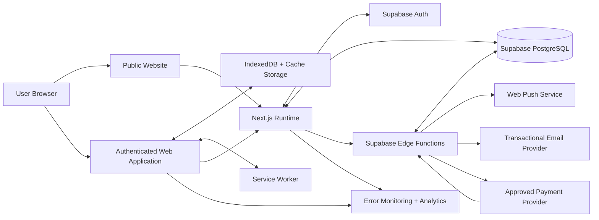
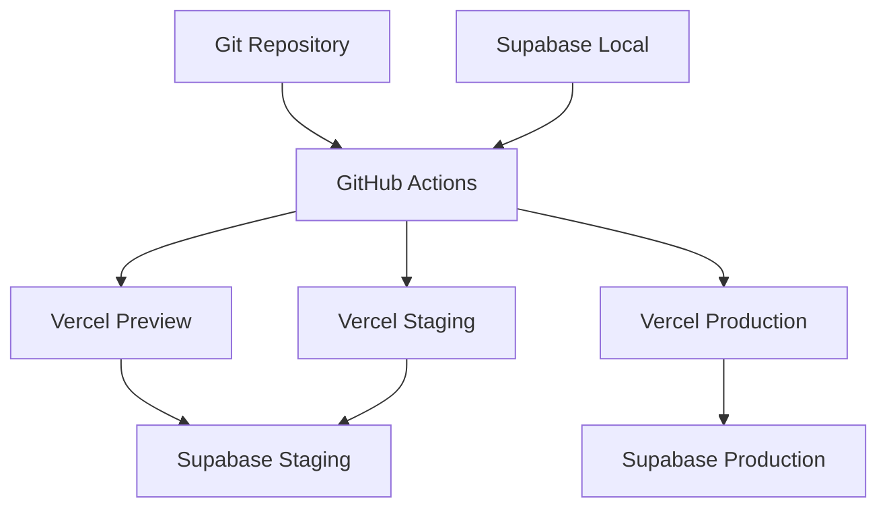
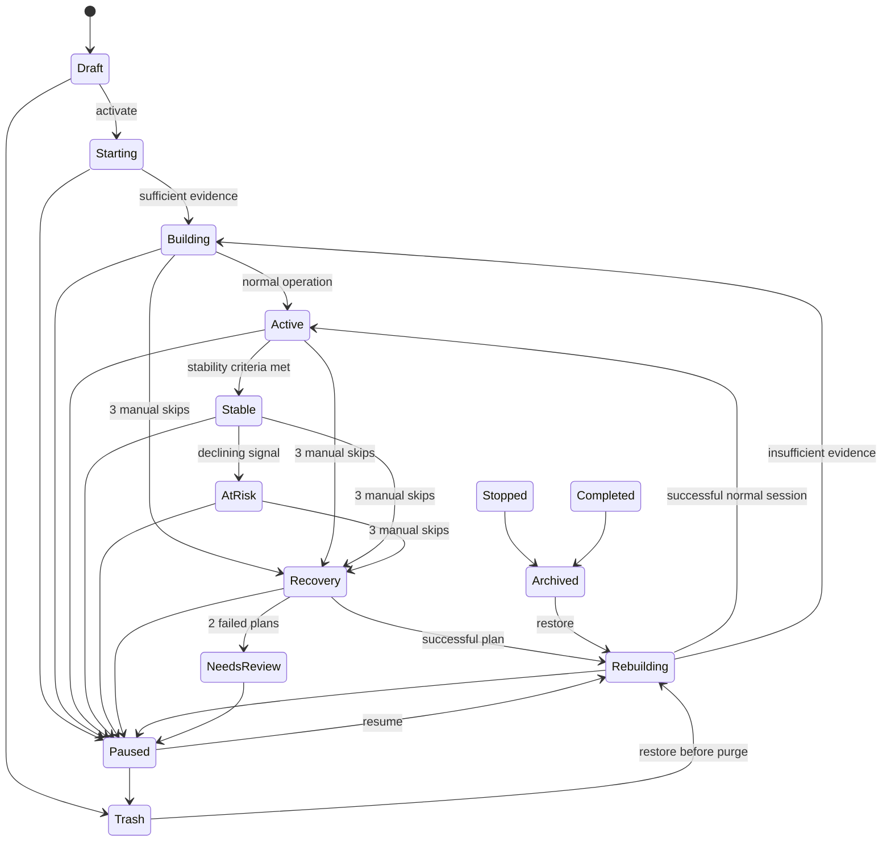
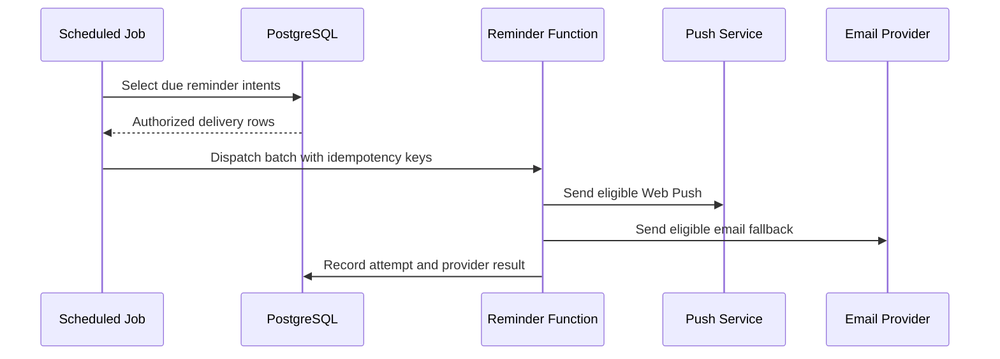
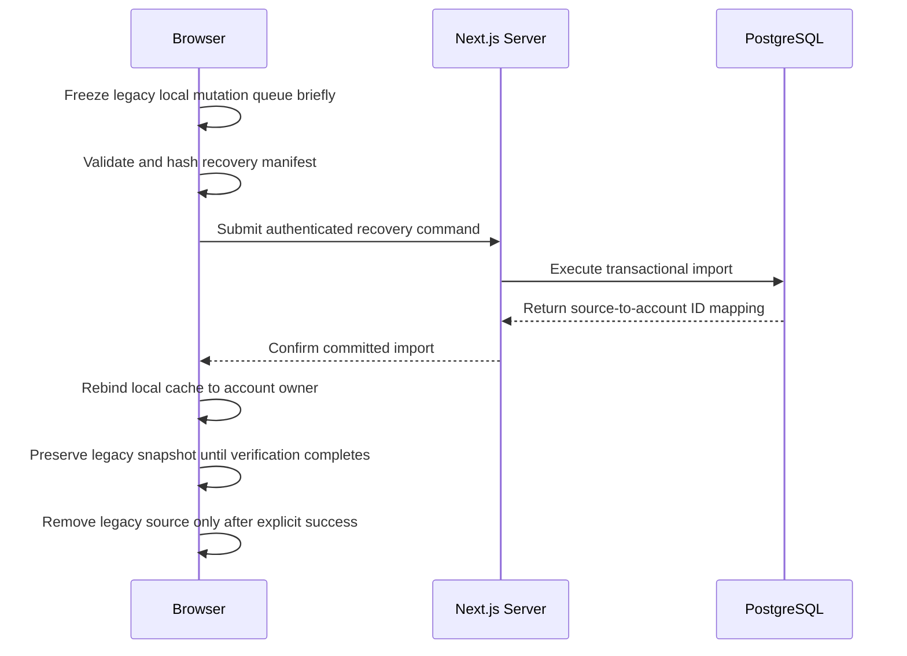
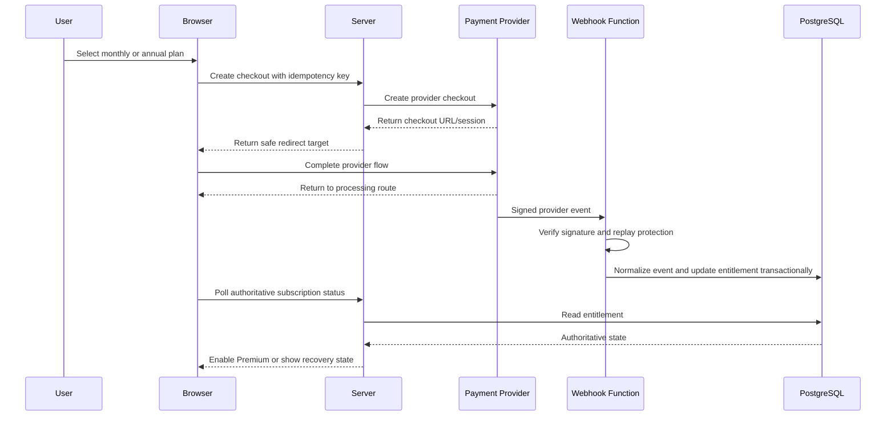

# Recovery-First Habit Tracker

## Website Technical Design Specification

**Document type:** System architecture and engineering specification  
**Platform:** Responsive website and installable Progressive Web App  
**Product stage:** Greenfield / pre-development  
**Architecture style:** Cloud-backed web application with browser-local resilience  
**Primary runtime:** Next.js App Router with TypeScript  
**Primary backend:** Supabase PostgreSQL, Auth, Row Level Security, and Edge Functions  
**Prepared:** 28 July 2026

## Source-of-truth dependencies

1. `docs/specs/PRD.md`
2. `docs/specs/UX-FLOWS.md`
3. `docs/specs/UI-SPEC.md`
4. This document
5. Approved Architecture Decision Records
6. Active detailed implementation plan

> **Greenfield scope**
>
> This specification defines the first technical implementation of the Recovery-First Habit Tracker. It assumes no existing application, database, production deployment, or legacy integration.

---

# Document Map

1. Purpose and engineering principles
2. System context and architecture
3. Technology stack
4. Environments and configuration
5. Repository and module structure
6. Runtime boundaries
7. Routing and rendering strategy
8. Identity, authentication, and authorization
9. Browser-local cache and legacy data
10. PostgreSQL data model
11. Row Level Security and database authorization
12. Domain rules and state machines
13. Session generation and time model
14. Check-ins, metrics, and deterministic computation
15. Recommendation, Recovery, and Review engines
16. Reminder architecture
17. Offline resilience and synchronization
18. Legacy local data recovery
19. Subscription, payment, and entitlement architecture
20. Application interfaces and server operations
21. Security architecture
22. Privacy, export, retention, and deletion
23. Observability and analytics
24. Performance and caching
25. Accessibility and localization
26. SEO and public-site delivery
27. Testing strategy
28. CI/CD and release architecture
29. Operations and incident handling
30. Engineering constraints and acceptance gates
31. Architecture decisions summary

---

# 1. Purpose and Engineering Principles

## 1.1 Purpose

This document translates the approved product requirements, UX flows, and UI specification into an implementable web architecture. It defines system boundaries, data ownership, persistence models, authorization rules, synchronization behavior, service interfaces, security controls, and verification expectations.

It does not replace the PRD or UX specification. Product behavior remains authoritative in those documents. This document determines how that behavior is implemented safely and consistently.

## 1.2 Engineering principles

### Local responsiveness, cloud authority

- Account data is cloud-authoritative; IndexedDB is a cache, draft store, and pending-operation store.
- Signed-in account data is canonically stored in Supabase PostgreSQL.
- The browser keeps a structured cache and durable pending-operation queue for fast interaction and temporary connectivity loss.
- Product actions confirm locally first when safe, then synchronize using stable identifiers and idempotency keys.

### Recovery before punishment

- Historical data is never destroyed merely because a habit is missed, redesigned, paused, downgraded, or restored.
- State transitions are explicit, auditable, and reversible where the product specification requires reversibility.
- Automatic Skipped and Manual Skipped remain technically distinct because they affect Recovery differently.

### Server authority for trust-sensitive state

The following are always server-authoritative:

- authenticated identity;
- account ownership;
- plan and entitlement;
- payment-event processing;
- cross-device conflict resolution;
- account deletion state;
- security-sensitive timestamps;
- authorization decisions;
- active-habit limit reconciliation for signed-in users.

### Browser honesty

- Browser capabilities are detected rather than assumed.
- Web Push is optional and capability-dependent.
- Legacy browser-local data loss risks are disclosed accurately.
- Offline support is limited to explicitly supported actions.
- The UI never claims that a reminder was delivered merely because it was scheduled.

### Determinism and idempotency

- Session generation is deterministic and safe to rerun.
- Check-in writes use stable IDs and idempotency keys.
- Payment events are processed exactly once from the product perspective.
- Legacy local-data recovery can be retried without creating duplicate habits, versions, sessions, or check-ins.

### Explicit boundaries

- UI components do not directly encode business rules.
- Domain services do not import framework-specific rendering APIs.
- Privileged server code does not execute in browser bundles.
- Payment-provider behavior is translated into an internal entitlement model.
- Analytics is isolated from operational domain data.

---

# 2. System Context and Architecture

## 2.1 Context diagram



## 2.2 High-level architecture

```text
Browser
├── Next.js-rendered public pages
├── Next.js application shell
├── React Client Components for interactive workflows
├── TanStack Query for server-state coordination
├── IndexedDB for account cache, legacy local data recovery, durable cache, and pending operations
├── Service Worker for application-shell caching and Web Push
└── BroadcastChannel for same-origin tab coordination

Server
├── Next.js Server Components for authenticated initial reads
├── Server Actions for scoped form commands where appropriate
├── Route Handlers for explicit HTTP APIs and provider callbacks
├── proxy.ts for lightweight session refresh and route gating
└── Vercel runtime for web delivery

Backend
├── Supabase Auth
├── PostgreSQL canonical account data
├── Row Level Security
├── SQL functions and transactional procedures
├── Scheduled jobs
└── Edge Functions for privileged or externally triggered workflows
```

## 2.3 Deployment topology



## 2.4 Canonical source ownership

| Data category | Signed-in account |
|---|---|
| Habits and versions | PostgreSQL with IndexedDB cache |
| Sessions and check-ins | PostgreSQL with IndexedDB cache |
| Drafts | IndexedDB, optionally synchronized when explicitly supported |
| UI preferences | PostgreSQL with local cache |
| Authentication session | Secure Supabase SSR cookies |
| Pending operations | IndexedDB until acknowledged |
| Subscription entitlement | PostgreSQL, derived from verified provider events |
| Push subscription | PostgreSQL for signed-in users |
| Analytics consent | PostgreSQL plus local cache |

---

# 3. Technology Stack

## 3.1 Core stack

| Area | Technology | Responsibility |
|---|---|---|
| Web framework | Next.js App Router | Routing, rendering, Server Components, Server Functions, Route Handlers |
| Language | TypeScript with strict mode | Compile-time safety across browser and server code |
| UI runtime | React | Interactive application surfaces |
| Styling | Tailwind CSS | Token-driven responsive styling |
| Component foundation | shadcn/ui primitives | Accessible reusable component implementation |
| Icons | Lucide | Consistent line-icon set |
| Server state | TanStack Query | Query lifecycle, mutation state, invalidation, optimistic UI |
| Local UI state | Zustand, limited use | Cross-component ephemeral UI state only |
| Forms | React Hook Form | Form state and accessible validation |
| Validation | Zod | Shared input and environment validation |
| Browser database | IndexedDB through Dexie | Account cache, queue, drafts, and local resilience |
| Backend | Supabase | Auth, PostgreSQL, RLS, storage, scheduled jobs, Edge Functions |
| Hosting | Vercel | Web runtime, preview deployments, production delivery |
| Unit tests | Vitest | Domain and utility tests |
| Component tests | React Testing Library | Component behavior and accessibility-oriented interaction |
| End-to-end tests | Playwright | Browser workflows and responsive checks |
| Error monitoring | Sentry-compatible adapter | Runtime errors and performance traces with redaction |
| Product analytics | PostHog-compatible adapter | Privacy-safe product events |

## 3.2 Package policy

- Production packages must have one documented responsibility.
- Framework utilities are preferred over custom infrastructure when behavior is stable and testable.
- No package may be added solely for a single trivial helper.
- Browser-only packages must never be imported by Server Components unless isolated behind a Client Component boundary.
- Server-only modules must include `server-only` protection where supported.
- Dependency versions are locked through `pnpm-lock.yaml`.
- Automated dependency updates must run tests and require review before merge.

## 3.3 State-management policy

Use the narrowest state mechanism that fits the requirement:

1. URL state for shareable filters, tabs, and pagination.
2. Server Component data for initial secure reads.
3. TanStack Query for mutable remote account data and synchronization state.
4. React local state for component-local interactions.
5. React Hook Form for forms.
6. Zustand only for application-wide ephemeral state that is not server data, such as an open global command surface.
7. IndexedDB for durable browser data and pending operations.

Business entities must not be duplicated in Zustand.

---

# 4. Environments and Configuration

## 4.1 Environments

| Environment | Purpose | Web deployment | Backend |
|---|---|---|---|
| Local | Development and automated local integration | `localhost` | Supabase Local through Docker |
| Preview | Pull-request and branch validation | Vercel Preview | Supabase Staging |
| Staging | Release-candidate verification | Dedicated staging domain | Supabase Staging |
| Production | Public service | Production domain | Supabase Production |

Preview deployments must never connect to the production database.

## 4.2 Environment variable classes

### Browser-exposed variables

```text
NEXT_PUBLIC_APP_URL
NEXT_PUBLIC_SUPABASE_URL
NEXT_PUBLIC_SUPABASE_PUBLISHABLE_KEY
NEXT_PUBLIC_SENTRY_DSN
NEXT_PUBLIC_ANALYTICS_KEY
NEXT_PUBLIC_ANALYTICS_HOST
```

Only values explicitly safe for public browser exposure may use the `NEXT_PUBLIC_` prefix.

### Server-only variables

```text
SUPABASE_SERVICE_ROLE_KEY
PAYMENT_PROVIDER_SECRET_KEY
PAYMENT_WEBHOOK_SECRET
EMAIL_PROVIDER_API_KEY
WEB_PUSH_VAPID_PRIVATE_KEY
WEB_PUSH_VAPID_SUBJECT
SENTRY_AUTH_TOKEN
CRON_SHARED_SECRET
DATA_EXPORT_SIGNING_SECRET
```

### Shared non-secret configuration

```text
APP_ENVIRONMENT
APP_DEFAULT_LOCALE
APP_DEFAULT_TIMEZONE
PAYMENT_PROVIDER
EMAIL_PROVIDER
FEATURE_WEB_PUSH
FEATURE_PREMIUM
FEATURE_ANALYTICS
```

## 4.3 Validation

- Environment variables are validated during build and server startup with Zod.
- Missing required server secrets fail deployment rather than producing partial runtime behavior.
- Preview and staging builds verify that production-only credentials are absent.
- `.env.example` documents names and expected formats without real values.
- `.env.local`, provider secrets, service-account files, and signing material are excluded from Git.

---

# 5. Repository and Module Structure

```text
recovery-first-habit-tracker/
├── AGENTS.md
├── README.md
├── package.json
├── pnpm-lock.yaml
├── next.config.ts
├── tsconfig.json
├── eslint.config.mjs
├── postcss.config.mjs
├── components.json
├── vitest.config.ts
├── playwright.config.ts
├── proxy.ts
├── .env.example
├── .gitignore
│
├── docs/
│   ├── specs/
│   │   ├── PRD.md
│   │   ├── UX-FLOWS.md
│   │   ├── UI-SPEC.md
│   │   └── TECHNICAL-DESIGN.md
│   ├── implementation/
│   ├── architecture/
│   └── operations/
│
├── public/
│   ├── icons/
│   ├── illustrations/
│   ├── manifest.webmanifest
│   └── offline.html
│
├── src/
│   ├── app/
│   │   ├── (public)/
│   │   ├── (auth)/
│   │   ├── (app)/
│   │   ├── api/
│   │   ├── layout.tsx
│   │   ├── error.tsx
│   │   ├── global-error.tsx
│   │   ├── not-found.tsx
│   │   └── globals.css
│   │
│   ├── components/
│   │   ├── ui/
│   │   ├── layout/
│   │   ├── navigation/
│   │   ├── forms/
│   │   ├── feedback/
│   │   └── data-display/
│   │
│   ├── features/
│   │   ├── authentication/
│   │   ├── habits/
│   │   ├── check-ins/
│   │   ├── reminders/
│   │   ├── recovery/
│   │   ├── weekly-review/
│   │   ├── insights/
│   │   ├── subscriptions/
│   │   ├── settings/
│   │   └── data-management/
│   │
│   ├── domain/
│   │   ├── habits/
│   │   ├── sessions/
│   │   ├── recommendations/
│   │   ├── subscriptions/
│   │   └── shared/
│   │
│   ├── lib/
│   │   ├── supabase/
│   │   ├── database/
│   │   ├── offline/
│   │   ├── payments/
│   │   ├── notifications/
│   │   ├── email/
│   │   ├── analytics/
│   │   ├── observability/
│   │   ├── security/
│   │   ├── validation/
│   │   └── time/
│   │
│   ├── providers/
│   ├── hooks/
│   ├── types/
│   └── test-support/
│
├── supabase/
│   ├── config.toml
│   ├── migrations/
│   ├── seed.sql
│   ├── tests/
│   └── functions/
│       ├── process-payment-webhook/
│       ├── reconcile-entitlement/
│       ├── dispatch-reminders/
│       ├── create-data-export/
│       ├── delete-account/
│       └── health/
│
├── tests/
│   ├── unit/
│   ├── integration/
│   ├── contract/
│   ├── e2e/
│   ├── accessibility/
│   ├── fixtures/
│   └── helpers/
│
└── .github/
    └── workflows/
        ├── quality.yml
        ├── database.yml
        ├── e2e.yml
        └── release.yml
```

## 5.1 Feature module contract

Each feature may contain:

```text
feature-name/
├── application/
├── components/
├── hooks/
├── server/
├── schemas/
├── queries/
├── mutations/
├── types/
└── index.ts
```

Rules:

- `application/` coordinates use cases.
- `server/` contains server-only commands and reads.
- `queries/` and `mutations/` contain TanStack Query definitions.
- `components/` contains feature-owned UI, not generic controls.
- `schemas/` contains Zod schemas for external input.
- Features may depend on `domain`, `lib`, and `components/ui`.
- Features may not import private internals from another feature; use its public `index.ts` contract.

---

# 6. Runtime Boundaries

## 6.1 Server Components

Use Server Components for:

- public-page content;
- initial authenticated account shell data;
- server-authorized reads;
- subscription status presentation;
- private route metadata that must not enter client bundles;
- static or slowly changing content.

Server Components must not access IndexedDB, service workers, browser notifications, or `window`.

## 6.2 Client Components

Use Client Components for:

- check-in controls;
- habit creation wizard;
- signed-in account cache and pending-operation state;
- offline queue state;
- responsive dialogs and drawers;
- Web Push permission;
- charts requiring interaction;
- same-tab optimistic updates;
- multiple-tab coordination.

Client boundaries should be narrow. A route should not become fully client-rendered merely because one control is interactive.

## 6.3 Server Actions

Use Server Actions for authenticated, same-origin form commands when:

- the command is initiated by a rendered form;
- no third-party callback contract is required;
- the response can use typed success or field-error results;
- idempotency is still applied for retryable commands.

Do not use Server Actions for:

- payment-provider webhooks;
- Web Push delivery callbacks;
- externally called APIs;
- long-running exports;
- service-worker synchronization endpoints.

## 6.4 Route Handlers

Use Route Handlers for:

- authentication callbacks;
- explicit synchronization endpoints;
- checkout-session creation;
- payment return status;
- data-export download authorization;
- Web Push subscription registration;
- internal health endpoints;
- provider-independent APIs called by service workers.

## 6.5 Edge Functions

Use Supabase Edge Functions for privileged or externally triggered workflows:

- payment webhook verification and normalization;
- entitlement reconciliation;
- reminder dispatch;
- email sending coordination;
- account deletion orchestration;
- export generation;
- scheduled cleanup and retention jobs.

---

# 7. Routing and Rendering Strategy

## 7.1 Public routes

```text
/
/features
/how-it-works
/pricing
/help
/status
/legal/privacy
/legal/terms
/legal/cookies
/auth/sign-in
/auth/forgot-password
/auth/update-password
/auth/callback
```

Public content uses static generation or cached server rendering where practical. Private data is never embedded in public-page output.

Private application routes are authenticated-only. Time is device-derived: a client component detects the device timezone and week-start day on load, applies them before the first render, and syncs them to the profile idempotently when they differ.

## 7.2 Application routes

```text
/app/today
/app/habits
/app/habits/new
/app/habits/[habitId]
/app/habits/[habitId]/history
/app/review
/app/review/weekly/[reviewId]
/app/review/recovery/[recoveryPlanId]
/app/review/check-ins
/app/insights
/app/reminders
/app/settings
/app/settings/profile
/app/settings/preferences
/app/settings/privacy
/app/settings/export
/app/settings/account
/app/subscription
/app/subscription/processing
```

## 7.3 Route protection

- `proxy.ts` performs lightweight cookie refresh, optimistic route gating, security-header application, and redirects.
- Proxy is not the final authorization layer.
- Every server read and mutation verifies the authenticated user and resource ownership.
- PostgreSQL RLS remains the final data-authorization boundary.
- Application routes require a valid account session before initializing account cache and pending-operation state.

## 7.4 Rendering rules

| Route class | Rendering strategy |
|---|---|
| Marketing and legal | Static or revalidated server rendering |
| Pricing | Server-rendered with cached approved plan configuration |
| Auth callback | Dynamic Route Handler |
| Signed-in Today | Server-prefetched account summary plus client synchronization |
| Account application | Server-delivered shell with authenticated account cache |
| Insights | Server-authorized query with client chart rendering |
| Subscription | Dynamic server-authorized rendering |
| Processing payment | Dynamic polling of backend entitlement state |

## 7.5 Error boundaries

- Global errors use `global-error.tsx`.
- Route-group errors use route-local `error.tsx`.
- Not-found resources use `not-found.tsx` or typed resource-not-found states.
- Offline failure is not represented as a generic server error when cached content is available.
- Sensitive error details are logged server-side and replaced with safe user-facing messages.

---

# 8. Identity, Authentication, and Authorization

## 8.1 Identity modes

```text
Free Account
Lite Account
Premium Account
```

All normal product identities are authenticated Supabase accounts. Legacy browser-local data is a recoverable dataset, not an account or entitlement.

## 8.2 Authentication methods

- Google OAuth through Supabase Auth.
- Email OTP or magic link through Supabase Auth.
- Password recovery through Supabase Auth recovery links.
- Authentication uses PKCE-compatible browser flows and secure cookie-based SSR sessions.
- The callback validates the intended destination before redirecting.
- A `type=recovery` callback query parameter routes to the password-update page instead of the standard sign-in bootstrap.
- The password-update page requires a valid Supabase session before `updateUser` is called.

## 8.3 Supabase client separation

```text
src/lib/supabase/client.ts   → browser client
src/lib/supabase/server.ts   → Server Components, Server Actions, Route Handlers
src/lib/supabase/admin.ts    → privileged server-only client
```

`admin.ts` must:

- be marked server-only;
- use the service-role key;
- never be imported from browser-reachable modules;
- be restricted to explicit privileged operations.

## 8.4 Session lifecycle

1. User authenticates through Google or email.
2. Supabase creates the Auth session.
3. Auth callback exchanges the code and establishes secure cookies.
4. The application ensures an internal `profiles` row exists.
5. The server loads plan and entitlement state.
6. The browser initializes the signed-in local cache.
7. If legacy local data exists, the recovery or export flow is offered contextually.
8. The client detects the device timezone and week-start day, applies them immediately, and syncs them to the profile when they differ; the account lands on Today.

## 8.5 Authorization layers

```text
Layer 1: Route-level authentication check
Layer 2: Server operation resource-ownership check
Layer 3: PostgreSQL Row Level Security
Layer 4: Domain invariant checks
Layer 5: Entitlement and active-limit checks
```

No client-side check is considered authorization.

## 8.6 Session expiration

- Expired sessions preserve the intended route.
- Unsynchronized local operations remain in IndexedDB.
- The UI blocks cloud-only writes while authentication is unresolved.
- Reauthentication resumes synchronization only after the current user identity matches the queue owner.
- A queue created for one account must never synchronize into another account.

---

# 9. Browser-Local Cache and Legacy Data

## 9.1 IndexedDB databases

Use one versioned Dexie database per website origin:

```text
recovery_first_web
```

Core local tables:

| Table | Purpose |
|---|---|
| `local_profiles` | Cached authenticated account identity and plan |
| `browser_installations` | Installation ID and capability state |
| `habits` | Signed-in cached habits |
| `habit_versions` | Immutable configuration snapshots |
| `sessions` | Scheduled occurrences |
| `check_ins` | Outcomes and friction references |
| `recommendations` | Proposed and decided changes |
| `recovery_plans` | Recovery progress |
| `review_items` | Weekly and contextual review items |
| `reminder_configs` | Local schedule and channel state |
| `drafts` | Habit wizard and form drafts |
| `pending_operations` | Durable outbox |
| `sync_metadata` | Cursors, revisions, and last-success timestamps |
| `query_cache` | Selected persisted read models |
| `settings` | Locale, timezone, UI, and consent preferences |

## 9.2 Account-local identity

- The account identity comes from the validated Supabase session.
- The browser installation ID identifies local cache ownership and grants no server authorization.
- Account-local cache remains scoped to the authenticated account and browser installation.
- The application must function after a browser restart when storage remains available.
- Private browsing is detected where practical but not relied upon; clear disclosure is always shown.

## 9.3 Local schema versioning

- Dexie migrations are append-only and tested from every supported prior schema version.
- A failed local migration does not delete the existing database.
- Before destructive local repair, the application offers export when readable data exists.
- Schema migrations are idempotent and resumable.

## 9.4 Storage limits and eviction

- The application requests persistent storage where supported after the user demonstrates value, not during first visit.
- Storage usage is monitored through available browser APIs.
- Large derived caches are evictable; canonical PostgreSQL records are not deliberately evicted by browser storage pressure.
- Query cache and image cache are cleared before domain records when space pressure is detected.

## 9.5 Account active limits

- Free, Lite, and Premium active limits are five, ten, and thirty.
- Activation is evaluated in the authoritative account transaction.
- Multiple tabs coordinate activation through BroadcastChannel and a local mutex record.
- If two tabs temporarily activate beyond the limit, deterministic reconciliation returns the later activation to Draft and displays a recoverable explanation.

---

# 10. PostgreSQL Data Model

## 10.1 Conventions

- Primary keys use UUIDs generated before network submission.
- Every account-owned table includes `user_id uuid not null`.
- Mutable rows include `revision bigint not null default 1`.
- Mutable rows include `created_at`, `updated_at`, and where relevant `deleted_at`.
- Timestamps use `timestamptz`.
- User-facing scheduled dates use explicit local-date and timezone fields.
- Enum-like product states use PostgreSQL enums or constrained text, selected per migration stability.
- Free-text fields have documented maximum lengths.

## 10.2 Core tables

### `profiles`

| Column | Type | Notes |
|---|---|---|
| `id` | uuid | Equals `auth.users.id` |
| `display_name` | text | Optional |
| `locale` | text | BCP 47 language tag |
| `timezone` | text | IANA timezone, synced from the device on application load |
| `week_start` | smallint | Validated 1–7, synced from the device locale on application load |
| `quiet_hours_start` | time | Optional |
| `quiet_hours_end` | time | Optional |
| `plan_code` | text | Cached display value, not sole entitlement authority |
| `created_at` | timestamptz | Server-generated |
| `updated_at` | timestamptz | Server-generated |
| `deletion_requested_at` | timestamptz | Nullable |

### `browser_installations`

| Column | Type | Notes |
|---|---|---|
| `id` | uuid | Browser-generated installation ID |
| `user_id` | uuid | Account owner |
| `display_name` | text | User-visible browser label |
| `push_capability` | text | supported, unsupported, denied, granted, expired |
| `last_seen_at` | timestamptz | Operational freshness |
| `revoked_at` | timestamptz | Stops future delivery |
| `created_at` | timestamptz | Audit |

### `habits`

| Column | Type | Notes |
|---|---|---|
| `id` | uuid | Stable identity across versions |
| `user_id` | uuid | Owner |
| `title` | text | Required |
| `category` | text | Optional controlled value |
| `lifecycle_state` | text | Current state |
| `current_version_id` | uuid | Current approved version |
| `state_changed_at` | timestamptz | Audit |
| `revision` | bigint | Optimistic concurrency |
| `created_at` | timestamptz | Audit |
| `updated_at` | timestamptz | Audit |
| `deleted_at` | timestamptz | Trash timestamp |
| `purge_after` | timestamptz | Normally 30 days after Trash |

### `habit_versions`

| Column | Type | Notes |
|---|---|---|
| `id` | uuid | Immutable version ID |
| `habit_id` | uuid | Parent habit |
| `user_id` | uuid | Denormalized for RLS |
| `version_number` | integer | Monotonic within habit |
| `normal_target` | jsonb | Structured target definition |
| `minimum_target` | jsonb | Structured minimum definition |
| `schedule_rule` | jsonb | Validated recurrence rule |
| `cue` | jsonb | Optional context cue |
| `recovery_structure` | jsonb | Recovery defaults |
| `effective_from_session_id` | uuid | First affected session where known |
| `source` | text | creation, redesign, recommendation, restore |
| `parent_version_id` | uuid | Lineage |
| `created_at` | timestamptz | Immutable audit |

Published version rows are immutable. Corrections create a new version.

### `sessions`

| Column | Type | Notes |
|---|---|---|
| `id` | uuid | Deterministic or pre-generated stable ID |
| `habit_id` | uuid | Parent habit |
| `habit_version_id` | uuid | Version that generated session |
| `user_id` | uuid | Owner |
| `scheduled_local_date` | date | User-visible occurrence date |
| `scheduled_local_time` | time | Optional |
| `timezone_snapshot` | text | IANA timezone at generation |
| `eligible_at` | timestamptz | UTC eligibility instant |
| `resolution_due_at` | timestamptz | End of Unrecorded window |
| `status` | text | unrecorded, full, minimum, manual_skipped, automatic_skipped, excused |
| `status_source` | text | user, system, import |
| `revision` | bigint | Edit concurrency |
| `created_at` | timestamptz | Audit |
| `updated_at` | timestamptz | Audit |

Unique constraint:

```text
(habit_id, habit_version_id, scheduled_local_date, scheduled_local_time)
```

The exact uniqueness expression accounts for all-day and timed habits without collapsing distinct valid occurrences.

### `check_ins`

| Column | Type | Notes |
|---|---|---|
| `id` | uuid | Stable write ID |
| `session_id` | uuid | One current check-in per session |
| `user_id` | uuid | Owner |
| `outcome` | text | full, minimum, manual_skipped, excused |
| `friction_code` | text | Optional controlled code |
| `friction_note` | text | Optional sensitive free text |
| `recorded_at` | timestamptz | Server accepted time |
| `recorded_local_at` | timestamptz | Browser event time for audit |
| `timezone_snapshot` | text | User-facing time context |
| `revision` | bigint | Same-day edit concurrency |
| `created_at` | timestamptz | Audit |
| `updated_at` | timestamptz | Audit |

A partial unique index enforces one non-deleted current check-in per session.

### `check_in_history`

Stores append-only prior outcomes when same-day edits occur.

### `recommendations`

| Column | Type | Notes |
|---|---|---|
| `id` | uuid | Stable recommendation ID |
| `habit_id` | uuid | Target habit |
| `habit_version_id` | uuid | Evidence context |
| `user_id` | uuid | Owner |
| `signal_code` | text | Dominant observed signal |
| `evidence` | jsonb | Structured and bounded evidence |
| `proposed_change` | jsonb | One-variable change |
| `explanation_key` | text | Localizable explanation template |
| `status` | text | pending, applied, customized, kept_current, expired |
| `decision_payload` | jsonb | Final user choice |
| `decided_at` | timestamptz | Nullable |
| `created_version_id` | uuid | New version if applied/customized |
| `created_at` | timestamptz | Audit |

### `recovery_plans`

| Column | Type | Notes |
|---|---|---|
| `id` | uuid | Stable ID |
| `habit_id` | uuid | Parent habit |
| `habit_version_id` | uuid | Starting context |
| `user_id` | uuid | Owner |
| `status` | text | proposed, active, deferred, succeeded, failed, cancelled |
| `target_definition` | jsonb | Recovery target |
| `duration_sessions` | integer | Bounded by product rules |
| `success_threshold` | integer | Required successful sessions |
| `started_at` | timestamptz | Nullable |
| `completed_at` | timestamptz | Nullable |
| `failure_sequence` | integer | Consecutive failed plan count |
| `created_at` | timestamptz | Audit |

### `review_cycles`

Represents a Weekly Review window and completion state.

### `review_items`

Represents ordered attention items, recommendation decisions, and unresolved Unrecorded sessions.

### `reminder_configs`

Stores logical reminder intent independent of delivery channel.

### `push_subscriptions`

Stores encrypted or protected browser push endpoint data, installation ownership, capability status, and revocation state.

### `email_preferences`

Stores verified email eligibility, reminder opt-in, frequency, and unsubscribe state.

### `entitlements`

| Column | Type | Notes |
|---|---|---|
| `id` | uuid | Internal entitlement ID |
| `user_id` | uuid | Owner |
| `product_code` | text | Lite or Premium product |
| `status` | text | trial_active, active, grace_period, past_due, cancelled, expired, refunded, revoked |
| `valid_from` | timestamptz | Authority window |
| `valid_until` | timestamptz | Nullable for open active interval |
| `cancel_at_period_end` | boolean | Renewal state |
| `provider_customer_id` | text | Server-only access policy |
| `provider_subscription_id` | text | Unique provider mapping |
| `revision` | bigint | Reconciliation revision |
| `updated_at` | timestamptz | Audit |

### `payment_events`

Append-only normalized event ledger with provider event ID unique constraint, signature result, processing status, payload hash, timestamps, and error classification. Raw provider payload retention follows the approved security policy.

### `idempotency_records`

Stores command key, user, operation type, request hash, result reference, and expiry.

### `audit_events`

Stores security-sensitive operations without habit free text or prohibited analytics data.

## 10.3 Required indexes

At minimum:

- `habits(user_id, lifecycle_state)`
- `habits(user_id, deleted_at)`
- `habit_versions(habit_id, version_number desc)`
- `sessions(user_id, scheduled_local_date)`
- `sessions(habit_id, scheduled_local_date)`
- `sessions(user_id, status, resolution_due_at)`
- `check_ins(session_id)`
- `recommendations(user_id, status, created_at)`
- `review_items(user_id, status, priority)`
- `reminder_configs(user_id, enabled)`
- `entitlements(user_id, status)`
- `payment_events(provider_event_id)` unique
- `idempotency_records(user_id, operation_type, idempotency_key)` unique

## 10.4 Database functions

Use transactional SQL functions for operations that require cross-table invariants:

```text
activate_habit
record_check_in
edit_same_day_check_in
create_habit_version
apply_recommendation
start_recovery_plan
complete_recovery_plan
resolve_unrecorded_sessions
recover_legacy_local_dataset
apply_subscription_downgrade
soft_delete_habit
restore_habit_from_trash
request_account_deletion
```

Each function:

- verifies authenticated ownership;
- validates expected revision where required;
- enforces active limits;
- returns a typed result;
- records audit data where appropriate;
- remains idempotent for a repeated command key.

---

# 11. Row Level Security and Database Authorization

## 11.1 Policy baseline

RLS is enabled on every account-owned table.

Baseline policy shape:

```sql
user_id = auth.uid()
```

Policies are separated by operation where behavior differs.

## 11.2 Direct browser access

Direct Supabase browser access is permitted only for tables and views whose policies fully express the required authorization. Complex invariant-changing writes use transactional functions rather than direct table mutation.

## 11.3 Privileged operations

Only server-only or Edge Function code using the service role may:

- process payment webhooks;
- write authoritative entitlements;
- perform scheduled automatic classification;
- dispatch reminders;
- create signed export artifacts;
- execute account purge;
- read cross-user operational metrics;
- reconcile failed external events.

## 11.4 Views

Expose purpose-specific views rather than broad table access:

```text
today_session_view
habit_summary_view
weekly_review_summary_view
insight_consistency_view
subscription_status_view
```

Views must preserve RLS behavior and exclude provider secrets, internal risk flags, raw payment payloads, and security-only fields.

## 11.5 Active-limit enforcement

Active limits are enforced in the database transaction, not only in the UI:

```text
Free account: database transaction, limit 5
Lite account: database transaction, limit 10
Premium account: database transaction, limit 30
```

The database determines effective plan from authoritative entitlement and counts only slot-consuming lifecycle states.

---

# 12. Domain Rules and State Machines

## 12.1 Lifecycle states

```text
Draft
Starting
Building
Active
Stable
At Risk
Recovery
Rebuilding
Needs Review
Paused
Stopped
Completed
Archived
Trash
Decision Required
```

## 12.2 State transition service

All lifecycle transitions pass through one domain service and one server transaction for signed-in users.

The transition command includes:

```text
habit_id
from_state
requested_to_state
reason_code
expected_revision
idempotency_key
effective_at
```

The service validates:

- allowed source and destination;
- active-slot impact;
- reminder cancellation or regeneration;
- future-session changes;
- current Recovery state;
- Premium program implications;
- Trash retention timestamp;
- audit history.

## 12.3 Transition rules



## 12.4 Slot-consuming states

```text
Starting
Building
Active
Stable
At Risk
Recovery
Rebuilding
Needs Review
```

## 12.5 Version creation

Create a new Habit Version when changing:

- schedule;
- frequency;
- Normal target;
- Minimum target;
- cue;
- recovery structure;
- material program structure.

Reminder-only changes do not create a Habit Version unless they alter the behavioral cue contract defined by the PRD.

---

# 13. Session Generation and Time Model

## 13.1 Time ownership

- User preferences store an IANA timezone.
- Every session stores a timezone snapshot.
- Server time is authoritative for synchronization, security, and payment.
- User-visible session dates are derived from the session snapshot, not from the viewer's current browser timezone.

## 13.2 Recurrence model

Habit schedules use a validated internal recurrence representation rather than arbitrary untrusted recurrence strings.

Supported MVP forms include:

- selected weekdays;
- every day;
- N times per week with explicit session-placement policy;
- finite program dates;
- optional local reminder time.

## 13.3 Generation horizon

- Generate a bounded future horizon sufficient for Today, reminders, and Weekly Review.
- A scheduled job extends the horizon daily.
- Opening the application may run a safe catch-up generator for the current user.
- Generation is deterministic and guarded by unique constraints.

## 13.4 Unrecorded resolution

1. Session becomes eligible.
2. If no outcome exists, status is Unrecorded.
3. User may resolve within the three-day window.
4. After `resolution_due_at`, a scheduled job classifies the session as Automatic Skipped.
5. Automatic Skipped does not increment the Manual Skipped Recovery counter.
6. Check-in Review may surface unresolved Unrecorded sessions before automatic classification.

## 13.5 Timezone changes

- A timezone change affects future not-yet-materialized sessions.
- Existing sessions retain their snapshot.
- Sessions already eligible are not silently moved to another local date.
- Ambiguous daylight-saving times use a documented deterministic policy and are covered by tests.

---

# 14. Check-ins, Metrics, and Deterministic Computation

## 14.1 Check-in command

```ts
type RecordCheckInCommand = {
  commandId: string
  sessionId: string
  outcome: 'full' | 'minimum' | 'manual_skipped' | 'excused'
  frictionCode?: string
  frictionNote?: string
  expectedSessionRevision: number
  clientRecordedAt: string
  timezone: string
}
```

## 14.2 Local confirmation

For supported check-ins:

1. Validate command locally.
2. Write the check-in and pending operation in one IndexedDB transaction.
3. Update Today read model immediately.
4. Display `Saved locally` or `Pending synchronization` when offline.
5. Send the command when connectivity and authentication permit.
6. Replace local provisional server fields with the acknowledged result.

## 14.3 Server transaction

The server:

- validates ownership;
- validates the session is eligible for the requested outcome;
- checks same-day edit rules;
- enforces idempotency;
- writes current check-in and history;
- updates session status;
- recalculates affected counters;
- evaluates Recovery trigger;
- returns authoritative revisions.

## 14.4 Metrics

### Consistency

```text
successful eligible sessions / resolved eligible sessions
```

Successful sessions:

```text
Full + Minimum
```

Excluded sessions:

```text
Excused + paused + unscheduled + unresolved Unrecorded
```

### Continuity

- Full preserves continuity.
- Minimum preserves continuity.
- Manual Skipped breaks continuity.
- Automatic Skipped breaks continuity.
- Excused does not preserve and does not count as failure.
- Unrecorded remains pending.

### Recovery counter

- Manual Skipped increments.
- Full or Minimum resets.
- Automatic Skipped does not increment.
- Excused and Unrecorded do not increment.

## 14.5 Computation strategy

- Domain computations are implemented as pure TypeScript functions and mirrored or wrapped by SQL functions where database transactions require them.
- The same test fixtures verify TypeScript and SQL outcomes.
- Derived metrics may be cached, but source check-ins remain authoritative.
- Cached metrics include a computation version so algorithm changes can trigger recomputation.

---

# 15. Recommendation, Recovery, and Review Engines

## 15.1 Recommendation engine

The MVP uses deterministic rules, not an opaque generative model.

Input signals may include:

- repeated Manual Skipped outcomes;
- high Minimum share;
- repeated friction code;
- reminder dismissals or declines;
- unstable schedule performance;
- successful prior recovery target;
- unresolved Check-in Review items.

The engine emits at most one dominant recommendation per evaluation context.

```ts
type RecommendationProposal = {
  signalCode: string
  evidence: StructuredEvidence
  proposedChange: SingleVariableChange
  explanationKey: string
  effectiveSessionPolicy: 'next_eligible' | 'user_selected'
}
```

## 15.2 Decision contract

Every material recommendation supports:

```text
Apply
Customize
Keep Current
```

Apply and Customize may create a new Habit Version. Keep Current records the decision without modifying the habit.

## 15.3 Recovery trigger

Recovery is triggered after three consecutive Manual Skipped sessions for the current habit context. Automatic Skipped sessions do not satisfy the trigger.

The trigger transaction:

- verifies the sequence;
- prevents duplicate active plans;
- transitions lifecycle state to Recovery;
- creates a proposed Recovery Plan;
- creates a Review item;
- cancels or adapts stale future reminders according to the approved plan.

## 15.4 Recovery plan evaluation

- Plan duration and success threshold are stored explicitly.
- Each eligible Recovery session contributes to plan progress.
- A successful plan transitions the habit to Rebuilding.
- Two consecutive failed Recovery Plans transition the habit to Needs Review.
- Deferral is stored and does not destroy the plan proposal.

## 15.5 Weekly Review

A Weekly Review cycle is generated on the user's selected review day.

Priority order:

1. Needs Review
2. Recovery decision
3. Unrecorded or Check-in Review
4. At Risk
5. Pending recommendation
6. Stable confirmation or informational progress

Batch approval may be used only when each item remains individually understandable and reversible.

## 15.6 Check-in Review

Check-in Review analyzes unresolved sessions and presents:

- session date;
- current status;
- available resolution actions;
- effect on metrics;
- whether the action may influence Recovery.

Resolution uses the same check-in command path as Today.

---

# 16. Reminder Architecture

## 16.1 Channels

```text
In-application reminder state
Web Push where supported and permitted
Email fallback for eligible signed-in users
```

## 16.2 Logical reminder model

A reminder configuration describes user intent independently of provider delivery:

```ts
type ReminderConfiguration = {
  id: string
  habitId: string
  primaryLocalTime?: string
  followUpDelayMinutes?: number
  channels: Array<'in_app' | 'web_push' | 'email'>
  quietHours?: { start: string; end: string }
  enabled: boolean
  timezone: string
  revision: number
}
```

## 16.3 Web Push permission

- Permission is requested only after contextual explanation.
- The browser native permission prompt is never triggered automatically on first visit.
- Denied, blocked, unsupported, granted, and expired are distinct capability states.
- Permission state is installation-specific.

## 16.4 Service Worker responsibilities

- cache the approved application shell and offline fallback;
- receive Web Push messages;
- display notification content that contains no sensitive habit details unless explicitly approved by policy;
- route notification clicks to stable application URLs;
- communicate delivery interactions where browser support permits;
- avoid implementing domain business rules.

## 16.5 Delivery pipeline



## 16.6 Idempotency and stale cancellation

- Every delivery intent receives a deterministic key.
- Updated or disabled reminders invalidate future stale intents.
- Completed check-ins cancel unnecessary follow-up reminders.
- Quiet-hour calculation occurs using the reminder timezone.
- Delivery status distinguishes scheduled, attempted, accepted by provider, failed, and expired; it does not claim human receipt.

---

# 17. Offline Resilience and Synchronization

## 17.1 Supported offline actions

- view previously cached application shell;
- view locally cached Today, Habits, Review summaries, and settings;
- create or edit a signed-in account habit;
- record supported signed-in check-ins;
- record signed-in check-ins into the pending queue;
- edit same-day pending check-ins before server acknowledgement;
- preserve habit wizard drafts;
- approve selected locally representable decisions that do not require immediate server authority.

## 17.2 Online-required actions

- sign in or complete authentication callback;
- recover legacy local data into an account;
- start checkout;
- refresh entitlement;
- send email;
- register a new server-side push subscription;
- create cloud export;
- request account deletion;
- resolve server conflicts requiring cloud history;
- perform privileged billing operations.

## 17.3 Pending operation model

```ts
type PendingOperation = {
  id: string
  ownerType: 'account'
  ownerId: string
  operationType: string
  entityType: string
  entityId: string
  idempotencyKey: string
  expectedRevision?: number
  payload: unknown
  createdAt: string
  attemptCount: number
  nextAttemptAt: string
  status: 'pending' | 'processing' | 'blocked' | 'failed'
  lastErrorCode?: string
}
```

## 17.4 Queue processing

- One logical queue worker runs per account/browser context.
- BroadcastChannel coordinates the leader tab.
- A renewable IndexedDB lease prevents simultaneous workers.
- Operations preserve causal ordering per entity.
- Independent entities may synchronize concurrently within a bounded limit.
- Retry uses exponential backoff with jitter.
- Authentication, validation, conflict, and permanent provider errors do not retry blindly.

## 17.5 Conflict classes

| Conflict | Resolution |
|---|---|
| Duplicate command | Return prior idempotent result |
| Stale check-in edit | Fetch authoritative state and offer explicit resolution |
| Concurrent habit redesign | Preserve both candidate versions; user selects current version |
| Concurrent active-limit activation | Server accepts only allowed count; rejected habit returns to Draft or Paused |
| Deleted remotely, edited locally | Preserve local edit as recoverable draft; do not resurrect silently |
| Entitlement changed | Apply server entitlement and start downgrade resolution if required |

## 17.6 Pull synchronization

Signed-in synchronization uses revision-based incremental reads:

```text
last successful cursor
→ fetch rows changed after cursor
→ validate and apply to IndexedDB transactionally
→ advance cursor only after success
```

Tombstones are included until all supported clients have had sufficient opportunity to synchronize or retention policy allows purge.

## 17.7 Multiple tabs

- BroadcastChannel publishes entity-change notifications and queue ownership.
- `storage` events are a fallback for limited coordination.
- Tabs invalidate affected TanStack Query keys after acknowledged changes.
- A tab never trusts another tab for authorization or entitlement.
- Sensitive operation confirmation remains within the initiating tab.

---

# 18. Legacy Local Data Recovery

## 18.1 Recovery package

The browser prepares a bounded, validated conversion manifest containing:

- legacy local dataset ID;
- browser installation ID;
- habits;
- versions;
- sessions;
- check-ins;
- recommendations and decisions;
- Recovery plans;
- reminder settings;
- relevant preferences;
- stable source IDs;
- manifest hash;
- conversion idempotency key.

## 18.2 Recovery sequence



## 18.3 Recovery guarantees

- Retrying the same manifest creates no duplicates.
- Existing account data is not overwritten silently.
- Stable source IDs and manifest ID map imported records.
- Account active limits are evaluated after merge.
- Excess active habits require explicit user resolution; no history is deleted.
- Legacy local data remains intact until server confirmation and local verification.
- Push permission remains installation-specific.

---

# 19. Subscription, Payment, and Entitlement Architecture

## 19.1 Provider abstraction

Product code depends on an internal payment interface:

```ts
interface PaymentProvider {
  createCheckout(input: CreateCheckoutInput): Promise<CheckoutResult>
  createCustomerPortal(input: CustomerPortalInput): Promise<PortalResult>
  verifyWebhook(input: RawWebhookRequest): Promise<VerifiedProviderEvent>
  fetchSubscription(providerSubscriptionId: string): Promise<ProviderSubscription>
}
```

Provider-specific identifiers and event names remain inside the adapter.

## 19.2 Internal entitlement states

```text
trial_active
trial_cancelled
active
grace_period
past_due
cancelled
expired
refunded
revoked
```

The browser never grants Premium from:

- checkout return URL;
- query string;
- local storage;
- client-side receipt;
- unverified provider response.

## 19.3 Checkout sequence



## 19.4 Trial rules

- Trial begins only after explicit plan confirmation and valid backend entitlement creation.
- No plan is selected by default.
- Trial start is idempotent.
- Trial and billing dates are calculated server-side.
- Reminder notices are generated from authoritative dates.

## 19.5 Webhook processing

- Verify signature against raw request body.
- Reject invalid timestamps or replayed event IDs according to provider capabilities.
- Store provider event ID under a unique constraint.
- Normalize provider event to internal event type.
- Apply entitlement transition transactionally.
- Record processing status and recoverable error code.
- Return success for already processed valid duplicate events.
- Alert after repeated permanent failures.

## 19.6 Downgrade workflow

When a paid tier expires:

1. Reconcile authoritative entitlement.
2. Resolve the new tier: Lite when the user remains subscribed to Lite, otherwise Free.
3. If active habits are within the new tier limit, continue normally.
4. If more than the new tier limit are active, create a downgrade resolution item.
5. User selects up to the new tier limit (10 for Lite or 5 for Free) to remain active.
6. Remaining active habits become Paused in one transaction.
7. Premium adaptive programs enter Decision Required.
8. User chooses Continue as Static or Pause Program.
9. No habit, version, session, check-in, or history is deleted.

---

# 20. Application Interfaces and Server Operations

## 20.1 Command result envelope

```ts
type CommandResult<T> =
  | {
      ok: true
      data: T
      serverTime: string
      revisions?: Record<string, number>
    }
  | {
      ok: false
      error: {
        code: string
        messageKey: string
        fieldErrors?: Record<string, string>
        retryable: boolean
        conflict?: unknown
      }
    }
```

## 20.2 Error taxonomy

```text
AUTH_REQUIRED
AUTH_SESSION_EXPIRED
FORBIDDEN
NOT_FOUND
VALIDATION_FAILED
ACTIVE_LIMIT_REACHED
REVISION_CONFLICT
IDEMPOTENCY_MISMATCH
OFFLINE_REQUIRED_ACTION
ENTITLEMENT_REQUIRED
PAYMENT_PENDING
PAYMENT_RECONCILIATION_REQUIRED
RATE_LIMITED
DEPENDENCY_UNAVAILABLE
INTERNAL_ERROR
```

## 20.3 Core operation contracts

### Create habit

```text
POST /api/habits
```

Input includes stable habit ID, initial version ID, structured targets, schedule, timezone, command ID, and activation choice.

### Record check-in

```text
POST /api/check-ins
```

Supports idempotent creation and same-day edit through explicit revision.

### Synchronize operations

```text
POST /api/sync/operations
GET  /api/sync/changes?cursor=...
```

Operations are bounded by payload size and batch count.

### Create checkout

```text
POST /api/subscription/checkout
```

Requires account, explicit plan, accepted disclosure version, and idempotency key.

### Register push subscription

```text
POST /api/reminders/push-subscriptions
DELETE /api/reminders/push-subscriptions/[installationId]
```

### Request export

```text
POST /api/data-export
GET  /api/data-export/[exportId]
```

### Delete account

```text
POST /api/account/deletion-request
POST /api/account/deletion-cancel
```

## 20.4 Input limits

- Enforce request-body size limits.
- Enforce maximum title, note, and friction-note lengths.
- Reject unknown enum values.
- Reject client-controlled user IDs for authenticated operations.
- Validate URLs and redirect destinations against an allowlist.
- Validate timestamps and timezones before domain processing.

---

# 21. Security Architecture

## 21.1 Security boundaries

```text
Untrusted:
- Browser input
- IndexedDB data
- URL parameters
- Service Worker messages
- Payment return URLs
- Analytics payloads

Trusted only after verification:
- Supabase Auth claims
- RLS-authorized database results
- Signed payment events
- Server-generated export links
- Server-generated entitlement state
```

## 21.2 Browser security headers

Production responses use a documented policy including:

- Content Security Policy;
- Strict-Transport-Security;
- `X-Content-Type-Options: nosniff`;
- restrictive `Referrer-Policy`;
- restrictive `Permissions-Policy`;
- frame-ancestor restrictions;
- cross-origin policies where compatible with required providers.

CSP uses nonces or framework-supported safe script policies. Payment, analytics, error monitoring, and Supabase origins are explicitly allowlisted rather than using broad wildcards.

## 21.3 CSRF and origin protection

- Cookie-authenticated state changes validate origin and same-site expectations.
- Server Actions and Route Handlers verify authentication and allowed origin.
- External webhooks do not use browser cookies and instead require provider signature verification.
- Destructive actions require recent authentication where appropriate.

## 21.4 Rate limiting

Apply rate limits to:

- authentication initiation;
- email OTP requests;
- checkout creation;
- entitlement refresh;
- export generation;
- account deletion;
- push registration;
- synchronization batches;
- public support forms.

Rate-limit keys combine safe account, installation, and network signals without exposing raw identifiers in analytics.

## 21.5 Secrets

- Secrets exist only in managed environment configuration.
- Service-role and provider secrets never enter browser bundles.
- Logs redact tokens, cookies, authorization headers, push endpoints, and payment payloads.
- Secret rotation has a documented overlap procedure.

## 21.6 Free-text protection

Habit descriptions, friction notes, and personal notes are potentially sensitive.

- They are excluded from analytics.
- They are redacted from error reports.
- They are not included in notification content by default.
- Operational staff access is restricted and audited.
- Database backups follow the same access controls as production data.

## 21.7 Supply-chain security

- Lockfile integrity is enforced.
- CI performs dependency audit and license checks.
- GitHub Actions use pinned major or commit references according to repository policy.
- Build provenance and deployment identity are retained.
- Secrets are unavailable to untrusted fork pull requests.

---

# 22. Privacy, Export, Retention, and Deletion

## 22.1 Data minimization

Collect only data required for:

- habit operation;
- synchronization;
- billing;
- reminders;
- security;
- approved analytics.

Do not collect medical diagnosis, protected health inference, contact lists, or unrelated device data.

## 22.2 Export

Authenticated export includes:

- profile settings;
- habits and versions;
- sessions and check-ins;
- recommendations and decisions;
- Recovery history;
- Review history;
- reminder configurations;
- subscription status history;
- relevant audit metadata.

It excludes:

- secrets;
- password or token material;
- raw internal security signals;
- other users' data;
- provider-private payloads not required for user portability.

Exports are generated asynchronously, encrypted at rest, delivered through short-lived signed URLs, and automatically expired.

## 22.3 Legacy local data export

Legacy local data export is generated entirely in the browser from IndexedDB where possible and is offered before transfer or clearing.

## 22.4 Trash retention

- Habit Trash retention is 30 days.
- `purge_after` is assigned when entering Trash.
- Restore before purge creates or reactivates the appropriate current version according to product rules.
- Scheduled purge deletes dependent private data in a controlled transaction or marks it for staged purge.

## 22.5 Account deletion

Deletion workflow:

1. Explain subscription impact and retention exceptions.
2. Require explicit confirmation and recent authentication.
3. Cancel or mark external renewal according to provider capability.
4. Set account to deletion-pending and block new product mutations.
5. Revoke active browser installations and sessions.
6. Execute staged deletion job.
7. Retain only legally required billing or security records, minimized and access-restricted.
8. Record completion without retaining private habit content.

## 22.6 Analytics deletion

Where analytics identity exists, account deletion sends a deletion or suppression request to the analytics provider according to the approved privacy policy.

---

# 23. Observability and Analytics

## 23.1 Observability layers

```text
Client error monitoring
Server error monitoring
Structured application logs
Database and Edge Function logs
Synthetic health checks
Payment processing alerts
Authentication alerts
Synchronization failure alerts
Reminder dispatch alerts
```

## 23.2 Correlation identifiers

Every server operation includes:

```text
request_id
command_id where applicable
user_id hash or internal safe reference
installation_id where relevant
operation_type
```

Raw access tokens, email addresses, notes, habit names, and friction text are never used as correlation values.

## 23.3 Product analytics

Analytics events use a typed schema and contain:

- event name;
- anonymous or approved account analytics ID;
- plan class;
- platform class;
- route class;
- outcome category;
- safe numeric counts;
- experiment identifier where approved.

Prohibited analytics payloads include:

- habit title;
- Normal or Minimum free text;
- friction note;
- email address;
- push endpoint;
- payment instrument data;
- complete IP address where avoidable;
- export content.

## 23.4 Operational alerts

Alert categories:

| Severity | Example |
|---|---|
| Critical | Production unavailable, entitlement corruption, cross-user authorization defect |
| High | Payment webhook backlog, authentication callback failure spike, account-deletion failure |
| Medium | Offline queue server errors, reminder dispatch degradation, export failures |
| Low | Non-blocking client error trend, isolated provider timeout |

## 23.5 Health endpoints

- Liveness verifies the Next.js process responds.
- Readiness verifies required configuration and basic dependency access.
- Deep dependency checks are protected and not exposed as public attack surfaces.
- Health output never includes secrets or database connection details.

---

# 24. Performance and Caching

## 24.1 Performance targets

- Full or Minimum check-in receives visible local confirmation within 150 ms under normal browser conditions.
- Public Core Web Vitals target at the 75th percentile: LCP ≤ 2.5 s, INP ≤ 200 ms, CLS ≤ 0.1.
- Today renders locally available cards without waiting for cloud synchronization.
- Primary navigation does not perform full document reloads.

## 24.2 Bundle strategy

- Public pages do not load authenticated application bundles.
- Charts are dynamically loaded only on Insights routes.
- Payment-provider SDK code loads only during subscription flows.
- Web Push registration code loads only in reminder or contextual permission surfaces.
- Heavy date libraries are avoided or imported narrowly.

## 24.3 Cache classes

| Data | Cache policy |
|---|---|
| Public marketing content | Static or revalidated |
| Pricing configuration | Short server cache with explicit invalidation |
| Authenticated profile | Per-user, private, no shared CDN cache |
| Today data | Local IndexedDB read model plus background refresh |
| Insights | Cached derived query keyed by date range and computation version |
| Subscription | Dynamic authoritative read; short client stale time only |
| Legal documents | Versioned static content |

## 24.4 Service Worker cache

Cache only:

- application shell assets;
- public static assets;
- approved offline fallback;
- non-sensitive route assets.

Do not cache:

- authenticated HTML responses containing private data;
- payment responses;
- export downloads;
- auth callbacks;
- raw API responses with secrets or private headers.

## 24.5 Query defaults

TanStack Query defaults are explicitly configured rather than relying on implicit library defaults. Subscription, entitlement, and security-sensitive queries use shorter freshness windows than stable reference data.

---

# 25. Accessibility and Localization

## 25.1 Accessibility target

The implementation targets WCAG 2.2 AA.

Required engineering checks:

- semantic landmarks;
- logical heading hierarchy;
- keyboard operation;
- visible focus;
- accessible names for icon controls;
- focus trapping and return for dialogs;
- screen-reader announcements for saved, pending, failed, and synchronized states;
- no color-only status communication;
- reduced-motion support;
- 200% text zoom;
- chart summaries and data alternatives.

## 25.2 Component contract

Every reusable component documents:

- semantic element;
- keyboard behavior;
- focus behavior;
- accessible name source;
- disabled and loading behavior;
- validation messaging;
- screen-reader announcement behavior.

## 25.3 Localization

- User-facing copy is referenced by translation keys.
- Business logic does not contain presentation sentences.
- Dates and numbers use `Intl` APIs with user locale.
- Timezones use IANA identifiers.
- Week start is user-configurable.
- English is the initial MVP language, while architecture remains localization-ready.

---

# 26. SEO and Public-Site Delivery

## 26.1 Indexable routes

Indexable:

```text
/
/features
/how-it-works
/pricing
/help
/legal/*
```

Non-indexable:

```text
/app/*
/auth/*
/api/*
private exports
account and subscription pages
```

## 26.2 Metadata

- Public pages have unique titles and descriptions.
- Canonical URLs use the production domain.
- Open Graph images contain no private user data.
- Structured data is limited to accurate public product and organization information.
- Preview and staging environments use `noindex` and prevent accidental indexing.

---

# 27. Testing Strategy

## 27.1 Test pyramid

```text
Pure domain unit tests
Database function and RLS tests
Component interaction tests
Server operation integration tests
Contract tests for external adapters
End-to-end browser tests
Accessibility and responsive tests
Production smoke tests
```

## 27.2 Domain unit tests

Required coverage includes:

- active-slot classification;
- lifecycle transitions;
- consistency computation;
- continuity computation;
- Recovery counter;
- three Manual Skipped trigger;
- Automatic Skipped exclusion;
- Stable eligibility;
- recommendation selection;
- downgrade selection;
- session recurrence and timezone behavior;
- idempotency request hashing;
- conflict classification.

## 27.3 Database tests

Use local Supabase to verify:

- migrations apply from empty database;
- migrations remain forward-only and repeatable in CI setup;
- RLS blocks cross-user reads and writes;
- transactional functions enforce active limits;
- duplicate session generation is impossible;
- duplicate payment event processing is idempotent;
- Trash purge and restore rules;
- legacy local data recovery retry behavior;
- entitlement transitions;
- account deletion boundaries.

## 27.4 Component tests

Test:

- check-in buttons and optimistic states;
- active-limit dialogs;
- habit wizard validation and draft restore;
- Recovery decision controls;
- Weekly Review ordering;
- offline and synchronization banners;
- notification permission states;
- subscription disclosure and confirmation;
- keyboard navigation;
- accessible error association.

## 27.5 End-to-end tests

Critical E2E scenarios:

1. A Free account creates the first habit and completes Full check-in.
2. The account refreshes the browser and cached data remains available.
3. A Free account reaches the five-active-habit limit.
4. A legacy local dataset is exported.
5. Legacy local data is recovered into an account without duplication.
6. Signed-in user synchronizes across two browser contexts.
7. Offline check-in survives restart and later synchronizes.
8. Three Manual Skipped outcomes trigger Recovery.
9. Automatic Skipped does not trigger Recovery counter.
10. Recovery succeeds and transitions to Rebuilding.
11. Two failed Recovery Plans create Needs Review.
12. Weekly Review resolves ordered items.
13. Web Push permission denied state remains usable.
14. Checkout return remains Processing until verified entitlement.
15. Duplicate payment webhook does not duplicate entitlement.
16. Premium downgrade preserves data and pauses excess habits.
17. Trash restore works before 30-day purge.
18. Account deletion requires explicit confirmation.

## 27.6 Browser matrix

Test latest two stable versions of:

```text
Chrome
Edge
Firefox
Safari
```

Responsive reference widths:

```text
390 × 844
834 × 1112
1280 × 800
1440 × 1024
1728 × 1117
```

## 27.7 Offline testing

- disable network after authenticated load;
- record check-in;
- reload browser;
- verify pending operation persists;
- reconnect;
- verify one server write;
- simulate stale revision;
- verify explicit conflict handling;
- verify queue ownership across two tabs.

## 27.8 Security tests

- cross-user RLS attempts;
- privilege escalation attempts;
- open redirect attempts;
- CSRF and invalid-origin requests;
- webhook signature failure;
- replayed provider event;
- rate-limit enforcement;
- secret scanning;
- CSP validation;
- export authorization;
- service-role bundle exclusion.

---

# 28. CI/CD and Release Architecture

## 28.1 Pull-request pipeline

```text
Install locked dependencies
→ validate formatting
→ lint
→ TypeScript typecheck
→ unit tests
→ component tests
→ Supabase migration reset
→ database and RLS tests
→ production build
→ selected Playwright tests
→ dependency and secret scan
→ preview deployment
```

## 28.2 Main-branch pipeline

```text
Full quality pipeline
→ full E2E suite
→ staging database migration
→ staging deployment
→ staging smoke tests
→ manual or policy-controlled production approval
→ production database migration
→ production deployment
→ production smoke tests
→ release record
```

## 28.3 Database migration policy

- Migrations are immutable after merge.
- Destructive changes use expand-migrate-contract sequencing.
- Application compatibility is maintained during rolling deployment.
- Every migration has local reset verification and staging validation.
- Production migration backup and rollback strategy are documented before release.

## 28.4 Deployment rollback

- Web deployment can roll back to the last verified Vercel release.
- Database rollback is not assumed to be a simple reverse migration.
- Schema changes must remain compatible with the previous application release during rollback window.
- Feature flags disable incomplete or externally degraded functionality without bypassing security rules.

## 28.5 Release gates

Production release requires:

- all required tests passing;
- zero unresolved critical or high security findings;
- successful database migration rehearsal;
- successful staging smoke test;
- verified payment webhook endpoint in non-production environment;
- verified account export and deletion path;
- verified error monitoring;
- approved legal and privacy pages;
- documented rollback point.

---

# 29. Operations and Incident Handling

## 29.1 Operational runbooks

Create:

```text
docs/operations/ENVIRONMENTS.md
docs/operations/DEPLOYMENT.md
docs/operations/DATABASE-MIGRATIONS.md
docs/operations/PAYMENT-INCIDENTS.md
docs/operations/AUTH-INCIDENTS.md
docs/operations/SYNC-RECOVERY.md
docs/operations/ACCOUNT-DELETION.md
docs/operations/SECURITY-INCIDENT-RESPONSE.md
```

## 29.2 Backups

- Supabase production backups follow the approved service plan.
- Restore procedures are tested on a non-production project.
- Backup access is restricted.
- Retention aligns with privacy and legal policy.
- Browser-local cache and legacy local data are not included in server backups.

## 29.3 Dependency degradation

| Dependency | Required degraded behavior |
|---|---|
| Supabase unavailable | Cached signed-in reads and pending local actions where safe |
| Payment provider unavailable | Block new checkout; retain existing cached display with authoritative warning |
| Email provider unavailable | Preserve reminder intent and retry; do not claim delivery |
| Push provider unavailable | Preserve in-app reminder state; log attempt failure |
| Analytics unavailable | Product remains fully functional |
| Error monitoring unavailable | Product remains functional; local structured server logs continue |

## 29.4 Incident priorities

Highest priority:

- cross-user data exposure;
- incorrect subscription entitlement at scale;
- irreversible data loss;
- account deletion failure after confirmation;
- payment duplication;
- authentication bypass.

---

# 30. Engineering Constraints and Acceptance Gates

## 30.1 Mandatory constraints

- Website-only responsive implementation.
- No native Android or iOS dependency.
- Account-first entry with authentication required for private application routes.
- Legacy local data remains explicitly local until transfer or export.
- Signed-in cloud data uses Supabase PostgreSQL as canonical source.
- RLS enabled for every account-owned table.
- Full, Minimum, Manual Skipped, Automatic Skipped, Excused, and Unrecorded remain distinct.
- Three consecutive Manual Skipped sessions trigger Recovery.
- Automatic Skipped does not increment Recovery trigger count.
- Habit redesign preserves history through immutable versions.
- Trash retains habits for 30 days.
- Browser return from checkout never directly enables Premium.
- Payment events are signed, verified, idempotent, and normalized.
- Offline queue survives refresh and browser restart.
- Active limits are enforced transactionally.
- Free-text habit and friction content is excluded from analytics and ordinary logs.
- Core flows meet WCAG 2.2 AA requirements.

## 30.2 Architecture acceptance gates

The architecture is ready for implementation planning only when:

- PRD behaviors map to a technical subsystem;
- route inventory matches UX flows;
- component requirements have clear runtime boundaries;
- Authenticated account ownership and legacy-data ownership are unambiguous;
- database tables support all required history and state transitions;
- RLS strategy covers every account-owned table;
- offline operations identify supported and unsupported actions;
- synchronization includes idempotency and conflict handling;
- payment access is backend-authoritative;
- export, retention, and deletion are technically defined;
- test strategy covers product-critical rules;
- deployment and rollback boundaries are documented.

---

# 31. Architecture Decisions Summary

| ID | Decision | Rationale |
|---|---|---|
| ADR-001 | Next.js App Router with TypeScript | Server and client rendering in one web architecture with typed routing conventions |
| ADR-002 | Supabase PostgreSQL as signed-in canonical store | Auth, relational data, RLS, and transactional functions in one managed backend |
| ADR-003 | IndexedDB through Dexie for account cache and offline resilience | Durable structured browser storage with schema migrations and transactions |
| ADR-004 | Cloud-backed, browser-resilient model | Reliable cross-device account data without claiming unlimited offline parity |
| ADR-005 | Immutable Habit Versions | Redesign and restore preserve historical meaning |
| ADR-006 | Stable client-generated UUIDs and command idempotency | Safe retries, offline writes, conversion, and duplicate prevention |
| ADR-007 | Deterministic rule-based recommendation engine for MVP | Explainability, testability, and one-variable changes |
| ADR-008 | Web Push plus email fallback | Browser-capability-aware reminders without guaranteed-delivery claims |
| ADR-009 | Payment-provider adapter with internal entitlement model | Provider replacement does not rewrite product access logic |
| ADR-010 | Backend-authoritative entitlement | Redirects and browser state cannot grant Premium |
| ADR-011 | TanStack Query for server state; Zustand only for ephemeral UI | Prevents duplicate domain stores and unclear ownership |
| ADR-012 | `proxy.ts` only for lightweight request gating | Authorization remains in server operations and RLS |
| ADR-013 | WCAG 2.2 AA as implementation requirement | Accessibility is part of system quality, not post-release polish |
| ADR-014 | Privacy-safe analytics adapter | Product metrics remain separable from sensitive habit content |

---

# Final Technical Contract

The Recovery-First Habit Tracker is implemented as a responsive, website-only SaaS and installable PWA. Free, Lite, and Premium users receive authenticated, server-authorized account data with IndexedDB cache and pending-operation support. Legacy browser-local data remains recoverable or exportable but is never treated as an entitlement or cloud account. Supabase PostgreSQL remains authoritative for account data. Domain rules are deterministic, versioned, and testable. Recovery, review, reminder, billing, export, and deletion workflows use idempotent server operations and preserve user history. Paid-tier access is derived only from verified backend entitlement. Security, accessibility, privacy, observability, and rollback are required release properties rather than deferred enhancements.
