# Recovery-First Habit Tracker

## Website UX Flows Specification

*A greenfield interaction specification for a responsive web application and installable Progressive Web App.*

| **Document status** | Greenfield product definition / pre-development specification |
|---|---|
| **Version** | 1.0 |
| **Product stage** | No implementation started / MVP interaction definition |
| **Primary platform** | Responsive website and installable PWA |
| **Source of truth** | `docs/specs/PRD.md` |
| **Prepared** | 28 July 2026 |

> **Greenfield scope**
>
> This document defines the first website experience. It assumes no existing application, user interface, production data, legacy navigation, or prior platform implementation.

> **Experience promise**
>
> The website helps users begin, sustain, adapt, and recover from habits without punitive streak mechanics. Every material recommendation remains explainable, reversible, and controlled by the user.

# Document Map

1. [UX Principles and Conventions](#1-ux-principles-and-conventions)
2. [Responsive Information Architecture](#2-responsive-information-architecture)
3. [Route and Screen Inventory](#3-route-and-screen-inventory)
4. [Global Website Shell](#4-global-website-shell)
5. [Public Website Flows](#5-public-website-flows)
6. [Application Entry and Account Onboarding](#6-application-entry-and-account-onboarding)
7. [Habit Creation](#7-habit-creation)
8. [Today and Daily Check-ins](#8-today-and-daily-check-ins)
9. [Unrecorded Sessions and Check-in Review](#9-unrecorded-sessions-and-check-in-review)
10. [Reminders and Web Notification Permission](#10-reminders-and-web-notification-permission)
11. [Recovery and Needs Review](#11-recovery-and-needs-review)
12. [Weekly Review and Recommendations](#12-weekly-review-and-recommendations)
13. [Habit Management and Versioning](#13-habit-management-and-versioning)
14. [Premium Program Preview](#14-premium-program-preview)
15. [Authentication and Legacy Local Data Recovery](#15-authentication-and-legacy-local-data-recovery)
16. [Subscription and Entitlements](#16-subscription-and-entitlements)
17. [Insights](#17-insights)
18. [Offline Resilience, Synchronization, and Multiple Tabs](#18-offline-resilience-synchronization-and-multiple-tabs)
19. [Settings, Privacy, Export, and Deletion](#19-settings-privacy-export-and-deletion)
20. [Global States and Error Recovery](#20-global-states-and-error-recovery)
21. [Accessibility and Responsive Interaction](#21-accessibility-and-responsive-interaction)
22. [Analytics Touchpoints](#22-analytics-touchpoints)
23. [UX Acceptance Checklist](#23-ux-acceptance-checklist)
24. [Appendices](#24-appendices)

# 1. UX Principles and Conventions

## 1.1 Product interaction principles

| **Principle** | **UX implication** |
|---|---|
| Recovery over punishment | Missed sessions use neutral language and preserve history. |
| User control | Material recommendations require an explicit decision. |
| Smallest useful change | A recommendation changes one meaningful variable at a time. |
| Progressive complexity | First-use flows expose only the decisions required to begin. |
| Contextual permission | Account, Web Push, email, and payment prompts appear only when the benefit is clear. |
| Explainability | Recommendations show the observed signal, proposed change, and expected benefit. |
| Reversibility | Material changes create history and may be restored as a new version. |
| Data preservation | Pause, stop, redesign, downgrade, archive, and restore do not erase historical activity. |
| Browser honesty | The website clearly states browser, storage, permission, connectivity, and synchronization limits. |
| Responsive consistency | Desktop and mobile-web layouts change presentation, not the underlying mental model. |

## 1.2 User-facing terminology

| **Internal term** | **User-facing treatment** |
|---|---|
| Full | `Full` — completed the normal version. |
| Minimum | `Minimum` — completed the minimum version and maintained continuity. |
| Manual Skipped | `Skipped` — optionally includes one friction reason. |
| Automatic Skipped | `Skipped — not recorded` — classified automatically after the resolution window. |
| Unrecorded | `Needs classification` or `Not recorded yet`. |
| Consistency | Successful eligible sessions divided by all eligible sessions. |
| Continuity | Current sequence of Full or Minimum eligible sessions. |
| Recovery Mode | `Recovery plan`. |
| Needs Review | `This habit needs a decision`. |
| Decision Required | `Choose what happens next`. |
| Pending sync | `Saved on this browser — waiting to sync`. |
| Legacy local data | `Stored only in this browser until transferred or exported`. |

## 1.3 Standard decision pattern

Material recommendations use one consistent decision component:

```text
Observed signal
Why it matters
Recommended change
When the change begins

[Apply] [Customize] [Keep Current]
```

Rules:

- No action is preselected.
- `Apply` accepts the recommendation exactly as shown.
- `Customize` opens only the fields affected by the recommendation.
- `Keep Current` records the decision without changing the habit.
- `Later` is available only where deferral is permitted by the PRD.
- The website states whether the change begins immediately or at the next eligible session.
- Keyboard focus moves to the recommendation heading when the surface opens.

## 1.4 Flow notation

Each detailed flow specifies:

- **Entry points**
- **Preconditions**
- **Primary path**
- **Alternate paths**
- **Exit states**
- **Persistence behavior**
- **Responsive behavior**
- **Accessibility behavior**
- **Requirement references**

Mermaid diagrams describe navigation and decisions. Written rules remain authoritative.

## 1.5 Interaction vocabulary

Use platform-neutral verbs:

- `Select` for buttons, links, cards, and menu items.
- `Enter` for text and numeric fields.
- `Open` for dialogs, drawers, popovers, and routes.
- `Submit` for forms.
- `Dismiss` for non-destructive overlays.
- `Confirm` for consequential changes.

Do not rely on hover alone because the website must support pointer, touch, keyboard, and assistive technology.

# 2. Responsive Information Architecture

## 2.1 Public website navigation

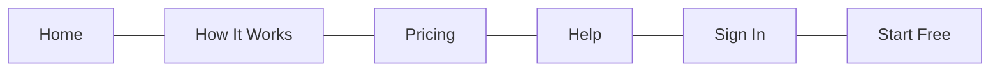
```mermaid
flowchart LR
    Home[Home] --- How[How It Works]
    How --- Pricing[Pricing]
    Pricing --- Help[Help]
    Help --- SignIn[Sign In]
    SignIn --- Start[Start Free]
```

Public routes:

```text
/
/how-it-works
/pricing
/help
/status
/sign-in
/privacy
/terms
/cookies
/refunds
```

## 2.2 Desktop and laptop application navigation

At viewport widths of 1024 px and above, the application uses a persistent left sidebar.

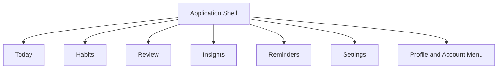
```mermaid
flowchart TD
    Shell[Application Shell]
    Shell --> Today
    Shell --> Habits
    Shell --> Review
    Shell --> Insights
    Shell --> Reminders
    Shell --> Settings
    Shell --> AccountMenu[Profile and Account Menu]
```

| **Destination** | **Primary purpose** |
|---|---|
| Today | Scheduled sessions, check-ins, attention items, and daily progress. |
| Habits | Habit creation, management, lifecycle, history, and versions. |
| Review | Weekly Review, Recovery, Check-in Review, At Risk, and pending decisions. |
| Insights | Consistency, continuity, patterns, and progress. |
| Reminders | Reminder schedules, permission state, email fallback, and quiet hours. |
| Settings | Appearance, locale, time, accessibility, privacy, export, and account settings. |

A persistent `Add Habit` action appears in the sidebar or page header on Today and Habits.

## 2.3 Tablet and mobile-web application navigation

At viewport widths below 1024 px, the primary navigation uses a bottom bar:

```text
Today | Habits | Review | Insights | More
```

`More` opens a full-height drawer containing:

```text
Reminders
Settings
Help
Account
Subscription
Export Data
Sign Out
```

Items appear only when applicable to the current user state.

## 2.4 Route hierarchy

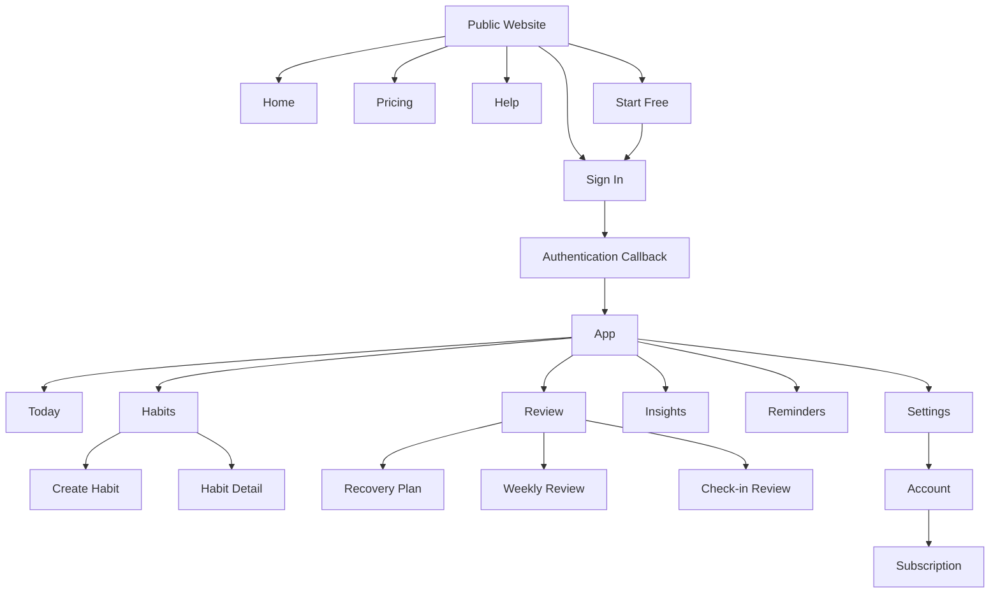
```mermaid
flowchart TD
    Public[Public Website]
    Public --> Home
    Public --> Pricing
    Public --> Help
    Public --> Auth[Sign In]
    Public --> Start[Start Free]

    Start --> Auth
    Auth --> Callback[Authentication Callback]
    Callback --> App

    App --> Today
    App --> Habits
    App --> Review
    App --> Insights
    App --> Reminders
    App --> Settings

    Habits --> Create[Create Habit]
    Habits --> HabitDetail[Habit Detail]
    Review --> Recovery[Recovery Plan]
    Review --> Weekly[Weekly Review]
    Review --> CheckReview[Check-in Review]
    Settings --> Account
    Account --> Subscription
```

## 2.5 Deep-link policy

- Every first-level application destination has a stable URL.
- Habit Detail, Weekly Review, Recovery, Check-in Review, Subscription, and Settings subsections support direct URLs.
- A valid authenticated deep link resumes after sign-in.
- An unauthenticated deep link shows the sign-in surface and preserves the intended destination.
- A deleted, expired, or inaccessible resource shows a recoverable not-found state, not a blank page.
- Browser Back and Forward restore the correct route, selected tab, filter state where safe, and scroll position where practical.

# 3. Route and Screen Inventory

## 3.1 Public routes

| **ID** | **Route** | **Screen** | **Primary content** |
|---|---|---|---|
| PUB-001 | `/` | Landing | Product promise, key benefits, product preview, primary CTA. |
| PUB-002 | `/how-it-works` | How It Works | Design, Do, Check-in, Adapt, Recover loop. |
| PUB-003 | `/pricing` | Pricing | Free, Lite, and Premium comparison. |
| PUB-004 | `/help` | Help | Searchable help categories and contact path. |
| PUB-005 | `/status` | Status | Service availability and incident history. |
| PUB-006 | `/sign-in` | Sign In | Google and email authentication. |
| PUB-007 | `/privacy` | Privacy | Privacy policy. |
| PUB-008 | `/terms` | Terms | Terms of service. |
| PUB-009 | `/cookies` | Cookie Policy | Cookie and storage disclosure. |
| PUB-010 | `/refunds` | Refund Policy | Refund and cancellation policy. |

## 3.2 Application shell routes

| **ID** | **Route** | **Screen** | **Primary content** |
|---|---|---|---|
| APP-001 | `/app` | Entry Resolver | Session restoration, legacy-local recovery, and default redirect. |
| APP-002 | `/app/today` | Today | Current sessions and attention items. |
| APP-003 | `/app/habits` | Habits | Active and inactive habit lists. |
| APP-004 | `/app/review` | Review | Recovery, Weekly Review, Check-in Review, and decisions. |
| APP-005 | `/app/insights` | Insights | Aggregate and habit-level metrics. |
| APP-006 | `/app/reminders` | Reminders | Reminder schedules and permissions. |
| APP-007 | `/app/settings` | Settings | User preferences and data controls. |

## 3.3 Habit routes and surfaces

| **ID** | **Route / surface** | **Primary content** |
|---|---|---|
| HAB-001 | `/app/habits/new` | Habit creation wizard. |
| HAB-002 | `/app/habits/templates` | Basic template catalogue. |
| HAB-003 | `/app/habits/programs` | Premium program catalogue. |
| HAB-004 | `/app/habits/[habitId]` | Habit Detail. |
| HAB-005 | `/app/habits/[habitId]/edit` | Edit current habit configuration. |
| HAB-006 | `/app/habits/[habitId]/history` | Session and check-in history. |
| HAB-007 | `/app/habits/[habitId]/changes` | Change and recommendation history. |
| HAB-008 | `/app/habits/[habitId]/versions/[versionId]` | Version detail. |
| HAB-009 | Responsive dialog or drawer | Check-in. |
| HAB-010 | Responsive dialog or drawer | Friction capture. |
| HAB-011 | Responsive dialog or drawer | Lifecycle action. |

## 3.4 Review routes

| **ID** | **Route** | **Primary content** |
|---|---|---|
| REV-001 | `/app/review/weekly` | Current Weekly Review. |
| REV-002 | `/app/review/weekly/[reviewId]` | Historical Weekly Review. |
| REV-003 | `/app/review/recovery/[habitId]` | Recovery recommendation and progress. |
| REV-004 | `/app/review/check-in/[habitId]` | Check-in Review. |
| REV-005 | `/app/review/decisions` | Pending habit and Premium decisions. |

## 3.5 Account and subscription routes

| **ID** | **Route** | **Primary content** |
|---|---|---|
| ACC-001 | `/app/account` | Profile and account state. |
| ACC-002 | `/app/account/security` | Active sessions and sign-out controls. |
| ACC-003 | `/app/account/export` | Account data export. |
| ACC-004 | `/app/account/delete` | Account deletion flow. |
| SUB-001 | `/app/subscription` | Current plan and entitlement. |
| SUB-002 | `/app/subscription/plans` | Plan selection. |
| SUB-003 | `/app/subscription/processing` | Pending checkout result. |
| SUB-004 | `/app/subscription/resolve` | Downgrade active-limit resolution. |

# 4. Global Website Shell

## 4.1 Application initialization

When an application route loads, the shell resolves:

1. browser support;
2. connectivity state;
3. authenticated account session;
4. local pending operations;
5. user timezone and locale;
6. current route permission;
7. entitlement state where an account exists.

The shell renders a branded loading surface only while the minimum required state is unresolved. It must not block cached account data merely because a cloud service is unavailable.

## 4.2 Desktop sidebar

The expanded sidebar contains:

```text
Product logo
Today
Habits
Review
Insights
Reminders
Settings

Add Habit

Profile / plan summary
```

Rules:

- The active item uses text, icon, and a non-color-only indicator.
- The sidebar may collapse to icons at constrained laptop widths.
- Collapsed items expose accessible names and tooltips.
- `Add Habit` remains discoverable in both states.
- A badge may indicate unresolved Review items, never missed-day shame.

## 4.3 Mobile bottom navigation

Rules:

- Exactly five destinations appear.
- Active state uses icon, label, and semantic state.
- The bar remains visible on first-level application routes.
- It may be hidden during focused creation, checkout, authentication, and destructive confirmation flows.
- Content includes sufficient bottom spacing so controls are not obscured.

## 4.4 Page header

A first-level page header may contain:

- page title;
- date or contextual subtitle;
- primary action;
- profile control;
- responsive overflow menu.

The profile control has the accessible label `Open account menu`.

## 4.5 Profile and account menu

### Free account

```text
User name or email
Free Plan
Upgrade to Lite or Premium
Account
Subscription
Settings
Help
Export Data
Sign Out
```

### Premium account

```text
User name or email
Premium
Account
Manage Subscription
Settings
Help
Export Data
Sign Out
```

### Lite account

```text
User name or email
Lite
Manage Subscription
Account
Settings
Help
Export Data
Sign Out
```

Rules:

- Larger screens use an anchored popover.
- Smaller screens use a drawer.
- Selecting outside, pressing Escape, or using browser Back dismisses the temporary surface before leaving the route.
- Delete Account is never placed in the compact account menu.

## 4.6 Dialog and drawer behavior

- Desktop and laptop use centered dialogs for focused tasks.
- Tablet and mobile web use full-height or bottom drawers where fields require more room.
- Focus is trapped within modal surfaces.
- Escape closes only non-destructive surfaces.
- Destructive confirmation cannot be dismissed by accidental outside selection after the irreversible action has begun.
- URL-backed dialogs preserve deep-link and browser history behavior.

## 4.7 Global banners

Priority order:

1. security or account-deletion notice;
2. payment or entitlement action required;
3. offline or synchronization state;
4. Recovery or pending review;
5. informational product notice.

Only one persistent banner should dominate a page at a time. Lower-priority items remain accessible in Review or notifications.

## 4.8 Browser navigation policy

- Browser Back returns to the previous meaningful route or closes the top temporary route-backed surface.
- Browser refresh preserves the current route.
- Unsaved form changes trigger an in-product confirmation before route changes where browser capabilities allow.
- Authentication and payment return URLs are idempotent and safe to refresh.
- Filters encoded in the URL may be restored after refresh.
- Sensitive one-time tokens are removed from the visible URL after successful processing.

# 5. Public Website Flows

## 5.1 UX-WEB-01 — Visit landing page

**Entry points**

- Direct visit to `/`.
- Search result.
- Shared public link.
- Return from legal, pricing, help, or status pages.

**Primary path**

1. The visitor sees the product promise and a clear `Start Free` action.
2. The visitor can review the recovery-first concept without signing in.
3. Product examples explain Full, Minimum, Skipped, and Recovery using neutral language.
4. The visitor may open How It Works or Pricing.
5. Selecting `Start Free` opens account creation or sign-in.

**Alternate paths**

- Selecting `Sign In` opens `/sign-in`.
- Selecting a Premium CTA while signed out opens plan information, then requires authentication before checkout.
- If legacy local data exists in this browser, the authenticated user receives a transfer or export choice before the account workspace opens.

**Exit states**

- Account creation or sign-in flow.
- Sign-in flow.
- Pricing.
- Help or legal page.

**UX rules**

- Public pages contain no private habit names, metrics, or account data.
- Marketing examples are clearly illustrative.
- The public site never claims medical or therapeutic outcomes.
- The first CTA does not request browser notification permission or payment.

**Requirement references:** FR-PUB-01, FR-PUB-02.

## 5.2 UX-WEB-02 — Review pricing

**Primary path**

1. The visitor opens `/pricing`.
2. Free, Lite, and Premium limits are shown side by side.
3. Monthly and annual Lite and Premium prices are presented without a preselected purchase option.
4. Trial terms are summarized with links to full policies.
5. The visitor selects a plan-related CTA.
6. If not signed in, the website explains that an account is required before starting a trial or purchasing.

**UX rules**

- Recovery basics remain visibly available on Free; Lite and Premium show their additional recovery capabilities.
- Annual savings are stated factually and not through countdown pressure.
- Final billing details are repeated before checkout confirmation.
- Illustrative pricing is not displayed as final unless approved in product configuration.

**Requirement references:** FR-PUB-01, FR-SUB-01, FR-SUB-02.

## 5.3 UX-WEB-03 — Open Help or Status

**Help path**

1. The visitor searches or browses help categories.
2. Articles distinguish legacy browser-local data from account cloud storage.
3. Browser notification, offline, payment, export, and deletion limitations are explained.
4. A support contact path is shown when self-service does not resolve the issue.

**Status path**

1. The visitor opens `/status`.
2. Current service components and recent incidents are shown.
3. Private account data is never displayed.

**Requirement references:** FR-PUB-01.

# 6. Application Entry and Account Onboarding

## 6.1 UX-APP-01 — Resolve application entry

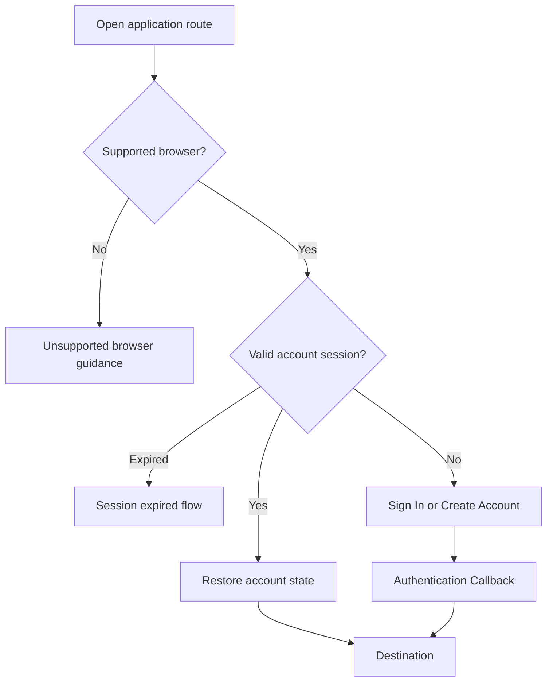
```mermaid
flowchart TD
    Visit[Open application route] --> Support{Supported browser?}
    Support -- No --> Unsupported[Unsupported browser guidance]
    Support -- Yes --> Session{Valid account session?}
    Session -- Yes --> RestoreAccount[Restore account state]
    Session -- Expired --> Reauth[Session expired flow]
    RestoreAccount --> Destination
    Session -- No --> SignIn[Sign In or Create Account]
    SignIn --> Callback[Authentication Callback]
    Callback --> Destination
```

**Primary path: first visit**

1. The website validates minimum browser capabilities.
2. The visitor sees `Create Account` and `Sign In`.
3. Successful authentication creates or restores a Free account.
4. If legacy local data exists, the website offers transfer or export before opening the account workspace.
5. The first-habit onboarding begins after account resolution.
6. New accounts complete the required one-time onboarding wizard before private application routes open (see UX-APP-03).

**Primary path: returning account user**

1. The account session is validated.
2. Cached content and pending local operations are checked.
3. The requested route opens, or the user is sent to Today.

**Primary path: returning account user**

1. The session is validated.
2. Cached content may render while fresh cloud data loads.
3. Pending local operations synchronize when connectivity is available.
4. The requested permitted route opens.

**Alternate paths**

- Private browsing or cleared storage may remove local cache, while canonical account data remains in PostgreSQL.
- Expired account session opens the session-expired flow.
- Offline first visit cannot create an authenticated session and must show the account-required state.

**Requirement references:** FR-PUB-02, FR-ONB-01, FR-ONB-05, FR-ONB-07, FR-OFF-01.

## 6.2 UX-APP-02 — Session expired

**Trigger**

- An authenticated request confirms that the session is no longer valid.

**Primary path**

1. A blocking authentication-required page explains that the session ended.
2. Unsynchronized local actions remain preserved.
3. The user selects `Sign In Again`.
4. Authentication completes.
5. The original route and pending action context resume where safe.

**Alternate path**

- No unauthenticated application entry is offered; legacy local data is handled only after authentication.
- `Sign Out` clears the expired session but does not silently erase local pending records that require reconciliation.

**UX rules**

- Do not present session expiration as data loss.
- Do not repeatedly redirect between the protected route and sign-in page.
- The website explains which actions need reconnection before completion.

**Requirement references:** FR-ONB-07, FR-OFF-02.

## 6.3 UX-APP-03 — First-time orientation

After first account sign-in with no habits:

1. Today displays a focused empty state.
2. The message explains that a habit has a Normal and Minimum version.
3. The primary action is `Create Your First Habit`.
4. Secondary links open a short explanation of Full, Minimum, and Skipped.
5. No account, notification, or Premium prompt interrupts this state.

**Requirement references:** FR-ONB-01, FR-ONB-02, FR-ONB-04.

## 6.4 UX-APP-04 — Required one-time onboarding wizard

**Trigger**

- A new account completes authentication for the first time, or any signed-in user with `onboarding_completed_at` unset attempts a private application route.

**Gate behavior**

- Every private application route redirects to `/onboarding` while `onboarding_completed_at` is unset.
- `/onboarding` itself, the auth routes, and public content are never redirected.
- The account profile remains readable at all times; the wizard writes only the caller's own profile row.

**Wizard steps**

1. **Consent** — the user selects a checkbox confirming acceptance of the Terms of Service and Privacy Policy (both linked). Without consent, the primary action shows an inline error and does not advance.
2. **Profile** — display name (optional), timezone (supported IANA options), week start day, and quiet hours (optional start/end pair). Saving persists the profile and records the consent timestamp.
3. **First habit** — name, category, Normal version, Minimum version, icon, and schedule range. The step reuses the standard habit-creation rules and Free active-habit limits.

**Primary path**

1. The wizard opens at step 1.
2. The user accepts the terms and selects Continue.
3. The user reviews or adjusts the profile and selects Continue.
4. The user names the first habit and selects Finish.
5. The account lands on Today.

**Failure states**

- Consent not checked: inline error, step does not advance.
- Profile save fails: inline error, retry keeps entered values.
- First-habit creation fails: inline error, retry; no completion timestamp is written.
- Completion timestamp write fails: inline error, retry; the habit already created is not duplicated (standard idempotency rules apply).
- Mid-wizard refresh: the wizard restarts at step 1; nothing is lost because nothing was persisted until a step saved.

**UX rules**

- Each step has one primary action and visible progress.
- Back navigation returns to the previous step with entered values preserved.
- The wizard is keyboard-operable and never uses color alone to communicate state.

**Requirement references:** FR-ONB-01, FR-ONB-02, FR-ONB-09, FR-ONB-10.

# 7. Habit Creation

## 7.1 Creation entry points

- `Add Habit` in the desktop sidebar.
- `Add Habit` in the Today or Habits page header.
- Empty-state CTA.
- `Use Basic Template` after a Premium preview.
- Recovery or Weekly Review action that recommends creating a replacement habit only where product rules permit.

Creation opens `/app/habits/new` as a route-backed wizard.

## 7.2 UX-HAB-01 — Choose creation route

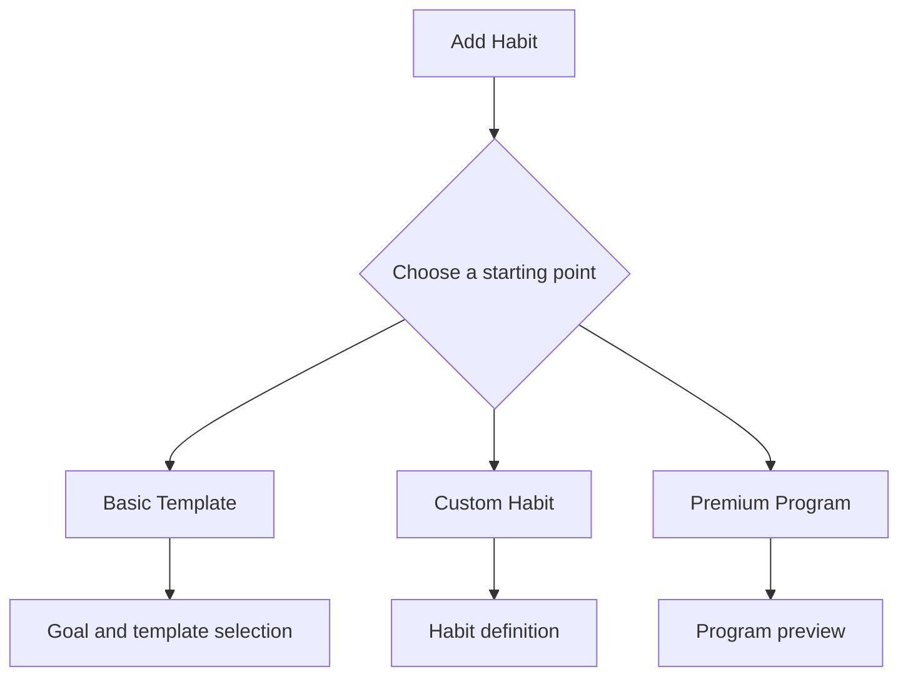
```mermaid
flowchart TD
    Start[Add Habit] --> Route{Choose a starting point}
    Route --> Template[Basic Template]
    Route --> Custom[Custom Habit]
    Route --> Program[Premium Program]
    Template --> Goal[Goal and template selection]
    Custom --> Definition[Habit definition]
    Program --> Preview[Program preview]
```

**Primary path**

1. The user sees three starting routes: Basic Template, Custom Habit, and Premium Program.
2. Premium Program remains visible to all users with clear Preview labeling.
3. The user selects one route.

**Responsive behavior**

- Desktop uses a three-card selection layout.
- Mobile web uses a vertical list with the same order and descriptions.

**Requirement references:** FR-HAB-01, FR-PRG-02.

## 7.3 UX-HAB-02 — Create from basic template

**Primary path**

1. The user selects a goal category or searches templates.
2. The user opens a template preview.
3. The template explains its default Normal and Minimum versions.
4. The user selects `Use Template`.
5. The wizard pre-fills editable fields.
6. The user confirms definition, schedule, cue, and optional reminder.
7. The summary page shows all values and active-slot impact.
8. The user selects `Create Habit`.
9. The habit becomes Active or Starting according to the lifecycle model.
10. Today opens with the new habit visible when currently eligible.

**Alternate paths**

- `Save Draft` preserves progress without consuming an active slot.
- Closing with unsaved changes opens `Discard changes?`.
- Reaching the active limit opens the active-limit resolution flow before activation.

**Requirement references:** FR-HAB-01, FR-HAB-03, FR-HAB-04, FR-HAB-05.

## 7.4 UX-HAB-03 — Create custom habit

**Wizard steps**

```text
1. Goal and name
2. Normal and Minimum versions
3. Schedule and cue
4. Optional reminder
5. Review and create
```

**Step 1 — Goal and name**

- Select a goal category or `Other`.
- Enter a concise habit name.
- The name remains private and is excluded from analytics payloads.

**Step 2 — Normal and Minimum versions**

- Enter the Normal action.
- Enter the Minimum action.
- The interface explains that Minimum is a successful continuity outcome.
- Optional estimated duration or quantity may be added where appropriate.

**Step 3 — Schedule and cue**

- Select eligible weekdays or frequency rules supported by MVP.
- Select or enter a cue.
- Confirm timezone used for session generation.

**Step 4 — Optional reminder**

- Set an in-app reminder schedule.
- Select Web Push only after reading the contextual permission explanation.
- Signed-in users may configure email fallback where entitled.

**Step 5 — Review and create**

- Show a complete summary.
- Show active-slot use.
- Explain when the first eligible session appears.
- Require explicit `Create Habit` confirmation.

**Requirement references:** FR-ONB-02, FR-HAB-02, FR-HAB-05, FR-REM-01.

## 7.5 UX-HAB-04 — Preserve or discard a draft

**Trigger**

- The user attempts to leave the wizard after changing a field.

**Decision**

```text
Save draft and leave
Discard changes
Continue editing
```

Rules:

- A saved Draft does not consume an active slot.
- A Draft cannot generate sessions or reminders.
- Returning to the Draft restores the last locally or cloud-saved step.
- Legacy drafts are disclosed as browser-local until transferred or exported.

**Requirement references:** FR-HAB-05.

## 7.6 UX-HAB-05 — Active-limit resolution

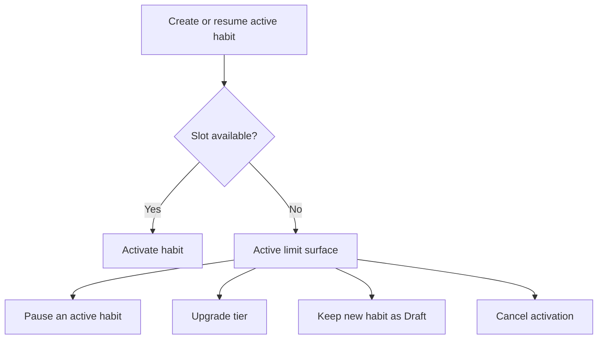
```mermaid
flowchart TD
    Activate[Create or resume active habit] --> Limit{Slot available?}
    Limit -- Yes --> Success[Activate habit]
    Limit -- No --> Resolve[Active limit surface]
    Resolve --> Pause[Pause an active habit]
    Resolve --> Upgrade[Upgrade tier]
    Resolve --> Draft[Keep new habit as Draft]
    Resolve --> Cancel[Cancel activation]
```

**Free account state**

- Explain the limit of five active habits.
- Offer `Pause an Active Habit`, `View Lite or Premium`, `Keep as Draft`, and `Cancel`.

**Lite account state**

- Explain the limit of ten active habits.
- Offer `Pause an Active Habit`, `View Premium`, `Keep as Draft`, and `Cancel`.

**Premium state**

- Explain the limit of thirty active habits.
- Offer `Pause an Active Habit`, `Keep as Draft`, and `Cancel`.

**UX rules**

- Do not delete habits to free a slot.
- Inactive habits are clearly identified as not consuming active slots.
- The user returns to the original activation flow after resolving the limit.

**Requirement references:** FR-HAB-04, FR-LIF-01.

# 8. Today and Daily Check-ins

## 8.1 Today hierarchy

The Today page presents, in order:

1. highest-priority action-required banner;
2. current date and completion summary;
3. eligible session cards;
4. pending local synchronization indicator;
5. upcoming or completed section;
6. empty-state or next-session guidance.

A session card includes:

```text
Habit name
Normal version
Minimum version
Cue or scheduled time
Current status
[Full] [Minimum] [Skipped]
```

The three check-in actions remain immediately distinguishable by text, not color alone.

## 8.2 UX-CHK-01 — Record Full or Minimum

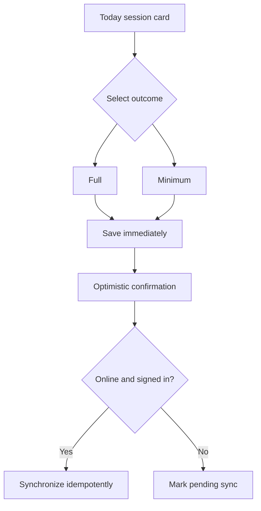
```mermaid
flowchart TD
    Card[Today session card] --> Choice{Select outcome}
    Choice --> Full[Full]
    Choice --> Minimum[Minimum]
    Full --> LocalSave[Save immediately]
    Minimum --> LocalSave
    LocalSave --> Confirm[Optimistic confirmation]
    Confirm --> Online{Online and signed in?}
    Online -- Yes --> Sync[Synchronize idempotently]
    Online -- No --> Pending[Mark pending sync]
```

**Primary path**

1. The user selects `Full` or `Minimum`.
2. The website saves the result locally before showing confirmation.
3. The card updates immediately.
4. A brief confirmation states the selected outcome.
5. An `Undo` or `Edit` action is available until the local same-day cutoff.
6. Signed-in data synchronizes when connectivity allows.

**Minimum semantics**

- Confirmation uses positive, non-diminishing language.
- Minimum contributes to successful sessions and continuity.
- The website never labels Minimum as failure, partial failure, or broken streak.

**Duplicate behavior**

- Repeated submission for the same session does not create another check-in.
- A second browser tab updates or warns based on the latest authoritative state.

**Requirement references:** FR-CHK-01, FR-CHK-02, FR-CHK-04, FR-CHK-06, FR-CHK-07.

## 8.3 UX-CHK-02 — First check-in guidance

**Trigger**

- The user opens the first eligible session before completing any check-in.

**Behavior**

- A non-blocking inline coach mark explains Full, Minimum, and Skipped.
- The coach mark does not obscure the three actions.
- Dismissing it records completion for the browser or account.
- Help remains available from the card overflow menu.

**Requirement references:** FR-ONB-04.

## 8.4 UX-CHK-03 — Record Skipped and optional friction

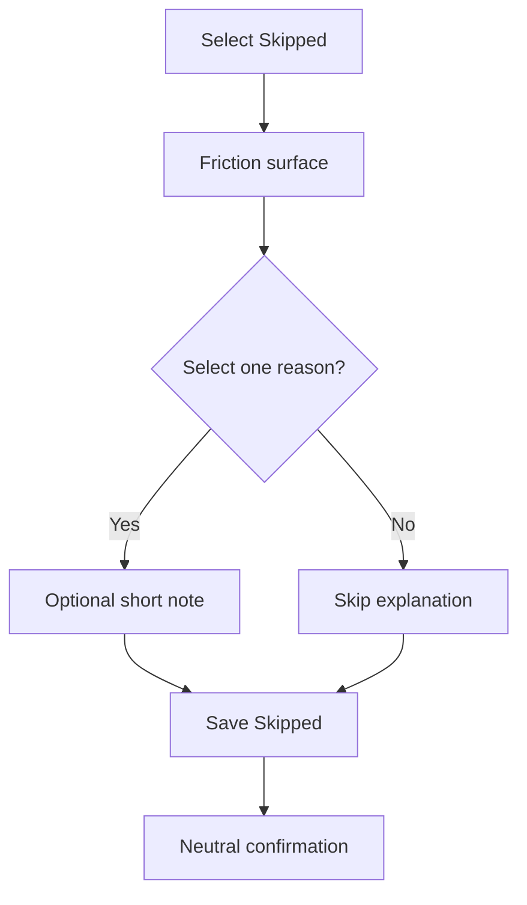
```mermaid
flowchart TD
    Skip[Select Skipped] --> Friction[Friction surface]
    Friction --> Reason{Select one reason?}
    Reason -- Yes --> OptionalNote[Optional short note]
    Reason -- No --> SaveWithout[Skip explanation]
    OptionalNote --> Save[Save Skipped]
    SaveWithout --> Save
    Save --> Confirm[Neutral confirmation]
```

**Primary path**

1. The user selects `Skipped`.
2. A responsive dialog or drawer asks for one primary friction reason.
3. The user may select a reason, add an optional note, or choose `Skip explanation`.
4. The result saves locally.
5. The confirmation states that the session was recorded and history remains intact.

**Friction reasons**

- Too tired or low energy
- Not enough time
- Forgot
- Schedule changed
- Environment or access issue
- Target felt too difficult
- Not relevant today
- Other

**UX rules**

- The reason is optional.
- Free-text notes are never sent to analytics.
- The website does not immediately show a Recovery plan after one isolated skip.
- Manual Skipped may contribute to Recovery triggers according to the PRD.

**Requirement references:** FR-CHK-03, FR-REC-01.

## 8.5 UX-CHK-04 — Edit same-day check-in

**Entry points**

- `Edit` on a completed session card.
- Habit History for the current eligible day.
- Confirmation toast action.

**Primary path**

1. The current outcome is shown.
2. The user selects Full, Minimum, or Skipped.
3. If changing to Skipped, friction remains optional.
4. A summary states which metrics may change.
5. The user confirms.
6. The current check-in is updated rather than duplicated.

**Boundary behavior**

- After the local same-day edit window, the website explains that direct editing is closed.
- Administrative correction paths are not part of MVP unless defined separately.

**Requirement references:** FR-CHK-04, FR-CHK-07.

## 8.6 Today empty and completion states

### No habits

```text
Create your first habit
Build a Normal version for regular days and a Minimum version for difficult days.
[Create Habit]
```

### No eligible sessions today

```text
Nothing is scheduled today
Your next eligible session is [date/time].
[View Habits]
```

### All eligible sessions recorded

```text
Today is recorded
Full and Minimum both support continuity.
[View progress]
```

### Pending synchronization

```text
Saved on this browser
Some changes are waiting to sync.
[View details]
```

# 9. Unrecorded Sessions and Check-in Review

## 9.1 UX-UNR-01 — Resolve an Unrecorded session

**Trigger**

- An eligible session reaches its cutoff without Full, Minimum, or Manual Skipped.

**Presentation**

- The session appears as `Needs classification` for three calendar days according to the habit timezone.
- Today may show a non-blocking attention card for recent unresolved sessions.
- The Review page lists all unresolved sessions.

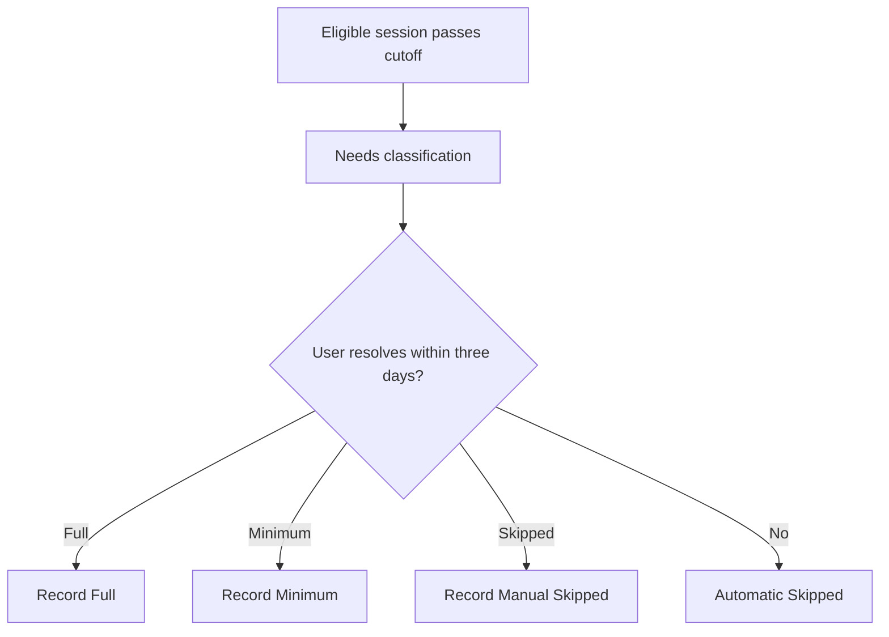
```mermaid
flowchart TD
    Cutoff[Eligible session passes cutoff] --> Unrecorded[Needs classification]
    Unrecorded --> Resolve{User resolves within three days?}
    Resolve -- Full --> Full[Record Full]
    Resolve -- Minimum --> Minimum[Record Minimum]
    Resolve -- Skipped --> Manual[Record Manual Skipped]
    Resolve -- No --> Auto[Automatic Skipped]
```

**Primary path**

1. The user opens the unresolved session.
2. The date, habit, Normal version, Minimum version, and timezone are shown.
3. The user selects Full, Minimum, or Skipped.
4. If Skipped is selected, friction capture remains optional.
5. The result saves and metrics recalculate.

**UX rules**

- Unrecorded is not presented as failure before the window expires.
- The website explains the classification deadline.
- Resolving an older session cannot create a duplicate current session.

**Requirement references:** FR-UNR-01, FR-UNR-02.

## 9.2 Automatic Skipped behavior

When the three-day resolution window ends:

- The session becomes `Skipped — not recorded`.
- The user sees when and why the automatic classification occurred.
- Automatic Skipped affects consistency.
- Automatic Skipped does not contribute to the three-consecutive-manual-skips Recovery trigger.
- The record remains distinguishable from a Manual Skipped session.

**Requirement references:** FR-UNR-03, FR-UNR-04.

## 9.3 UX-CIR-01 — Check-in Review trigger

**Trigger**

- The configured threshold of Automatic Skipped sessions is reached for a habit.

**Primary path**

1. A non-blocking banner appears on Today and Review.
2. The banner states that check-ins are often not being recorded.
3. Selecting `Review check-ins` opens `/app/review/check-in/[habitId]`.
4. The page summarizes only the relevant schedule and reminder signals.
5. One recommendation is presented.
6. The user selects Apply, Customize, or Keep Current.
7. The decision is written to Change History.

**Recommendation examples**

- Move the reminder closer to the usual completion time.
- Add one follow-up reminder.
- Change the eligible day or time.
- Temporarily reduce reminder frequency when reminders are repeatedly ignored.

**UX rules**

- The product does not infer motivation or diagnose behavior.
- The analysis focuses on observable check-in and reminder patterns.
- A recommendation changes one relevant variable at a time.

**Requirement references:** FR-UNR-05, FR-CIR-01, FR-CIR-02, FR-CIR-03.

# 10. Reminders and Web Notification Permission

## 10.1 Reminder surfaces

Reminder configuration is available:

- during habit creation;
- from Habit Detail;
- from `/app/reminders`;
- through an approved recommendation.

Reminder channels:

- in-application reminder schedule;
- Web Push where supported and permitted;
- email fallback for eligible signed-in users.

## 10.2 UX-REM-01 — Configure an in-application reminder

1. The user selects a reminder time relative to the habit schedule.
2. The user optionally adds one follow-up reminder.
3. Quiet hours are applied and previewed.
4. The website shows the next expected reminder time.
5. The user saves.

**Requirement references:** FR-REM-01, FR-REM-04, FR-REM-05.

## 10.3 UX-REM-02 — Request Web Push permission contextually

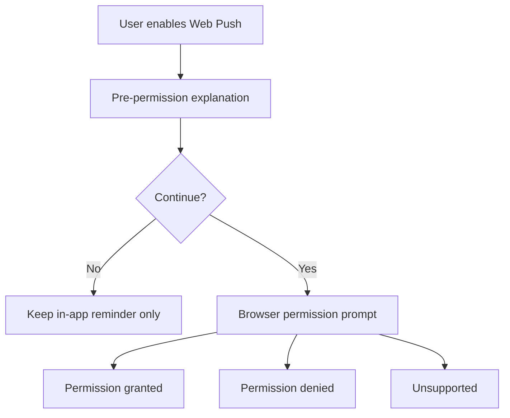
```mermaid
flowchart TD
    Choose[User enables Web Push] --> Explain[Pre-permission explanation]
    Explain --> Continue{Continue?}
    Continue -- No --> InApp[Keep in-app reminder only]
    Continue -- Yes --> Browser[Browser permission prompt]
    Browser --> Granted[Permission granted]
    Browser --> Denied[Permission denied]
    Browser --> Unsupported[Unsupported]
```

**Primary path**

1. The user explicitly enables Web Push for a habit or from Reminders.
2. The product explains the benefit and browser dependency before invoking the browser prompt.
3. The user selects `Continue`.
4. The browser permission prompt appears.
5. On grant, the website confirms the next expected reminder.

**UX rules**

- Do not request permission on landing, first page load, or account entry.
- Do not imitate the browser permission prompt.
- Do not claim delivery is guaranteed.
- The product records permission state but respects browser-controlled revocation.

**Requirement references:** FR-REM-02, FR-REM-09.

## 10.4 UX-REM-03 — Permission denied, blocked, or unsupported

**Denied**

- Show `Browser notifications are off`.
- Keep in-app reminders active.
- Explain how to change browser settings without repeatedly prompting.

**Blocked**

- Do not invoke the browser prompt again.
- Show browser-specific general guidance without asserting exact menus that may differ.

**Unsupported**

- Explain that Web Push is unavailable in the current browser context.
- Offer in-app reminder and eligible email fallback.

**Requirement references:** FR-REM-03.

## 10.5 UX-REM-04 — Adaptive reminder suggestion

1. The system identifies a supported reminder pattern.
2. A recommendation appears in Review, not as an interruptive browser prompt.
3. The observed signal is stated.
4. One proposed change is shown.
5. The user selects Apply, Customize, or Keep Current.
6. The result is recorded in Change History.

**Requirement references:** FR-REM-06.

## 10.6 UX-REM-05 — Reminder reduction trial

When repeated reminders are ignored:

1. The system proposes a temporary reduction rather than adding more prompts.
2. The duration and restoration condition are shown.
3. The user explicitly approves or declines.
4. Declining does not trigger repeated suggestions until a meaningful new signal exists.

**Requirement references:** FR-REM-07, FR-REM-08.

# 11. Recovery and Needs Review

## 11.1 UX-REC-01 — Recovery trigger and first decision

**Trigger**

- Three consecutive scheduled Manual Skipped sessions for the same habit.

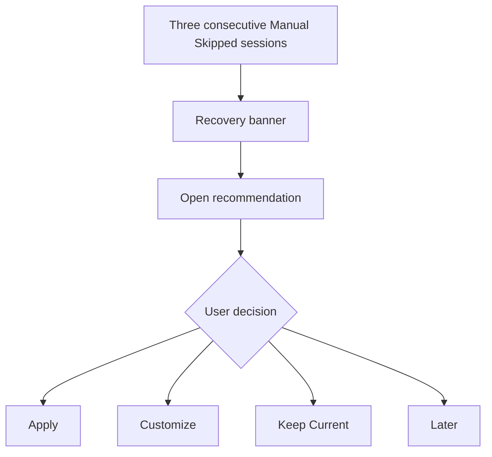
```mermaid
flowchart TD
    Trigger[Three consecutive Manual Skipped sessions] --> Banner[Recovery banner]
    Banner --> Open[Open recommendation]
    Open --> Decision{User decision}
    Decision --> Apply[Apply]
    Decision --> Customize[Customize]
    Decision --> Keep[Keep Current]
    Decision --> Later[Later]
```

**Primary path**

1. A non-blocking Recovery banner appears on Today and Review.
2. The banner uses neutral language: `This habit has been difficult recently.`
3. Selecting `Review a lighter plan` opens the Recovery route.
4. The page shows the dominant observable friction signal.
5. One Recovery plan is recommended.
6. The default plan covers three scheduled sessions.
7. The user selects Apply, Customize, Keep Current, or Later where deferral remains allowed.

**UX rules**

- Recovery does not block unrelated habits or navigation.
- The system never silently applies the plan.
- The recommendation does not diagnose the user.
- Later returns the item to Review with a clear status.

**Requirement references:** FR-REC-01, FR-REC-02, FR-REC-03, FR-REC-04.

## 11.2 Recovery recommendation mapping

| **Dominant signal** | **Recommended variable** |
|---|---|
| Target felt too difficult | Reduce the temporary Normal target. |
| Low energy | Use the Minimum version as the temporary default. |
| Not enough time | Shorten the temporary duration or quantity. |
| Schedule changed | Move eligible time or cue. |
| Forgot | Adjust reminder timing. |
| Environment or access issue | Add a fallback version or change context. |
| Mixed or insufficient signal | Propose the smallest reversible reduction. |

Only one primary variable changes per initial Recovery recommendation.

## 11.3 UX-REC-02 — Recovery progress

During Recovery:

- Habit Detail and Today show a `Recovery plan` label.
- The temporary Normal and Minimum versions are visible.
- Progress is stated as scheduled sessions completed, not days elapsed.
- The original approved configuration remains available in Change History.
- The user may view plan details without exiting Recovery.

**Requirement references:** FR-REC-04.

## 11.4 UX-REC-03 — Recovery result

### Success

1. The configured success threshold is met.
2. The website acknowledges completion without celebratory pressure.
3. The next eligible session returns to the Normal target unless the user chooses to redesign.
4. The Recovery result is stored in history.

### Failure

1. The success threshold is not met.
2. The product proposes a lighter plan.
3. The user approves, customizes, keeps current, or chooses another eligible action.
4. A second failed Recovery plan moves the habit to Needs Review.

**Requirement references:** FR-REC-05, FR-REC-06.

## 11.5 UX-REC-04 — Needs Review

**State message**

```text
This habit needs a decision
Recent plans have not fit well enough. Your history is safe.
```

**Actions**

- Redesign Habit
- Pause Habit
- Stop Habit
- Keep Current

**Primary path**

1. The user opens the Needs Review item.
2. The website summarizes recent Recovery attempts and relevant signals.
3. The user selects one action.
4. Consequences and effective timing are previewed.
5. The user confirms.
6. History remains accessible.

**Requirement references:** FR-REC-07, FR-LIF-01.

# 12. Weekly Review and Recommendations

## 12.1 UX-WRV-01 — Open Weekly Review

**Entry points**

- Review page on or after the configured review day.
- Today banner.
- Direct route.

**Primary path**

1. The opening screen summarizes the week in neutral terms.
2. Attention items are prioritized:
   1. Decision Required;
   2. Needs Review;
   3. Recovery;
   4. At Risk;
   5. Check-in Review;
   6. Stable or no-change habits.
3. The user reviews recommendation cards.
4. Each card states signal, impact, change, and effective timing.
5. The user may approve, customize, or keep current per card.
6. The final confirmation summarizes all selected changes.
7. The user confirms once.
8. Changes are applied transactionally where possible and recorded individually.

**Requirement references:** FR-WRV-01, FR-WRV-02, FR-WRV-03, FR-WRV-04.

## 12.2 UX-WRV-02 — Batch recommendation approval

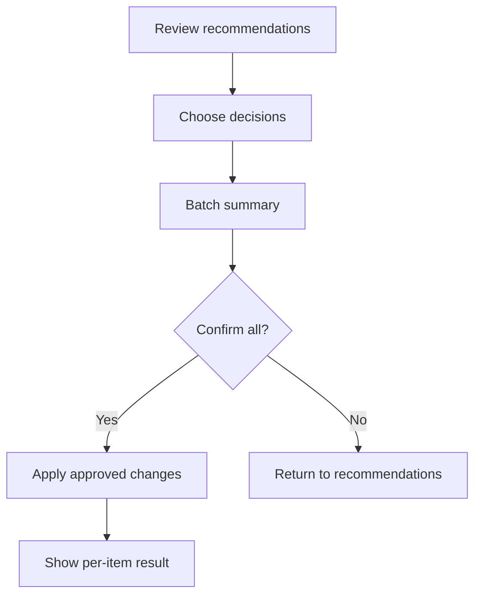
```mermaid
flowchart TD
    Review[Review recommendations] --> Select[Choose decisions]
    Select --> Summary[Batch summary]
    Summary --> Confirm{Confirm all?}
    Confirm -- Yes --> Apply[Apply approved changes]
    Confirm -- No --> Back[Return to recommendations]
    Apply --> Result[Show per-item result]
```

**Rules**

- No recommendation is pre-approved.
- A failed item does not hide successful items.
- Partial backend failure produces a per-item result and safe retry path.
- Every material change remains reversible through Change History.
- A user may complete the review with no changes.

**Requirement references:** FR-WRV-04, FR-WRV-05.

## 12.3 Weekly Review completion

Completion shows:

- decisions applied;
- habits left unchanged;
- unresolved items;
- next review date;
- link to Change History.

The product does not frame zero approved recommendations as failure.

# 13. Habit Management and Versioning

## 13.1 Habits list

The Habits page supports:

- Active habits;
- Paused habits;
- Stopped habits;
- Completed habits;
- Archived habits;
- Drafts;
- Trash entry point.

Filters are available by lifecycle state. Search matches the private habit name locally or through protected account data and never sends the query to analytics.

Each habit row or card includes:

```text
Habit name
Lifecycle status
Current Normal and Minimum summary
Next eligible session
Consistency summary where available
Contextual action menu
```

## 13.2 Habit Detail

Habit Detail includes:

- current lifecycle status;
- current version;
- Normal and Minimum definitions;
- schedule and cue;
- reminder summary;
- current consistency and continuity;
- recent session history;
- Recovery state where applicable;
- links to History and Change History;
- lifecycle actions.

## 13.3 UX-LIF-01 — Edit without material redesign

Non-material edits may update the current configuration according to product rules, such as:

- display name correction;
- non-behavioral description;
- reminder delivery preference;
- accessibility presentation preference.

The page states whether the edit changes the habit version. Material behavioral edits use redesign.

## 13.4 UX-LIF-02 — Redesign and create a new version

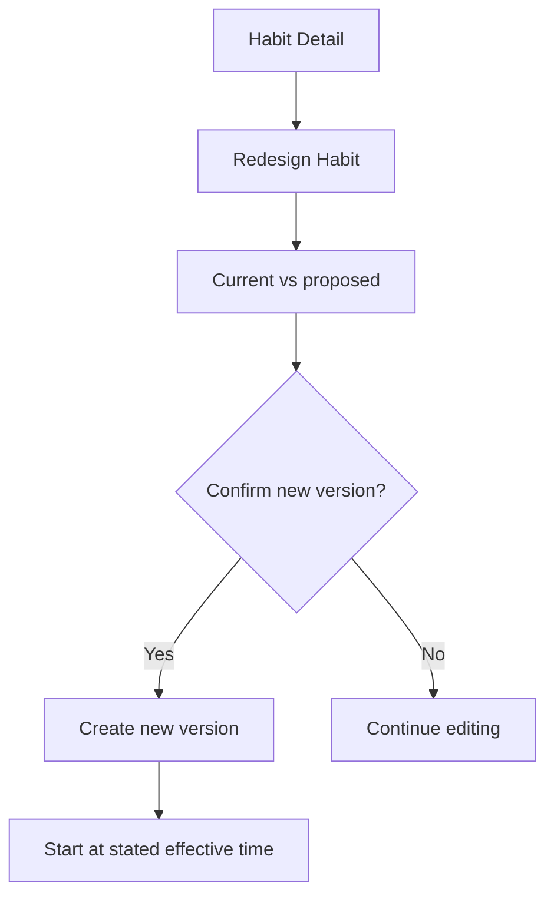
```mermaid
flowchart TD
    Detail[Habit Detail] --> Edit[Redesign Habit]
    Edit --> Compare[Current vs proposed]
    Compare --> Confirm{Confirm new version?}
    Confirm -- Yes --> Version[Create new version]
    Confirm -- No --> Back[Continue editing]
    Version --> Effective[Start at stated effective time]
```

**Primary path**

1. The user selects `Redesign Habit`.
2. Current values are pre-filled.
3. The user changes one or more material fields.
4. A comparison page shows current and proposed values.
5. The effective date or next eligible session is stated.
6. The user confirms.
7. A new version is created.
8. Previous versions and lifetime history remain available.

**Material fields**

- Normal version;
- Minimum version;
- eligible schedule;
- core cue;
- fallback behavior;
- program structure.

**Requirement references:** FR-LIF-02, FR-MET-03.

## 13.5 UX-LIF-03 — Restore a historical version

1. The user opens Change History or a version detail.
2. The historical version is shown read-only.
3. The user selects `Restore as New Version`.
4. A comparison with the current version appears.
5. The user confirms.
6. The historical configuration becomes a newly created current version.
7. No existing version is overwritten.

**Requirement references:** FR-LIF-03.

## 13.6 UX-LIF-04 — Pause, resume, stop, complete, and archive

### Pause

- Explain that sessions and reminders stop.
- History remains.
- The habit no longer consumes an active slot.

### Resume

- Confirm slot availability.
- Show next eligible session.
- If no slot exists, use the active-limit resolution flow.

### Stop

- Explain that the habit is intentionally ended but remains available in history.
- Require confirmation.

### Complete

- Use only when the user intentionally marks the habit goal complete.
- Preserve all history and versions.

### Archive

- Remove the habit from routine management views.
- Preserve history.
- Archive does not consume an active slot.

**Requirement references:** FR-LIF-01.

## 13.7 UX-LIF-05 — Move to Trash and restore

**Move to Trash**

1. The user selects `Move to Trash` from Habit Detail or lifecycle actions.
2. The confirmation explains the 30-day retention period.
3. The user confirms.
4. The habit enters Trash and no longer generates sessions or reminders.

**Restore**

1. The user opens Trash.
2. The item shows days remaining before permanent deletion.
3. The user selects `Restore`.
4. The habit restores as Paused.
5. The user may resume separately, subject to active-slot limits.

**Permanent deletion**

- Available only from Trash where product policy permits.
- Requires explicit high-friction confirmation.
- Explains that habit history and versions will be permanently removed.
- Cannot be undone after backend or local deletion completes.

**Requirement references:** FR-LIF-04, FR-LIF-05.

# 14. Premium Program Preview

## 14.1 UX-PRG-01 — Browse Premium programs

1. Any user opens the Premium Program catalogue.
2. Program cards show title, intended benefit, duration, and Premium status.
3. Free and Lite users see `Preview` rather than a disabled card.
4. Premium users see `Start Program` where eligible.

**Requirement references:** FR-PRG-01, FR-PRG-02.

## 14.2 UX-PRG-02 — Three-day interactive simulation

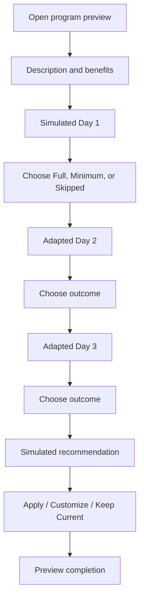
```mermaid
flowchart TD
    Preview[Open program preview] --> Intro[Description and benefits]
    Intro --> Day1[Simulated Day 1]
    Day1 --> Outcome1[Choose Full, Minimum, or Skipped]
    Outcome1 --> Day2[Adapted Day 2]
    Day2 --> Outcome2[Choose outcome]
    Outcome2 --> Day3[Adapted Day 3]
    Day3 --> Outcome3[Choose outcome]
    Outcome3 --> Recommendation[Simulated recommendation]
    Recommendation --> Decision[Apply / Customize / Keep Current]
    Decision --> End[Preview completion]
```

**Rules**

- The preview is clearly labeled as a simulation.
- Simulated activity never changes real habit metrics.
- Days 1–3 demonstrate one relevant adaptation at a time.
- The recommendation decision is also simulated.
- Preview completion offers:
  - View Plans;
  - Use Basic Template;
  - Close.

**Requirement references:** FR-PRG-03, FR-PRG-04, FR-PRG-05, FR-PRG-06.

## 14.3 Premium user starts a program

1. The user reviews the real program configuration.
2. Active-slot impact is shown.
3. The user confirms schedule, reminders, and start date.
4. The program becomes an active habit with versioned program configuration.
5. Adaptive changes remain subject to the standard decision contract where required.

# 15. Authentication and Legacy Local Data Recovery

## 15.1 Contextual account prompts

An account prompt may appear when the authenticated user has legacy local data:

- signs in on a browser containing a legacy local dataset;
- requests a transfer or export;
- starts a Lite or Premium trial or purchase;
- selects an account-only capability.

The prompt states:

```text
Why an account is needed
What legacy local data is currently stored
What will happen after sign-in
[Continue] [Not Now]
```

No prompt claims that legacy local data is already backed up.

**Requirement references:** FR-ONB-03, FR-ONB-05.

## 15.2 UX-AUTH-01 — Sign in with Google

1. The user selects `Continue with Google`.
2. The current route and intended action are saved safely.
3. The browser opens the provider authentication flow.
4. The callback is validated.
5. The session is established.
6. The website resumes the original context.
7. If legacy local data exists, the recovery review begins.

**Failure states**

- User cancels provider flow.
- Callback is expired or invalid.
- Provider account has no usable email under product policy.
- Network fails before completion.

Each failure returns to a stable sign-in surface without deleting legacy local data.

**Requirement references:** FR-ONB-06.

## 15.3 UX-AUTH-02 — Sign in with email magic link or OTP

1. The user enters an email address.
2. The website confirms that a sign-in message or code was sent without exposing account existence unnecessarily.
3. The user opens the magic link or enters the OTP.
4. The callback or code is validated.
5. The session is established.
6. The original context resumes.

**Cross-device link behavior**

- If the magic link opens in another browser, the account session may be established there.
- Browser-local legacy data from the original browser is not implied to exist on the new browser.
- The user receives clear guidance to return to the original browser to transfer its legacy data.

**Requirement references:** FR-ONB-06.

## 15.4 UX-AUTH-03 — Recover legacy local data into an empty account

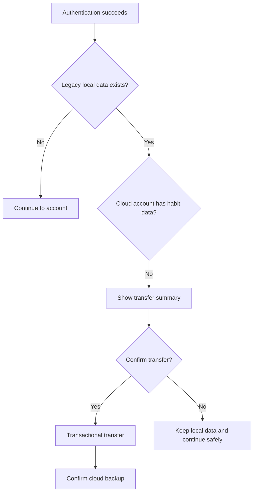
```mermaid
flowchart TD
    SignedIn[Authentication succeeds] --> Legacy{Legacy local data exists?}
    Legacy -- No --> Continue[Continue to account]
    Legacy -- Yes --> Cloud{Cloud account has habit data?}
    Cloud -- No --> Summary[Show transfer summary]
    Summary --> Confirm{Confirm transfer?}
    Confirm -- Yes --> Transfer[Transactional transfer]
    Confirm -- No --> KeepLocal[Keep local data and continue safely]
    Transfer --> Success[Confirm cloud backup]
```

**Primary path**

1. The website counts legacy local habits, check-ins, drafts, settings, and pending operations.
2. A transfer summary is shown.
3. The user confirms.
4. Data is copied transactionally to the account.
5. Server confirmation is received.
6. The website confirms that the data is now backed up.
7. Local data remains available as a cache according to signed-in storage policy.

**Requirement references:** FR-ONB-03, FR-DAT-02.

## 15.5 UX-AUTH-04 — Merge legacy local data with an existing account

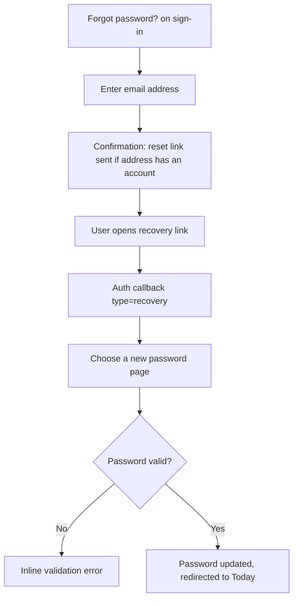
```mermaid
flowchart TD
    Forgot[Forgot password? on sign-in] --> Email[Enter email address]
    Email --> Sent[Confirmation: reset link sent if address has an account]
    Sent --> Link[User opens recovery link]
    Link --> Callback[Auth callback type=recovery]
    Callback --> Update[Choose a new password page]
    Update --> Validate{Password valid?}
    Validate -- No --> Inline[Inline validation error]
    Validate -- Yes --> Done[Password updated, redirected to Today]
```

**Primary path**

1. The user selects `Forgot password?` on the sign-in page.
2. The user enters an email address.
3. The website shows a neutral confirmation that a reset link was sent; it never reveals whether the address has an account.
4. The user opens the recovery link.
5. The auth callback detects a `recovery` link and sends the user to the password-update page.
6. The user enters a new password (at least 8 characters) and a matching confirmation.
7. The password is updated and the user lands in the application.

**Failure states**

- Expired, reused, or malformed recovery link: the callback fails safely back to a stable auth surface without changing the password.
- No active session at the update page: the user is asked to start a fresh reset flow.
- New password too short or mismatched confirmation: inline errors, no update is attempted.

**UX rules**

- Never confirm or deny the existence of an account for a given address.
- After a successful reset, do not silently drop the user; land them in a signed-in state on Today.
- Do not present reset as punitive; recovery language is neutral.

**Requirement references:** FR-ONB-08.

## 15.6 UX-AUTH-04 — Merge legacy local data with an existing account

1. The website detects both legacy local data and existing cloud data.
2. A merge summary lists counts and potential conflicts.
3. Duplicate detection uses stable identifiers and supported matching rules.
4. The user confirms the merge.
5. Non-conflicting data transfers.
6. Conflicts preserve both histories and open a resolution path where required.
7. The browser-local source is not cleared until the server confirms success.

**UX rules**

- Never overwrite a cloud habit merely because names match.
- Never discard a check-in silently.
- Do not require the user to manually inspect every non-conflicting item.

## 15.6 UX-AUTH-05 — Reset a forgotten password


```mermaid
flowchart TD
    Forgot[Forgot password? on sign-in] --> Email[Enter email address]
    Email --> Sent[Confirmation: reset link sent if address has an account]
    Sent --> Link[User opens recovery link]
    Link --> Callback[Auth callback type=recovery]
    Callback --> Update[Choose a new password page]
    Update --> Validate{Password valid?}
    Validate -- No --> Inline[Inline validation error]
    Validate -- Yes --> Done[Password updated, redirected to Today]
```

**Primary path**

1. The user selects `Forgot password?` on the sign-in page.
2. The user enters an email address.
3. The website shows a neutral confirmation that a reset link was sent; it never reveals whether the address has an account.
4. The user opens the recovery link.
5. The auth callback detects a `recovery` link and sends the user to the password-update page.
6. The user enters a new password (at least 8 characters) and a matching confirmation.
7. The password is updated and the user lands in the application.

**Failure states**

- Expired, reused, or malformed recovery link: the callback fails safely back to a stable auth surface without changing the password.
- No active session at the update page: the user is asked to start a fresh reset flow.
- New password too short or mismatched confirmation: inline errors, no update is attempted.

**UX rules**

- Never confirm or deny the existence of an account for a given address.
- After a successful reset, do not silently drop the user; land them in a signed-in state on Today.
- Do not present reset as punitive; recovery language is neutral.

**Requirement references:** FR-ONB-08.

## 15.7 Legacy local data recovery failure

- Show which stage failed.
- Preserve browser-local legacy data.
- Provide `Retry` and `Continue without transfer` where safe.
- Do not claim cloud backup succeeded.
- Do not create duplicate data on retry.

# 16. Subscription and Entitlements

## 16.1 UX-SUB-01 — Select a Premium plan

**Entry points**

- Pricing.
- Subscription page.
- Premium preview completion.
- Active-limit resolution.

**Primary path**

1. The signed-in user opens plan selection.
2. Monthly and annual plans appear with no preselected option.
3. The user selects one plan.
4. The website shows:
   - trial length;
   - exact post-trial price;
   - first billing date;
   - auto-renewal terms;
   - cancellation path;
   - applicable refund policy.
5. The user explicitly confirms checkout.
6. The approved payment provider flow begins.

**Requirement references:** FR-SUB-01, FR-SUB-02.

## 16.2 UX-SUB-02 — Return from checkout and verify entitlement

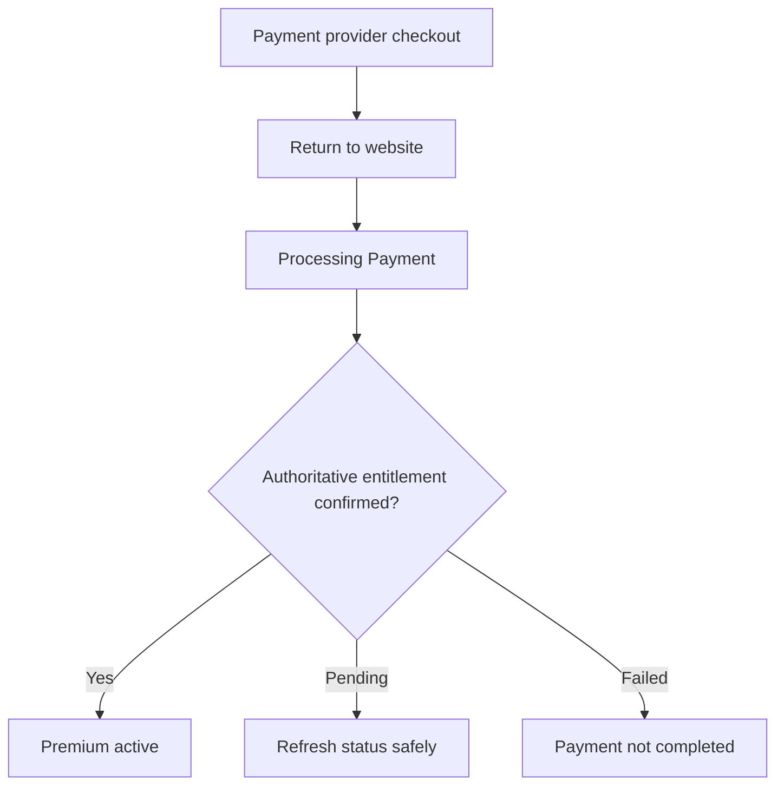
```mermaid
flowchart TD
    Checkout[Payment provider checkout] --> Return[Return to website]
    Return --> Processing[Processing Payment]
    Processing --> Backend{Authoritative entitlement confirmed?}
    Backend -- Yes --> Active[Premium active]
    Backend -- Pending --> Poll[Refresh status safely]
    Backend -- Failed --> Failure[Payment not completed]
```

**Primary path**

1. The user returns to `/app/subscription/processing`.
2. The website displays `Processing Payment`.
3. Client redirect parameters are treated as informational only.
4. The website checks backend entitlement.
5. Premium activates only after authoritative confirmation.
6. The user is redirected to Subscription with the confirmed status.

**Pending behavior**

- The page may refresh status automatically with bounded retries.
- The user may leave and return safely.
- A manual `Refresh Status` action is available.
- Repeated refresh does not create another subscription.

**Requirement references:** FR-SUB-03, FR-SUB-04, FR-SUB-10, FR-SUB-11.

## 16.3 UX-SUB-03 — Trial active and billing notices

Subscription displays:

- selected plan;
- `Trial Active` status;
- trial end date;
- first billing date;
- post-trial price;
- cancellation action.

The application provides notices three days and one day before first billing. Eligible users may also receive email notices according to policy.

**Requirement references:** FR-SUB-02.

## 16.4 UX-SUB-04 — Change monthly or annual plan

1. The user opens Manage Plan.
2. The alternative plan is shown.
3. Effective date, price, and proration behavior are displayed.
4. The user confirms.
5. The backend records the requested change.
6. Subscription shows the current plan and pending change separately.

**Requirement references:** FR-SUB-05.

## 16.5 UX-SUB-05 — Cancel auto-renewal

1. The user selects `Cancel Subscription`.
2. The website explains the expiry date and retained access.
3. The user confirms cancellation.
4. Authoritative backend state is refreshed.
5. The status becomes `Cancelled — Expires on [date]` when confirmed.
6. Premium remains active until expiry unless refunded or revoked.

**Requirement references:** FR-SUB-06.

## 16.6 UX-SUB-06 — Paid-tier expiry and active-limit resolution

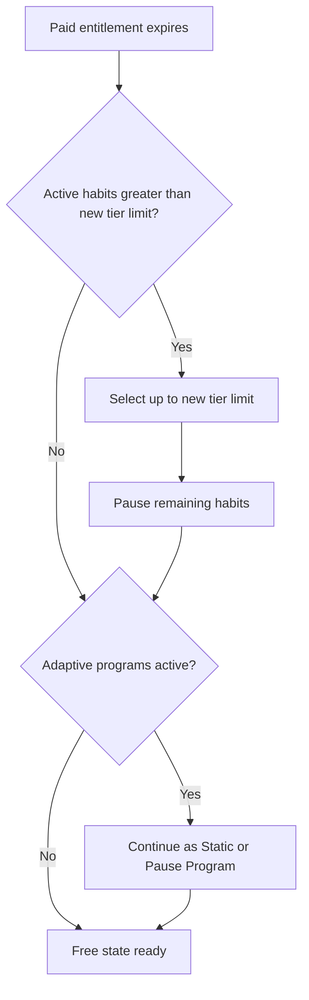
```mermaid
flowchart TD
    Expire[Paid entitlement expires] --> Count{Active habits greater than new tier limit?}
    Count -- No --> Programs{Adaptive programs active?}
    Count -- Yes --> Select[Select up to new tier limit]
    Select --> Pause[Pause remaining habits]
    Pause --> Programs
    Programs -- Yes --> Decide[Continue as Static or Pause Program]
    Programs -- No --> Complete[Free state ready]
    Decide --> Complete
```

**Primary path**

1. The website explains that no history will be deleted.
2. If more than five habits are active, the user selects up to five to remain active.
3. Remaining active habits become Paused.
4. Adaptive programs enter Decision Required.
5. The user selects `Continue as Static` or `Pause Program` for each program.
6. The downgrade summary is confirmed.
7. The account enters the selected lower tier: Lite or Free.

**Requirement references:** FR-SUB-07, FR-SUB-08, FR-SUB-09.

## 16.7 Refunded or revoked entitlement

- The website refreshes authoritative entitlement.
- Premium-only adaptation stops according to backend state.
- Data and history remain visible.
- Active-limit and program-resolution flows begin immediately where required.
- The message distinguishes refund, revocation, expiration, and temporary payment recovery.

# 17. Insights

## 17.1 UX-INS-01 — View aggregate Insights

**Primary path**

1. The user opens Insights.
2. The page defaults to a recent supported period.
3. Aggregate consistency, successful sessions, Full/Minimum distribution, and continuity are shown.
4. The user may change the supported period.
5. The user may select a habit to open habit-level Insights.

**UX rules**

- Minimum remains part of successful outcomes.
- Skipped and Unrecorded classifications are distinguishable where useful.
- Charts include textual summaries and accessible data tables or equivalent descriptions.
- The website avoids competitive ranking and punitive streak framing.
- Legacy local Insights are limited to data still available in the current browser until transfer or export.

**Requirement references:** FR-MET-01, FR-MET-02.

## 17.2 UX-INS-02 — View habit-level Insights

Habit-level Insights include:

- current-version consistency;
- lifetime consistency;
- current continuity;
- Full/Minimum distribution;
- friction categories where sufficient data exists;
- Recovery history;
- version boundaries;
- Stable, At Risk, or related status explanation.

Selecting a version boundary opens the corresponding version detail.

**Requirement references:** FR-MET-03.

## 17.3 Stable and Minimum-heavy presentation

- Stable status is explained as sustained successful behavior under the configured eligibility rules.
- A habit may be Stable while using Minimum frequently.
- Minimum-heavy stability is not framed as inferior.
- Where a redesign is suggested, the user sees the observed pattern and retains final control.

**Requirement references:** FR-STA-01, FR-STA-02.

## 17.4 Empty and insufficient-data states

### No completed sessions

```text
Your insights will appear after you record eligible sessions.
[Go to Today]
```

### Insufficient friction data

```text
There is not enough information to show a reliable friction pattern yet.
```

### Legacy local storage unavailable

```text
Insights are unavailable because this browser no longer contains the legacy local history.
```

# 18. Offline Resilience, Synchronization, and Multiple Tabs

## 18.1 Offline state model

| **State** | **User-facing treatment** |
|---|---|
| Online and synchronized | No persistent connectivity banner. |
| Online with pending operations | `Syncing changes…` with details available. |
| Offline with cached content | Persistent `Offline` banner; supported actions remain available. |
| Offline without cached route | Offline explanation with links to available cached routes. |
| Synchronization failed | `Some changes need attention` with retry details. |
| Conflict detected | Recoverable comparison and resolution surface. |

## 18.2 UX-OFF-01 — Record a check-in offline

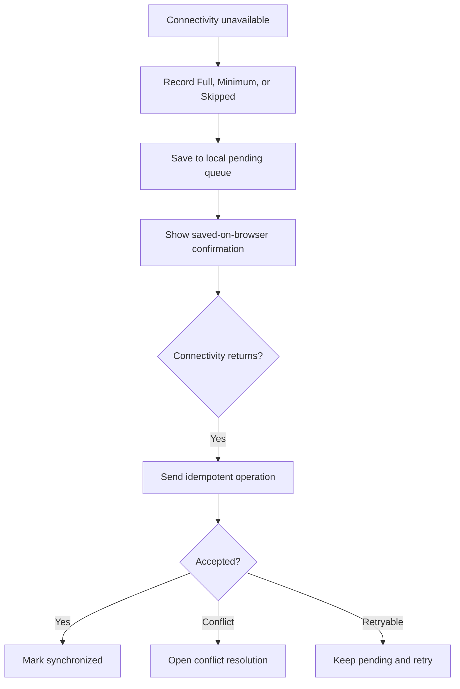
```mermaid
flowchart TD
    Offline[Connectivity unavailable] --> CheckIn[Record Full, Minimum, or Skipped]
    CheckIn --> Local[Save to local pending queue]
    Local --> Confirm[Show saved-on-browser confirmation]
    Confirm --> Reconnect{Connectivity returns?}
    Reconnect -- Yes --> Sync[Send idempotent operation]
    Sync --> Result{Accepted?}
    Result -- Yes --> Synced[Mark synchronized]
    Result -- Conflict --> Resolve[Open conflict resolution]
    Result -- Retryable --> Pending[Keep pending and retry]
```

**Primary path**

1. An Offline banner is visible.
2. The user records a supported check-in.
3. The website saves it locally.
4. The confirmation reads `Saved on this browser — waiting to sync` for signed-in users.
5. When connectivity returns, synchronization runs automatically.
6. The pending indicator clears only after server confirmation.

**Requirement references:** FR-OFF-01, FR-OFF-02, FR-OFF-03.

## 18.3 UX-OFF-02 — Unsupported offline action

Actions requiring connectivity include:

- account creation or sign-in completion;
- authentication callback validation;
- payment checkout;
- entitlement refresh;
- cloud export request;
- account deletion;
- email delivery;
- cross-device synchronization.

**Behavior**

1. The unavailable action remains visible when useful.
2. Selecting it opens a concise explanation.
3. The page offers `Try Again` and a safe local alternative where one exists.
4. Other cached application functions remain usable.

**Requirement references:** FR-OFF-04.

## 18.4 UX-OFF-03 — Manual retry

The synchronization details surface lists pending operations by safe category and time, without exposing sensitive note content unnecessarily.

Actions:

- Retry All
- Retry one operation
- View conflict
- Dismiss resolved history

The user cannot manually submit the same operation multiple times while a retry is in flight.

## 18.5 UX-SYNC-01 — Configuration conflict

**Trigger**

- The same habit configuration was materially changed in different browser contexts before synchronization completed.

**Primary path**

1. The website preserves both configuration candidates.
2. A conflict page shows:
   - local change time;
   - cloud change time;
   - current and proposed fields;
   - affected future sessions;
   - confirmation that check-in history is preserved.
3. The user selects:
   - Keep Cloud Version;
   - Use Local Version as New Version;
   - Customize a New Version.
4. The chosen result creates or retains a valid version.
5. The conflict closes only after authoritative confirmation.

**Requirement references:** FR-OFF-05, FR-LIF-02.

## 18.6 Multiple-tab behavior

### Same habit updated in another tab

- The inactive tab receives a state-change signal.
- A passive notice reads `This habit changed in another tab`.
- Safe read-only content updates automatically.
- Unsaved forms do not refresh silently.

### Same session checked in from another tab

- The second tab updates to the latest outcome.
- Attempting another outcome opens the same-day edit flow rather than creating a duplicate.

### Account sign-out in another tab

- Protected routes transition to session-ended state.
- Local pending operations remain preserved for safe reconciliation.

**Requirement references:** FR-LIF-06, FR-CHK-07.

# 19. Settings, Privacy, Export, and Deletion

## 19.1 Settings information architecture

```text
General
├── Appearance
├── Language and locale
├── Timezone
└── Week and review preferences

Reminders
├── Web Push permission state
├── Email fallback
└── Quiet hours

Accessibility
├── Reduced motion
├── Contrast preferences where supported
└── Content density where supported

Privacy and Data
├── Export data
├── Clear legacy local data
├── Cookie and analytics preferences
└── Account deletion

Account
├── Profile
├── Security and sessions
├── Subscription
└── Sign out
```

Free, Lite, and Premium account users see only applicable sections.

## 19.2 UX-DAT-01 — Export legacy local data

1. The authenticated user opens Privacy and Data while legacy local data is detected.
2. The page explains that data is stored only in the current browser.
3. The user selects `Export Legacy Local Data`.
4. The website prepares a documented machine-readable file locally where technically possible.
5. The browser download begins.
6. A success message states the included categories.

**Requirement references:** FR-DAT-02.

## 19.3 UX-DAT-02 — Export account data

1. The signed-in user opens Export Data.
2. The page lists included data categories.
3. The user selects `Request Export`.
4. Re-authentication occurs where required.
5. The backend prepares the export.
6. The website shows request status.
7. The user receives a secure download path according to product policy.

**Requirement references:** FR-DAT-01.

## 19.4 UX-DAT-03 — Clear legacy local data

```mermaid
flowchart TD
    Clear[Select Clear Legacy Local Data] --> Offer[Offer export first]
    Offer --> Confirm[Explicit confirmation]
    Confirm --> Delete[Delete local product data]
    Delete --> Result[Return to fresh public or application entry]
```

**Confirmation content**

- habits and history in this browser will be removed;
- no cloud backup exists unless an account transfer previously completed;
- the action cannot be undone;
- export is available first.

The final action uses `Clear Data Permanently`.

**Requirement references:** FR-DAT-04.

## 19.5 UX-DAT-04 — Delete account

**Entry point**

- Account Settings only.

**Primary path**

1. The user opens Delete Account.
2. The website explains:
   - data deletion lifecycle;
   - subscription consequences;
   - retention exceptions required by law or security;
   - irreversible effects;
   - local browser data behavior.
3. The user is prompted to cancel or understand active subscription consequences.
4. Re-authentication is required where applicable.
5. The user enters the required confirmation phrase or uses an equivalently deliberate control.
6. The deletion request is submitted.
7. The website shows the authoritative request state.
8. The user is signed out when appropriate.

**UX rules**

- Delete Account is visually separated from normal settings.
- The product never hides subscription consequences.
- A failed request does not claim deletion occurred.
- Local browser data is cleared or clearly offered for clearing after account deletion, according to policy.

**Requirement references:** FR-DAT-03.

## 19.6 Cookie and analytics preferences

- Essential storage required for authentication, security, and requested product functions is distinguished from optional analytics.
- Optional analytics is not enabled contrary to applicable consent policy.
- Changing preferences takes effect without deleting habit data.
- Habit names, notes, and free-text friction content are excluded from analytics regardless of consent.

# 20. Global States and Error Recovery

## 20.1 Loading states

- Public pages use content-preserving skeletons only where meaningful.
- Application routes may show cached data with a subtle refresh indicator.
- Full-page loading is reserved for unresolved session or local-state initialization.
- Loading indicators include accessible status text.
- A control in progress cannot be submitted repeatedly.

## 20.2 Empty states

Every empty state includes:

1. what is empty;
2. why it may be empty;
3. one relevant next action;
4. no blame-oriented language.

Required empty states:

- no habits;
- no eligible sessions today;
- no Review items;
- no Insights data;
- no reminders;
- no Trash items;
- no pending synchronization;
- no historical versions;
- no subscription.

## 20.3 Error states

### Recoverable form error

- Keep entered values.
- Focus the error summary after submission.
- Associate field errors with inputs.
- Provide a clear correction path.

### Network error

- Distinguish offline from server failure.
- Preserve local changes where supported.
- Provide Retry.

### Authorization error

- Explain that the resource is unavailable.
- Do not reveal whether another user owns the resource.
- Provide a safe route back.

### Not found

- Use a dedicated 404 state.
- Offer Today or Habits depending on context.

### Unexpected application error

- Preserve the global shell where safe.
- Provide Retry and a support path.
- Do not expose stack traces, tokens, internal IDs, or secrets.

## 20.4 Locked and entitlement states

Premium-locked surfaces:

- explain the value;
- preserve visible preview access where promised;
- offer View Plans;
- never imply existing history will be deleted;
- remain keyboard and screen-reader accessible.

Account-required surfaces explain the exact benefit before sign-in.

## 20.5 Destructive confirmations

Required for:

- discard unsaved habit creation;
- stop habit;
- move habit to Trash;
- permanent habit deletion;
- clear legacy local data;
- account deletion;
- subscription cancellation where provider policy requires confirmation.

Confirmation dialogs state:

- object affected;
- immediate effect;
- reversibility;
- retained data;
- final action label.

## 20.6 Toast and notification rules

- Toasts confirm completed actions but never contain the only copy of critical information.
- Error toasts include a persistent recovery path when needed.
- Multiple toasts are queued, not stacked over key controls.
- Screen readers receive polite announcements for normal confirmations and assertive announcements only for blocking errors.

# 21. Accessibility and Responsive Interaction

## 21.1 Keyboard navigation

- All interactive controls are reachable by keyboard.
- Focus order follows visual and logical order.
- Skip links provide direct access to main content and primary navigation.
- Escape dismisses non-destructive temporary surfaces.
- Arrow-key behavior follows established patterns for menus, tabs, and radio groups.
- Focus returns to the invoking control after a dialog or drawer closes.

## 21.2 Check-in semantics

- Full, Minimum, and Skipped are real buttons with clear accessible names.
- Current check-in status is programmatically exposed.
- Minimum is announced as a successful outcome.
- Color is never the only status indicator.
- Confirmation announcements do not use punitive streak language.

## 21.3 Responsive layouts

| **Range** | **Primary layout behavior** |
|---|---|
| 360–767 px | Single-column mobile web, bottom navigation, drawers. |
| 768–1023 px | Tablet layout, bottom navigation, wider drawers or split content where appropriate. |
| 1024–1439 px | Laptop layout, persistent or collapsible sidebar, centered content. |
| 1440 px and above | Desktop layout with persistent sidebar and bounded content width. |

Rules:

- No core function requires horizontal page scrolling at supported widths.
- Data tables provide responsive alternatives or controlled horizontal regions with labels.
- Dialog content becomes a drawer or route when space is insufficient.
- Browser zoom up to 200% does not remove core functions.
- Text scaling does not overlap check-in controls.

## 21.4 Pointer and touch targets

- Interactive targets meet the product accessibility target size.
- Hover states supplement but never replace focus and active states.
- Dragging is not the only method for reordering or selecting.
- Destructive actions are not placed immediately adjacent to routine primary actions without separation.

## 21.5 Motion

- Essential information does not depend on animation.
- Reduced-motion preferences disable or simplify transitions.
- Progress changes avoid celebratory effects that conflict with the calm product tone.
- Recovery transitions emphasize continuity and clarity, not failure.

## 21.6 Content and copy

Required tone:

- neutral;
- specific;
- calm;
- non-diagnostic;
- non-punitive;
- action-oriented.

Avoid:

- `You failed`;
- `Your streak is broken`;
- `Perfect users never miss`;
- shame-based urgency;
- false scarcity;
- unsupported psychological conclusions.

## 21.7 Screen-reader and chart requirements

- Charts include titles, summaries, and accessible data equivalents.
- Status badges expose complete text.
- Dynamic synchronization state is announced without excessive repetition.
- Form error summaries link to invalid fields.
- Decorative illustrations are hidden from assistive technology.

# 22. Analytics Touchpoints

## 22.1 Recommended product events

Event names describe product behavior without sensitive content:

```text
public_cta_selected
account_started
habit_creation_started
habit_created
habit_draft_saved
check_in_recorded
check_in_edited
friction_reason_selected
unrecorded_resolved
recovery_prompt_opened
recovery_decision_recorded
weekly_review_started
weekly_review_completed
recommendation_decision_recorded
account_prompt_opened
authentication_completed
legacy_data_transfer_started
legacy_data_transfer_completed
premium_preview_started
premium_preview_completed
plan_selected
checkout_started
entitlement_confirmed
subscription_cancelled
offline_action_queued
offline_action_synced
sync_conflict_opened
data_export_requested
account_deletion_requested
```

## 22.2 Allowed properties

Examples:

- anonymous session identifier according to policy;
- account tier;
- habit count bucket;
- generic goal category;
- outcome type: Full, Minimum, Skipped;
- generic friction category;
- route name;
- viewport category;
- browser capability state;
- synchronization result category;
- recommendation type;
- subscription status category.

## 22.3 Prohibited analytics payloads

Never include:

- habit name;
- habit description;
- free-text friction note;
- email address;
- authentication token;
- payment credentials;
- exact private schedule text where unnecessary;
- exported data;
- account-deletion confirmation text;
- raw browser storage content.

## 22.4 Analytics failure behavior

- Analytics failure never blocks a product action.
- Offline analytics must not compete with or corrupt the product synchronization queue.
- Consent changes are respected promptly.
- Duplicate browser events are deduplicated where practical.

# 23. UX Acceptance Checklist

## 23.1 Greenfield and platform consistency

- [ ] The document assumes no existing application or legacy interface.
- [ ] All primary flows are defined for a responsive website and installable PWA.
- [ ] No device-native platform dependency appears in a required flow.
- [ ] Browser storage and cloud storage are described accurately.

## 23.2 Public website and entry

- [ ] Public pages expose no private habit data.
- [ ] Start Free leads to account creation or sign-in before private application access.
- [ ] Returning account sessions restore safely.
- [ ] Session expiration preserves pending local actions.
- [ ] Deep links resume after authentication where permitted.

## 23.3 Navigation and responsive shell

- [ ] Desktop uses persistent sidebar navigation.
- [ ] Mobile web uses Today, Habits, Review, Insights, and More.
- [ ] Browser Back, Forward, refresh, and deep links behave consistently.
- [ ] Temporary surfaces are keyboard accessible and responsive.
- [ ] The active destination is not communicated by color alone.

## 23.4 Habit creation

- [ ] Basic Template, Custom Habit, and Premium Program routes are visible.
- [ ] Normal and Minimum versions are required.
- [ ] Drafts do not consume active slots.
- [ ] Free, Lite, and Premium limits resolve without deletion.
- [ ] Reminder permission is contextual and optional.

## 23.5 Daily check-ins

- [ ] Full, Minimum, and Skipped are one-action choices.
- [ ] Minimum is represented as success.
- [ ] Skipped friction capture is optional.
- [ ] Same-day editing updates rather than duplicates the check-in.
- [ ] Offline check-ins confirm local preservation honestly.

## 23.6 Unrecorded and reminders

- [ ] Unrecorded remains resolvable for three days.
- [ ] Automatic Skipped remains distinguishable from Manual Skipped.
- [ ] Automatic Skipped does not trigger Recovery.
- [ ] Web Push permission is never requested on initial load.
- [ ] Denied or unsupported Web Push has usable alternatives.

## 23.7 Recovery and review

- [ ] Three consecutive Manual Skipped sessions trigger a non-blocking Recovery prompt.
- [ ] Recovery recommendations change one primary variable.
- [ ] Apply, Customize, and Keep Current are available.
- [ ] Two failed Recovery plans produce Needs Review.
- [ ] Weekly Review permits a no-change outcome.
- [ ] Batch changes display individual results.

## 23.8 Lifecycle and versioning

- [ ] Material redesign creates a new version.
- [ ] Historical versions remain readable.
- [ ] Restore creates a new version rather than overwriting history.
- [ ] Paused, Stopped, Completed, Archived, and Trash do not consume active slots.
- [ ] Trash shows the 30-day retention period.

## 23.9 Authentication and legacy local data recovery

- [ ] Account prompts explain the contextual benefit.
- [ ] Google and email authentication resume the intended route.
- [ ] Legacy local data remains local until transfer or export is confirmed.
- [ ] Existing cloud data produces a safe merge summary.
- [ ] Transfer retries are idempotent.

## 23.10 Premium and subscription

- [ ] Premium preview is visible to Free and Lite users.
- [ ] Simulation does not affect real metrics.
- [ ] No plan is preselected.
- [ ] Trial and billing terms appear before checkout.
- [ ] Browser return state alone never activates Premium.
- [ ] Cancelled subscriptions retain access until authoritative expiry.
- [ ] Downgrade preserves all habit history.

## 23.11 Offline, synchronization, and tabs

- [ ] Cached routes show an explicit Offline state.
- [ ] Supported actions survive refresh and browser restart in the same profile.
- [ ] Unsupported offline actions explain why connectivity is required.
- [ ] Duplicate operations are prevented.
- [ ] Configuration conflicts preserve both histories.
- [ ] Changes from another tab do not silently overwrite an unsaved form.

## 23.12 Privacy, deletion, and accessibility

- [ ] Account and legacy local exports are available according to entitlement and storage state.
- [ ] Clear Legacy Local Data offers export first.
- [ ] Account deletion explains subscription and retention consequences.
- [ ] Habit names and notes are excluded from analytics.
- [ ] All controls are keyboard accessible.
- [ ] Charts have accessible equivalents.
- [ ] Layout remains functional across supported responsive ranges and browser zoom.

# 24. Appendices

## 24.1 Cross-flow state matrix

| **State** | **Today** | **Habits** | **Review** | **Insights** | **Reminders** | **Settings** |
|---|---|---|---|---|---|---|
| Free | Full basic use | Up to 5 active | Basic | Cloud-backed basic | Web Push and basic email | Account and subscription |
| Lite | Full basic use | Up to 10 active | Enhanced | Cloud-backed basic | Web Push and supported reminder features | Account and subscription |
| Premium | Full use | Up to 30 active | Advanced | Advanced | Adaptive analysis | Full account controls |
| Offline account | Cached and queued | Cached and queued | Cached items | Cached data | Cloud changes blocked or queued only where supported | Cloud actions blocked |
| Session expired | Re-auth required for cloud data | Re-auth required | Re-auth required | Re-auth required | Re-auth required | Sign-in path |
| Decision Required | Banner | Status visible | Primary resolution | History visible | Existing settings visible | Subscription context visible |

## 24.2 Primary wireframe priority

```text
1. Responsive application shell
2. Today and session card states
3. Habit creation wizard
4. Habits list and Habit Detail
5. Recovery recommendation and progress
6. Weekly Review and batch confirmation
7. Authentication and legacy local data recovery
8. Subscription selection and processing
9. Reminders and permission states
10. Insights and accessible charts
11. Offline, synchronization, and conflict states
12. Settings, export, Trash, and deletion
13. Public landing, pricing, help, and legal pages
```

## 24.3 Source-of-truth precedence

When a conflict is discovered during design or implementation:

```text
Approved task-specific clarification
        ↓
UX-FLOWS.md interaction contract
        ↓
PRD.md product and business requirements
        ↓
UI-SPEC.md visual and component rules
        ↓
TECHNICAL-DESIGN.md implementation architecture
```

A conflict must be documented and resolved rather than silently interpreted.

## 24.4 Definition of UX-ready

The website UX specification is ready for UI specification when:

- all MVP routes and responsive navigation states are inventoried;
- every core PRD journey has a primary path, alternate path, and exit state;
- Free, Lite, and Premium differences are explicit;
- browser Back, Forward, refresh, deep-link, offline, and multiple-tab behavior are defined;
- loading, empty, locked, error, pending, and conflict states are defined;
- destructive actions state consequences and reversibility;
- accessibility behavior is specified for keyboard, screen reader, zoom, touch, and reduced motion;
- no required interaction depends on a device-native platform;
- no unresolved placeholder remains in the document.
